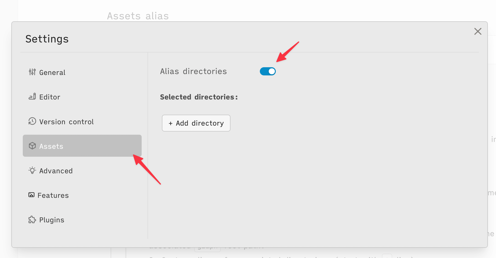
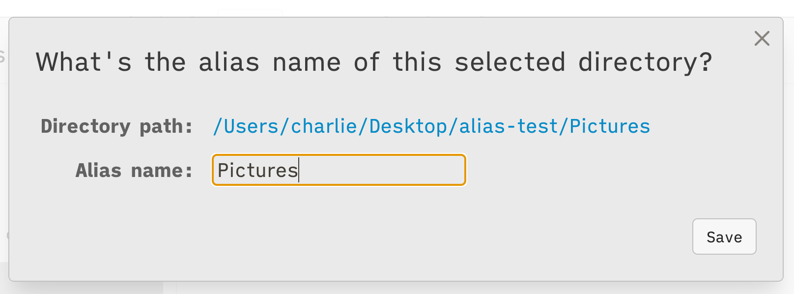
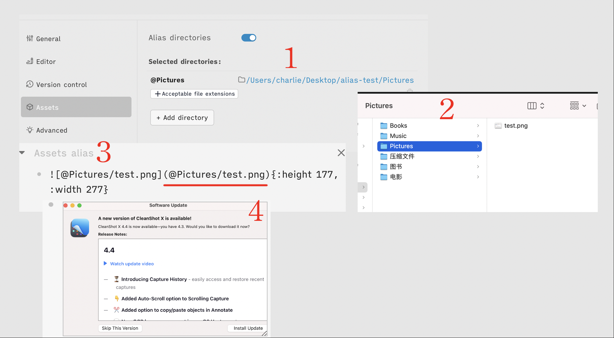
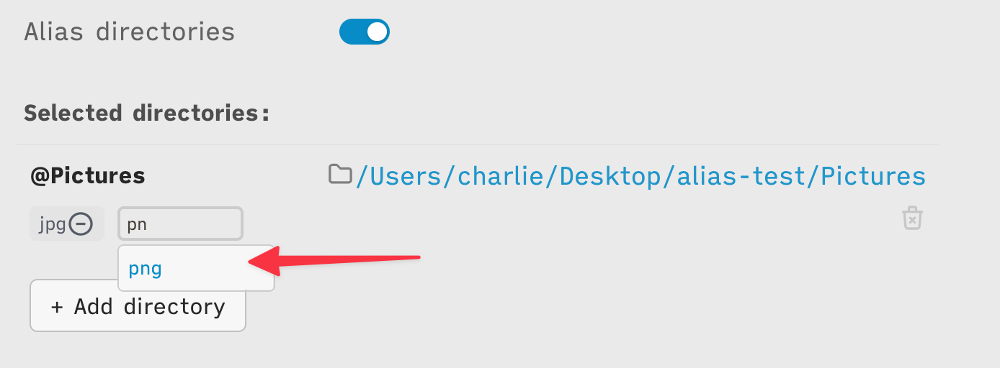

type:: [[Feature]]
platform:: [[Desktop]]

- #+BEGIN_NOTE
  This only works on the desktop app at the moment.
  #+END_NOTE
- **What's the `Assets` resource of each graph?**
	- Some resources like images, audio, PDF documents, etc. They will be stored by default in the `. /assets` directory.
- **Why we need the feature of `Assets` alias directories?**
	- Since the current built-in `Assets` directory is located in the associated `graph` root directory and only in the `assets` directory, the user cannot customize this directory name. Due to this limitation, it is very inflexible to manage `assets` resource files.
	- **Advantages of Assets alias?**
		- 1. Associating multiple `assets` directories, the location of which is not limited to the associated `graph` root path.
		- 2. Custom aliases for associated directories. (start with `@`alias)
		- 3. Match uploaded `assets` files by suffix name and separate them into different configured alias directories.
- **How to use?**
	- a. active this feature in the settings modal.
	  {:height 224, :width 441}
	- b. add an external alias directory. (also works for multiple directories)
	  b1. name the alias of the selected directory.
	  {:height 167, :width 439}
	- c. currently if there's an image file `test.png` in the selected directory. you can access this file by `alias` name that start with `@`. `@Pictures/test.png`
	  
	- d. if you want to separate specific files to the `@Pictures` directory, as images with `.png` suffix. We can add `acceptable file extensions` to do that!
	  {:height 201, :width 557}
-