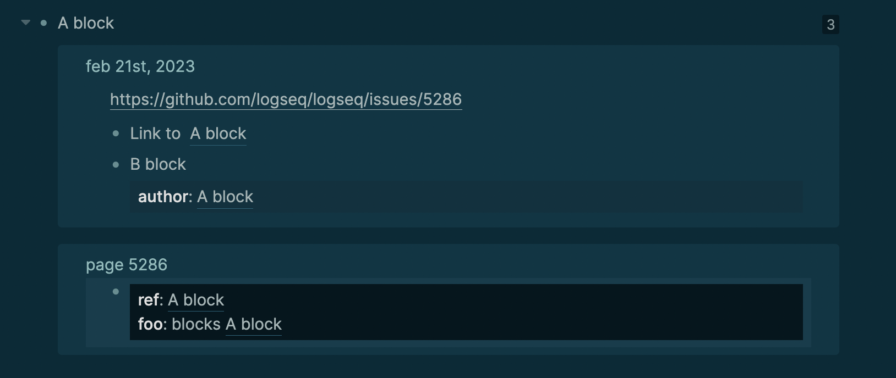

type:: [[Feature]]
platforms:: [[All Platforms]]
alias:: term/block reference
description:: Clickable link to a particular Logseq block  e.g. `((123e4567-e89b-12d3-a456-426614174000))`. Produced by putting a unique [UUID](https://en.wikipedia.org/wiki/Universally_unique_identifier) inside parenthesis `(())`

- ## Usage
	- Create one by first typing `((` or the `/Block reference` command and then selecting a block from the #autocompletion search
	- Read [[The basics of block references]] tutorial for more on creating and using a block reference.
- ## Functionality
	- A block that has references will have a reference counter to its right.
	- Clicking on that reference counter will expand all of its block linked references and group them by page:
		- 
	- Blocks should be referenceable anywhere including properties.