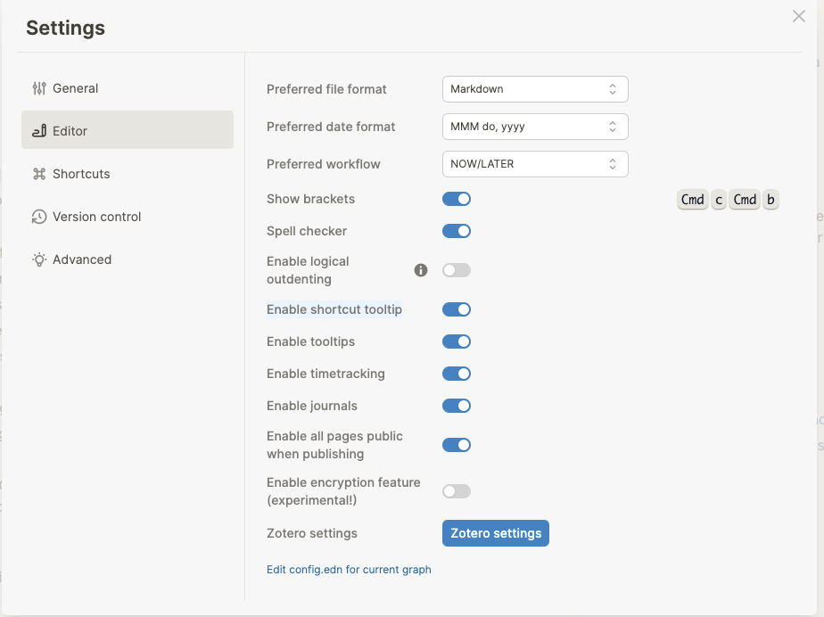
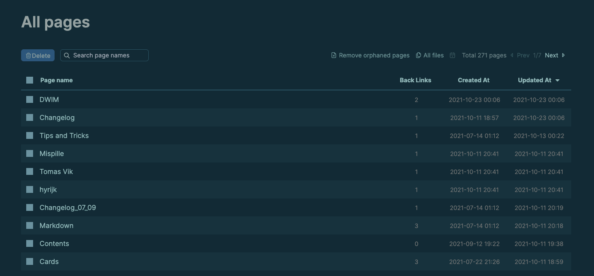

- ## Beta 0.9.3 [[Apr 19th, 2023]]
  Desktop app and Android App download link: <https://github.com/logseq/logseq/releases/tag/0.x.y>
	- [[Features]]
		- Add global scale level option to Whiteboards [#9097](https://github.com/logseq/logseq/pull/9097)
	- [[Thanks]]
		- [[Ulices]]
			- Update Spanish translations
			- Improve contributing-to-translations doc
		- [[Zhizhen He]]
			- Remove duplicated item in .gitignore
		- [[John Doe]]
			- Update nginx version in Docker image
		- [[Phoenix Eliot]]
			- Show marker when block text is empty
		- [[situ2001]]
			- Refactor: rename fn params in `frontend.db.model`
	- [[Fixed issues]]
		- Broken outliner structure when Backspace at the beginning [#9125](https://github.com/logseq/logseq/pull/9125)
		- Copy & paste problems [#9145](https://github.com/logseq/logseq/pull/9145)
		- Disable `group-by-page` when result-transform exists [#9133](https://github.com/logseq/logseq/pull/9133)
		- Insert properties will truncate other properties if there's any empty property [#9117](https://github.com/logseq/logseq/pull/9117)
		- Show marker when block text is empty [#9104](https://github.com/logseq/logseq/pull/9104)
		- Fix for graph parsing for CLIs [#9099](https://github.com/logseq/logseq/pull/9099)
		- `config.edn` & `custom.css` overwrite by syncing remote versions [#9138](https://github.com/logseq/logseq/pull/9138)
		- Logseq Sync keeps showing yellow badge and not syncing sometimes [#9144](https://github.com/logseq/logseq/pull/9144)
		- Incorrect position of mobile toolbar [#9118](https://github.com/logseq/logseq/pull/9118)
	- [[Enhancement]]
		- Persist block UUID upon external editing [#8823](https://github.com/logseq/logseq/pull/8823)
		- I18n: Update Spanish translations [#9114](https://github.com/logseq/logseq/pull/9114)
		- Advanced queries have a new :group-by-page? option [#9133](https://github.com/logseq/logseq/pull/9133)
- ## Beta 0.9.2 [[Apr 13th, 2023]]
  Desktop app and Android App download link: <https://github.com/logseq/logseq/releases/tag/0.9.2>
	- [[Features]]
		- Support custom colors in Whiteboards [#9067](https://github.com/logseq/logseq/pull/9067)
		- Support exporting to image  [#9037](https://github.com/logseq/logseq/pull/9037)
	- [[Thanks]]
		- [[Adam Hupp]]
			- Simplify Windows development docs
		- [[djaggi]]
			- Fix twitter badge in readme
		- [[MyNameIsKitsune]]
			- Add Ukrainian translation
		- [[Seokseong Jeon]]
			- Correct a comment in config.edn
		- [[Zhizhen He]]
			- Change feature icon from tie-app-feature to square-asterisk
		- [[Mikhail Smelov]]
			- Improve Russian (ru) translation
		- [[queeup]]
			- Update Turkish translation
	- [[Enhancement]]
		- Whiteboards: Auto enter edit mode when we create shapes [#9080](https://github.com/logseq/logseq/pull/9080)
		- I18n: Ukrainian translation [#9005](https://github.com/logseq/logseq/pull/9005), Russian (ru) translations [#8991](https://github.com/logseq/logseq/pull/8991) [#9050](https://github.com/logseq/logseq/pull/9050), Turkish translation [#9070](https://github.com/logseq/logseq/pull/9070)
		- Add more functions to context menu [#8930](https://github.com/logseq/logseq/pull/8930)
		- Make publishing accessible to CLIs [#9033](https://github.com/logseq/logseq/pull/9033)
		- Plugin-related improvements [#8787](https://github.com/logseq/logseq/pull/8787)
		- Show custom title instead of live query for custom queries [#9026](https://github.com/logseq/logseq/pull/9026)
		- Prettify html export [#8968](https://github.com/logseq/logseq/pull/8968)
		- Add hint class for the blank content block [#9072](https://github.com/logseq/logseq/pull/9072)
		- Dynamic layout of the plugin UI items from the app toolbar [#8962](https://github.com/logseq/logseq/pull/8962)
		- Add an apply button to multiple selects in query builder [#9025](https://github.com/logseq/logseq/pull/9025)
		- Enhance undo redo handling [#9048](https://github.com/logseq/logseq/pull/9048)
	- [[Fixed issues]]
		- Bring back result count for built-in queries [#8954](https://github.com/logseq/logseq/pull/8954)
		- Buggy selection highlights [#9074](https://github.com/logseq/logseq/pull/9074)
		- Deleting with the backspace key should not delete block IDs or disrupt reference connections [#8974](https://github.com/logseq/logseq/pull/8974)
		- Fix hash tags enclosed in double brackets are broken [#9030](https://github.com/logseq/logseq/pull/9030)
		- Sometimes the HTTP api server does not auto restart [#9042](https://github.com/logseq/logseq/pull/9042)
		- Query performance fix [#9016](https://github.com/logseq/logseq/pull/9016)
- ## Beta 0.9.1 [[Mar 29th, 2023]]
  Download links for Desktop App and Android App: <https://github.com/logseq/logseq/releases/tag/0.9.1>
	- [[Fixed issues]]
		- Internal blocks paste [#8932](https://github.com/logseq/logseq/pull/8932)
		- File pasting [#8936](https://github.com/logseq/logseq/pull/8936)
		- Query with breadcrumbs show blocks on the wrong hierarchy [#8939](https://github.com/logseq/logseq/pull/8939)
		- Asset URL handling for Whiteboards and custom.css [#8927](https://github.com/logseq/logseq/pull/8927) [#8933](https://github.com/logseq/logseq/pull/8933)
		- Cannot open dir with default app [#8931](https://github.com/logseq/logseq/pull/8931)
	- [[Enhancement]]
		- Adapt the Logseq Sync login modal size to responsive layout [#8920](https://github.com/logseq/logseq/pull/8920)
- ## Beta 0.9.0 [[Mar 28th, 2023]]
  Download links for Desktop App and Android App: <https://github.com/logseq/logseq/releases/tag/0.9.0>
	- [[Breaking Changes]]
		- Refactored file system handling to fix filename issues on mobile platforms, requiring re-indexing of your working graph [#8792](https://github.com/logseq/logseq/pull/8792)
	- [[Features]]
		- Added a simple [Query Builder](https://docs.logseq.com/#/page/Query%20Builder) [#8774](https://github.com/logseq/logseq/pull/8774)
		- Updated the login UI for Logseq Sync [#8865](https://github.com/logseq/logseq/pull/8865)
		- Made [Whiteboards](https://docs.logseq.com/#/page/whiteboard) publicly available to all users [#8853](https://github.com/logseq/logseq/pull/8853)
	- [[Thanks]]
		- [[aiirobyte]]
			- Add config option to handle default block refs expanding behavior in [#8839](https://github.com/logseq/logseq/pull/8839)
		- [[AkrISrn]]
			- fix logbook `with-second-support?` doesn't work in [#8803](https://github.com/logseq/logseq/pull/8803)
		- [[Bad3r]]
			- Add Hub & Awesome-logseq to README in [#8738](https://github.com/logseq/logseq/pull/8738)
		- [[Zhizhen He]]
			- Format table and update command of docs in [#8845](https://github.com/logseq/logseq/pull/8845)
		- [[Yichen Yan]]
			- Upgrade playwright to 1.31.0 in [#8688](https://github.com/logseq/logseq/pull/8688)
		- [[sallto]]
			- Add better error messages for duplicate key in config.edn in [#8488](https://github.com/logseq/logseq/pull/8488)
		- [[Zhaohui Shi]]
			- Update default config template to correct format in [#8907](https://github.com/logseq/logseq/pull/8907)
		- [[situ2001]]
			- Shrink on-click range of sidebar-item in [#8752](https://github.com/logseq/logseq/pull/8752)
			- Fix: do not convert URL to macro while raw pasting in [#8815](https://github.com/logseq/logseq/pull/8815)
		- [[Sky Hong]]
			- Update Traditional Chinese translation (zh-Hant) in [#8791](https://github.com/logseq/logseq/pull/8791)
		- [[김원웅]]
			- Update Korean translation in [#8813](https://github.com/logseq/logseq/pull/8813)
		- [[Yuriy Piskun]]
			- Fix: hide empty settings description in [#8739](https://github.com/logseq/logseq/pull/8739)
			- Fix: unwrap hierarchy and unlinked page blocks in [#8798](https://github.com/logseq/logseq/pull/8798)
	- [[Fixed issues]]
		- Massive fixes to Whiteboards: pasting shape [#8636](https://github.com/logseq/logseq/pull/8636), autocomplete on portals [#8747](https://github.com/logseq/logseq/pull/8747), shape index and arrow binding [#8885](https://github.com/logseq/logseq/pull/8885), history handling [#8788](https://github.com/logseq/logseq/pull/8788), [#8893](https://github.com/logseq/logseq/pull/8893)
		- Copy event handling  [#8777](https://github.com/logseq/logseq/pull/8777)
		- Display page's original name in linked reference [#8773](https://github.com/logseq/logseq/pull/8773)
		- Multi-window crash when Logseq Sync enabled [#8874](https://github.com/logseq/logseq/pull/8874)
		- Select only the current block when opening its context menu [#8863](https://github.com/logseq/logseq/pull/8863)
		- Block edit undo handling [#8833](https://github.com/logseq/logseq/pull/8833) [#8864](https://github.com/logseq/logseq/pull/8864)
		- Use system certs for Logseq Sync [#8731](https://github.com/logseq/logseq/pull/8731)
		- Incorrect position of absolute modal on some mobile platforms [#8826](https://github.com/logseq/logseq/pull/8826)
		- `beforeunload` hook of Plugin system [#8768](https://github.com/logseq/logseq/pull/8768)
		- Do not convert URL to macro while raw pasting [#8815](https://github.com/logseq/logseq/pull/8815)
		- Logbook's `with-second-support?` doesn't work [#8803](https://github.com/logseq/logseq/pull/8803)
		- Shrink on-click range of sidebar-item [#8752](https://github.com/logseq/logseq/pull/8752)
	- [[Enhancement]]
		- Whiteboards
			- Paste and dnd behavior (also add a placeholder to shape labels) [#8753](https://github.com/logseq/logseq/pull/8753)
			- Publishing [#8899](https://github.com/logseq/logseq/pull/8899)
			- Refine UX [#8797](https://github.com/logseq/logseq/pull/8797)
		- Add mldoc ast schema [#8829](https://github.com/logseq/logseq/pull/8829)
		- Add page column for query tables with block results [#8869](https://github.com/logseq/logseq/pull/8869)
		- Several copy-as/export enhancements [#8814](https://github.com/logseq/logseq/pull/8814)
		- I18N: Update Korean translation [#8813](https://github.com/logseq/logseq/pull/8813), Traditional Chinese translation (zh-Hant) [#8791](https://github.com/logseq/logseq/pull/8791)
		- PDF view UI lag for the case of large highlights data [#8772](https://github.com/logseq/logseq/pull/8772)
		- Add better error messages for duplicate key in `config.edn` [#8488](https://github.com/logseq/logseq/pull/8488)
		- Audio and video player render after upload asset command [#8876](https://github.com/logseq/logseq/pull/8876)
		- Optimize active state of the auto-complete component for mouse interaction [#8808](https://github.com/logseq/logseq/pull/8808)
		- HTTP APIs server UI indicator [#8744](https://github.com/logseq/logseq/pull/8744)
		- Add config option to handle default block refs expanding behavior [#8839](https://github.com/logseq/logseq/pull/8839). A new setting item `:ui/auto-expand-block-refs?` is added.
- ## Beta 0.8.18 [[Mar 1st, 2023]]
  Desktop app and Android App download link: <https://github.com/logseq/logseq/releases/tag/0.8.18>
	- [[Features]]
		- Support cues for Cloze cards [#8654](https://github.com/logseq/logseq/pull/8654) [Documentation](https://docs.logseq.com/#/page/cloze)
	- [[Thanks]]
		- [[Bad3r]]
			- bump NodeJS from 16.x to 18.x LTS [#8406](https://github.com/logseq/logseq/pull/8406)
			- bump Ubuntu image from 18.04 to 22.04 [#8420](https://github.com/logseq/logseq/pull/8420)
			- New README structure [#8160](https://github.com/logseq/logseq/pull/8160)
			- Add contributing guidelines [#8222](https://github.com/logseq/logseq/pull/8222)
		- [[Adam]]
			- Fix: incorrect page title when `hls__` is opened [#8697](https://github.com/logseq/logseq/pull/8697)
		- [[Zhizhen He]]
			- Add typo check to GitHub action [#8671](https://github.com/logseq/logseq/pull/8671)
		- [[Hendrik]]
			- Update german translation
		- [[An Li]]
			- Add repl setup to development document [#8588](https://github.com/logseq/logseq/pull/8588)
		- [[ksqsf]]
			- Support cues for SRS cloze cards [#8654](https://github.com/logseq/logseq/pull/8654)
		- [[Elgun]]
			- Fix incorrect version control description
		- [[megayu]]
			- Enhance pasting from clipboard [#8642](https://github.com/logseq/logseq/pull/8642)
		- [[queeup]]
			- Update Turkish translation
		- [[sallto]]
			- Add command for copying a page url [#8538](https://github.com/logseq/logseq/pull/8538)
			- Fix "Copy Image" menu item correctly copies images [#8424](https://github.com/logseq/logseq/pull/8424)
		- [[Yuriy Piskun]]
			- Add description to plugin settings headers [#8643](https://github.com/logseq/logseq/pull/8643)
	- [[Fixed issues]]
		- Massive bug fixes for whiteboards: [#8603](https://github.com/logseq/logseq/pull/8603) [#7786](https://github.com/logseq/logseq/pull/7786)
		- "Copy Image" menu item correctly copies images [#8424](https://github.com/logseq/logseq/pull/8424)
		- Command completion triggering too often [#8546](https://github.com/logseq/logseq/pull/8546)
		- Handle duplicated block ids [#8657](https://github.com/logseq/logseq/pull/8657) [#8668](https://github.com/logseq/logseq/pull/8668)
		- `hls` page name in page ref and page title [#8670](https://github.com/logseq/logseq/pull/8670) [#8697](https://github.com/logseq/logseq/pull/8697)
		- Tag and property value autocompletion cases [#8558](https://github.com/logseq/logseq/pull/8558)
		- Disable image resize on mobile platform [#8672](https://github.com/logseq/logseq/pull/8672)
		- Cannot copy blank string [#8632](https://github.com/logseq/logseq/pull/8632)
		- Remove prefix(`@`) checking for links of org mode page [#8589](https://github.com/logseq/logseq/pull/8589)
		- Force disable the unloaded(error) plugin [#8714](https://github.com/logseq/logseq/pull/8714)
		- Fix marker layout of area highlight PDF ref in block content [#8630](https://github.com/logseq/logseq/pull/8630)
		- Fix Logseq Sync network issues; add FreeBSD dev support [#8682](https://github.com/logseq/logseq/pull/8682)
	- [[Enhancement]]
		- Experimental support of auto-completion UI for [config.edn](https://docs.logseq.com/#/page/config.edn) file editing  [#8584](https://github.com/logseq/logseq/pull/8584)
		- Add support for [block refs](https://docs.logseq.com/#/page/block%20reference) in properties to backlink to blocks [#8695](https://github.com/logseq/logseq/pull/8695)
		- Add command for copying a page url [#8538](https://github.com/logseq/logseq/pull/8538)
		- Add description to plugin settings headers [#8643](https://github.com/logseq/logseq/pull/8643)
		- Refactored copy/export [#8530](https://github.com/logseq/logseq/pull/8530)
		- [Whiteboards](https://docs.logseq.com/#/page/whiteboard): Auto pan canvas to pointer when out of view [#8611](https://github.com/logseq/logseq/pull/8611)
		- Handle invalid config.edn [#8573](https://github.com/logseq/logseq/pull/8573) [#8578](https://github.com/logseq/logseq/pull/8578)
		- Shortcuts can be disabled with `false` now  [#8618](https://github.com/logseq/logseq/pull/8618)
		- Add more translations, remove unused ones and add linter for unused [#8568](https://github.com/logseq/logseq/pull/8568)
		- Enhance re-index performance [#8563](https://github.com/logseq/logseq/pull/8563)
		- Show git status when commit changes [#7808](https://github.com/logseq/logseq/pull/7808)
		- PDF viewer enhancements [#8616](https://github.com/logseq/logseq/pull/8616)
		- Make the modals position friendly for the auto-complete component  [#8652](https://github.com/logseq/logseq/pull/8652)
		- I18n: German [#8658](https://github.com/logseq/logseq/pull/8658), Turkish [#8575](https://github.com/logseq/logseq/pull/8575)
		- [Local HTTP Server](https://docs.logseq.com/#/page/local%20http%20server) now supports CORS for use from another web page or browser extension [#8651](https://github.com/logseq/logseq/pull/8651)
- ## Beta 0.8.17 [[Feb 10th, 2023]]
  id:: 63e5df37-63ae-4caa-ac10-25dec8ec741b
  Desktop app and Android App download link: https://github.com/logseq/logseq/releases/tag/0.8.17
  This is a release focused on bug fixes and minor enhancements.
  Introduced more query inputs `#8387 #8449`.
  Introduced a new template variable `{date}` to quick-capture, [Documentation](https://docs.logseq.com/#/page/logseq%20protocol).
	- [[Thanks]]
		- [[sallto]]
			- Add css selectors to macros [#8299](https://github.com/logseq/logseq/pull/8299)
			- Support Media Fragment URIs with audio [#8300](https://github.com/logseq/logseq/pull/8300)
			- Add error notification if graph can't be opened [#8200](https://github.com/logseq/logseq/pull/8200)
		- [[situ2001]]
			- Fix CodeMirror indenting shortcuts cause page routing [#8415](https://github.com/logseq/logseq/pull/8415)
			- Fix: remove extra braces for some incorrect macro usages [#8381](https://github.com/logseq/logseq/pull/8381)
			- Fix: searching in page defers while entering Chinese characters using a Pinyin IME [#8399](https://github.com/logseq/logseq/pull/8399)
			- Fix incorrect undo/redo sequence of indent/outdent [#8228](https://github.com/logseq/logseq/pull/8228)
			- Fix validating of URLs in `video` block [#8164](https://github.com/logseq/logseq/pull/8164)
		- [[Bad3r]]
			- Fix docker web app failing to build [#8384](https://github.com/logseq/logseq/pull/8384)
			- Add missing user-config options [#8429](https://github.com/logseq/logseq/pull/8429)
		- [[Brooks Rady]]
			- Fix normalizing the case of property keys [#8412](https://github.com/logseq/logseq/pull/8412)
			- Fix rendering of inline symbols [#8358](https://github.com/logseq/logseq/pull/8358)
		- [[Yuexun Jiang]]
			- Add support for dragging the PDF viewer head to move the window [#7187](https://github.com/logseq/logseq/issues/7187)
		- [[Colson]]
			- Fix tables not widening in wide mode [#8375](https://github.com/logseq/logseq/pull/8375)
		- [[Paulo Oliva]]
			- Update European Portuguese translation
		- [[ksqsf]]
			- Update Chinese (Simplified) translation
		- [[Dan Zwell]]
			- Clarify the option to prefer pasting a file rather than text [#8363](https://github.com/logseq/logseq/pull/8363)
		- [[Yichen Yan]]
			- Cache special query value as resolved value [#8263](https://github.com/logseq/logseq/pull/8263)
		- [[Phoenix Eliot]]
			- Fix arch/sudo command in instructions in docs [#8476](https://github.com/logseq/logseq/pull/8476)
		- [[queeup]]
			- Update Turkish translation
		- [[Richard Garčár]]
			- Add Slovak language
		- [[WsinGithub]]
			- Fix missing PDF caused by incomplete linked file path from zotero [#7676](https://github.com/logseq/logseq/pull/7676)
		- [[Ryen Xiang]]
			- Chinese (Simplified) translation
	- [[Fixed issues]]
		- Auto heading on markdown mode [#8327](https://github.com/logseq/logseq/pull/8327) - [Documentation](https://docs.logseq.com/#/page/headings)
		- Search tippy component failing [#8373](https://github.com/logseq/logseq/pull/8373)
		- CodeMirror indenting shortcuts cause page routing [#8415](https://github.com/logseq/logseq/pull/8415)
		- Page properties not being visible in the query table [#8336](https://github.com/logseq/logseq/pull/8336) [#8482](https://github.com/logseq/logseq/pull/8482) (Re-index required)
		- Tables not widening in wide mode [#8375](https://github.com/logseq/logseq/pull/8375)
		- Incorrect undo/redo sequence of indent/outdent [#8228](https://github.com/logseq/logseq/pull/8228)
		- Fix date-picker opening conditions [#8333](https://github.com/logseq/logseq/pull/8333)
		- Stability of Logseq Sync, allow ignore checking certs, retrying upload [#8350](https://github.com/logseq/logseq/pull/8350) [#8504](https://github.com/logseq/logseq/pull/8504) [#8486](https://github.com/logseq/logseq/pull/8486)
		- Missing PDF caused by incomplete linked file path from zotero [#7676](https://github.com/logseq/logseq/pull/7676)
		- Remove plugin settings entry when plugin disabled [#8548](https://github.com/logseq/logseq/pull/8548)
		- Mobile: timestamp submenu of toolbar not shown [#8559](https://github.com/logseq/logseq/pull/8559)
	- [[Enhancement]]
		- Adds support for `:query-page` as an input [#8449](https://github.com/logseq/logseq/pull/8449) - [Documentation](https://docs.logseq.com/#/page/advanced%20queries/block/query%20inputs)
		- Support dragging the PDF viewer head to move the window [#8305](https://github.com/logseq/logseq/pull/8305)
		- Support Media Fragment URIs with audio [#8300](https://github.com/logseq/logseq/pull/8300)
		- Add error notification if graph can't be opened [#8200](https://github.com/logseq/logseq/pull/8200)
		- Add css selectors to rendered macros [#8299](https://github.com/logseq/logseq/pull/8299)
		- Add validation to logseq/config.edn [#8382](https://github.com/logseq/logseq/pull/8382)
		- Add `{date}` template variable to quick-capture [#8560](https://github.com/logseq/logseq/pull/8560)
		- Add `:default-page` to `quick-capture-options` [#8529](https://github.com/logseq/logseq/pull/8529)
		- Add +/- syntax, (w)eek (m)onth (y)ear, and time support to query :inputs [#8387](https://github.com/logseq/logseq/pull/8387) - [Documentation](https://docs.logseq.com/#/page/advanced%20queries/block/query%20inputs)
		- Add native logging for desktop and android [#8515](https://github.com/logseq/logseq/pull/8515)
		- File and page commands work in more contexts and warn when they don't work [#8495](https://github.com/logseq/logseq/pull/8495)
		- I18n: Chinese [#8509](https://github.com/logseq/logseq/pull/8509), Slovak [#8464](https://github.com/logseq/logseq/pull/8464), Portuguese [#8389](https://github.com/logseq/logseq/pull/8389)
		- Whiteboards: add tweet shape [#8279](https://github.com/logseq/logseq/pull/8279) - [Documentation](https://docs.logseq.com/#/page/whiteboard%2Fobject%2Ftweet)
- ## Beta 0.8.16 [[Jan 12th, 2023]]
  id:: 63c01211-e5cd-4bb5-80dd-a33cae5730f3
  Desktop app and Android App download link: https://github.com/logseq/logseq/releases/tag/0.8.16
	- [[Features]]
		- PDF highlight drag & drop [#8103](https://github.com/logseq/logseq/pull/8103)
	- [[Thanks]]
		- [[Darwis]]
			- New query inputs for advanced query
		- [[Yue Yang]]
			- Center content in search items
		- [[Giuseppe D'Andrea]]
			- Fix Header navigation of namespace pages in page preview popup
		- [[ksqsf]]
			- Prevent Ctrl+A from selecting the whole document
		- [[Sergio Miguéns]]
			- Add a new option to show full blocks in references
		- [[Phoenix Eliot]]
			- Refine undo/redo button icons
			- Add note about auto-formatting in `dev-practices.md`
		- [[sallto]]
			- Remove non-clickable space between links in sidebar
		- [[situ2001]]
			- Document components related to hide page-preview itself when hovered hierarchy ref in the preview
			- Add a new bug report page
			- Fix: should update `:block/namespace` while renaming pages
			- Fix e2e test cases
		- [[Taylor Hoffmann]]
			- I18n updates
	- [[Fixed issues]]
		- Capture open-url failure [#8219](https://github.com/logseq/logseq/pull/8219)
		- Query table not showing full property values and publishing failing on query tables [#8301](https://github.com/logseq/logseq/pull/8301)
		- Save code block shouldn't reset cursor position [#8177](https://github.com/logseq/logseq/pull/8177)
		- Graph name with period didn't parse correctly, causing wrong block URLs [#8294](https://github.com/logseq/logseq/pull/8294)
		- Should update `:block/namespace` while renaming page [#8266](https://github.com/logseq/logseq/pull/8266)
		- Wrong behavior when backspace with line-head text selection [#8197](https://github.com/logseq/logseq/pull/8197)
		- File deletion handling in Logseq Sync; Should trigger remote->local sync when idle [#8277](https://github.com/logseq/logseq/pull/8277) [#8241](https://github.com/logseq/logseq/pull/8241)
		- Should not stop syncing when Android App entering background [#8246](https://github.com/logseq/logseq/pull/8246)
		- Header navigation of namespace pages in page preview popup [#6405](https://github.com/logseq/logseq/pull/6405)
		- Remove non clickable space between links in sidebar [#8268](https://github.com/logseq/logseq/pull/8268)
	- [[Enhancement]]
		- Bug report page, adding clipboard data inspector [#8317](https://github.com/logseq/logseq/pull/8317)
		- Check app awake from sleep [#8291](https://github.com/logseq/logseq/pull/8291)
		- New query inputs for advanced query [#5674](https://github.com/logseq/logseq/pull/5674) [Document: Query Inputs](https://docs.logseq.com/#/page/advanced%20queries/block/query%20inputs)
		- Add a new option `:ui/show-full-blocks?` to show full blocks in references [#8124](https://github.com/logseq/logseq/pull/8124)
		- Prevent Ctrl+A from selecting the whole document [#7177](https://github.com/logseq/logseq/pull/7177)
		- Refine undo/redo button icons [#8201](https://github.com/logseq/logseq/pull/8201)
		- Make the weblink PDF filename to be human-readable for the annotations page [#8240](https://github.com/logseq/logseq/pull/8240)
		- Plugin API: filter hooks of DB block changes for performance [#8234](https://github.com/logseq/logseq/pull/8234)
		- No need to pass `isPageBlock` for api/insert_block API [#8176](https://github.com/logseq/logseq/pull/8176)
		- Remove warning of macro renderer slot for mobile [#8220](https://github.com/logseq/logseq/pull/8220)
		- Add delete option for blocks context menu [#8204](https://github.com/logseq/logseq/pull/8204)
		- Center content in search items [#8179](https://github.com/logseq/logseq/pull/8179)
		- I18n: pt-BR, pt-PT, fr and tr [#8247](https://github.com/logseq/logseq/pull/8247)
- [[Dec 29th, 2022]]
  Beta 0.8.15
  Desktop app and Android App download link: https://github.com/logseq/logseq/releases/tag/0.8.15
  This version fixes empty pages caused by nonstandard path-naming, by applying Unicode normalization to all paths. We recommend you update as soon as possible.
	- [[Features]]
		- Use shortcut `mod+a` to select parent blocks up to the whole page [#7803](https://github.com/logseq/logseq/pull/7803)
		- [[Local Http server]] for API invoke [#7699](https://github.com/logseq/logseq/pull/7699)
	- [[Thanks]]
		- [[Bad3r]]
			- Wording enhancements of App UI
		- [[Gabriele Lippi]]
			- Fix format property reference when in org-mode
		- [[gut4]]
			- Enable iOS file sharing for transfer files with the Finder or iTunes
		- [[Guy Pursey]]
			- Fix query table sorting
		- [[queeup]]
			- Update Turkish translation
		- [[situ2001]]
			- Display full search results in the web app
		- [[Hidekazu Kubota]]
			- Add several missing i18n items to the right-click menu
			- Add Japanese translations for new shortcuts and menus
	- [[Fixed issues]]
		- Fix empty pages caused by nonstandard path-naming, apply unicode normalization to all paths [#8146](https://github.com/logseq/logseq/pull/8146) [#8147](https://github.com/logseq/logseq/pull/8147)
		- Format property reference when org mode [#7389](https://github.com/logseq/logseq/pull/7389)
		- Cannot switch between modals by shortcuts [#7805](https://github.com/logseq/logseq/pull/7805)
		- Provide consistent page links for web and publishing [#7801](https://github.com/logseq/logseq/pull/7801)
		- Query table sorting [#7751](https://github.com/logseq/logseq/pull/7751)
	- [[Enhancement]]
		- Display full search results in the web app [#8132](https://github.com/logseq/logseq/pull/8132)
		- Enable iOS file sharing for transfer files with the Finder or iTunes [#7774](https://github.com/logseq/logseq/pull/7774)
		- I18n: Missing translation fields [#8139](https://github.com/logseq/logseq/pull/8139), Japanese [#7984](https://github.com/logseq/logseq/pull/7984), Turkish [#7800](https://github.com/logseq/logseq/pull/7800)
		- UI enhancements: mobile [#8141](https://github.com/logseq/logseq/pull/8141), responsive right-sidebar [#8126](https://github.com/logseq/logseq/pull/8126)
- [[Dec 20th, 2022]]
  Beta 0.8.14
  Desktop app and Android App download link: https://github.com/logseq/logseq/releases/tag/0.8.14
	- [[Fixed issues]]
		- Raw file editor content cleared when on-blur [#7787](https://github.com/logseq/logseq/pull/7787)
		- Linked references filter is empty [#7793](https://github.com/logseq/logseq/pull/7793)
- [[Dec 19th, 2022]]
  Beta 0.8.13
  Desktop app and Android App download link: https://github.com/logseq/logseq/releases/tag/0.8.13
	- [[Features]]
		- Logseq Whiteboards now become a Beta Feature
	- [[Enhancement]]
		- Open the keyboard shortcuts helping page on the right side panel [#7550](https://github.com/logseq/logseq/pull/7550)
		- Refine Network proxy support, add proxy support to Logseq Sync [#7711](https://github.com/logseq/logseq/pull/7711)
		- Improve query performance [#7708](https://github.com/logseq/logseq/pull/7708)
		- Plugin API enhancements [#7555](https://github.com/logseq/logseq/pull/7555) [#7549](https://github.com/logseq/logseq/pull/7549) [#7716](https://github.com/logseq/logseq/pull/7716)
		- Added shortcut for closing the right sidebar top item [#7622](https://github.com/logseq/logseq/pull/7622)
		- Added support for urls to heading blocks in web and published apps [#7668](https://github.com/logseq/logseq/pull/7668) - [See Documentation](https://docs.logseq.com/#/page/publishing/block/available%20urls)
	- [[Breaking Changes]]
		- Change "Git commit" shortcut from a single `c` to `mod+g c` [#7609](https://github.com/logseq/logseq/pull/7609)
		- Introduce a new config property `:logseq.query/nlp-date`. Default to `false`. Query without `logseq.query/nlp-date:: true` would disable date normalization [#7708](https://github.com/logseq/logseq/pull/7708)
	- [[Thanks]]
		- [[Bad3r]]
			- Enhance(dev): add `cljs:dev-release-electron`
			- Do not use posthog when dev
			- Minor fixes in README.md
		- [[Sebastian Sosa]]
			- Added shortcut for closing the right sidebar top item
		- [[queeup]]
			- Update Turkish translation
		- [[sallto]]
			- Fix link can't be pasted on selected text in block content
			- Fix overflow of installed plugin settings dialog
			- Fix: prevent 2 Datepickers from being open at the same time
		- [[Siddharth Yadav]]
			- Fix: update code edit state for the code blocks that are opened in main area and sidebar, as embeds
		- [[situ2001]]
			- Provide i18n for settings-page
			- Fixes for PDF context menu
		- [[Sergey Kolesnik]]
			- Fix a bunch of sanity in search palette CSS
		- [[SteOtt]]
			- Update README.md
		- [[Manuel]]
			- Add keepUUID option to insertBatchBlock plugin API
		- [[usoon]]
			- Fix: group linked references by parent
		- [[xxchan]]
			- Dev update: link to forum directly for feature requests & questions
	- [[Fixed issues]]
		- Validates global config [#7620](https://github.com/logseq/logseq/pull/7620) [#7651](https://github.com/logseq/logseq/pull/7651)
		- Block reference only returns the first level of data [#7776](https://github.com/logseq/logseq/pull/7776)
		- Copy block-ref instantly after input text lost block content [#7732](https://github.com/logseq/logseq/pull/7732)
		- Group linked references by parent [#7613](https://github.com/logseq/logseq/pull/7613)
		- Highlight text color on light themes [#7599](https://github.com/logseq/logseq/pull/7599)
		- Link can't be pasted on selected text in block content [#7618](https://github.com/logseq/logseq/pull/7618)
		- Missing children in linked references [#7626](https://github.com/logseq/logseq/pull/7626)
		- Open inline block refs by default when zooming in a block [#7650](https://github.com/logseq/logseq/pull/7650)
		- Remove spaces around CJK characters when auto-complete pages [#7631](https://github.com/logseq/logseq/pull/7631)
		- Remove orphaned files/blocks from DB when comparing DB and disk [#7686](https://github.com/logseq/logseq/pull/7686)
		- Some PDF context menu fix [#7690](https://github.com/logseq/logseq/pull/7690)
		- Update code edit state for the code blocks that are opened in main area and sidebar, as embeds [#7639](https://github.com/logseq/logseq/pull/7639)
		- Bug fixes for Logseq Sync, in handling file deletion and renaming
	- [[Mobile Specific]]
		- Always show hamburger button [#7512](https://github.com/logseq/logseq/pull/7512)
		- Mobile UX enhancements [#7492](https://github.com/logseq/logseq/pull/7492)
- [[Dec 2nd, 2022]]
  Beta 0.8.12
  Desktop app and Android App download link: https://github.com/logseq/logseq/releases/tag/0.8.12
	- [[Features]]
		- Add `page` and `append` parameters to quickCapture URL, add corresponding config in `config.edn` [Documentation: Logseq Protocol](https://docs.logseq.com/#/page/Logseq%20Protocol)
	- [[Thanks]]
		- [[Axel CÉARD]]
			- I18n updates for French
		- [[Darwis]]
			- Enhance sci eval-string and Clojure code eval-result
			- Fix render custom HTML element as hiccup not working
		- [[Yue Yang]]
			- Fix: use name to detect default theme
		- [[Gabriele Lippi]]
			- Add a document section on how to contribute by opening a PR
		- [[Rui Sun]]
			- I18n updates for Chinese
		- [[Soumik]]
			- Add show theme plugin settings under "Plugin Settings"
		- [[Zhizhen He]]
			- I18n updates for Chinese
		- [[hkgnp]]
			- Add support for quick-capturing youtube links as embedded video
			- Add settings support for quick-capturing target page and redirection
		- [[Jon]]
			- I18n updates for Spanish
			- Fix auto pair parenthesis
		- [[Matthew Lilley]]
			- Fix shift+click on "all pages" launching a new browser window
			- Fix Retain block references on file reload
		- [[queeup]]
			- I18n updates for Turkish
		- [[Siddharth Yadav]]
			- Fix cannot upload assets with certain formats
		- [[Sergey Kolesnik]]
			- Fix some CSS variables
		- [[Manuel]]
			- Add option to insert block without focusing it afterward
			- Fix customUUID not converted to UUID type
		- [[Vitali Haravy]]
			- Fix: correct wording of a comment in `config.edn`
		- [[WesleyCh3n]]
			- Fix a typo in README
	- [[Fixed issues]]
		- Massive bug fixes for Logseq Sync
		- Enhancements to PDF viewer [#7369](https://github.com/logseq/logseq/pull/7369)
		- Enhance sci eval-string and Clojure code eval-result [#7287](https://github.com/logseq/logseq/pull/7287) - [Documentation](https://docs.logseq.com/#/page/ClojureScript%20Eval%20in%20a%20Block)
		- Custom UUID not converted to UUID type [#7375](https://github.com/logseq/logseq/pull/7375)
		- Code block markup disappear [#7411](https://github.com/logseq/logseq/pull/7411)
		- Can't paste nested blocks into an empty block [#7504](https://github.com/logseq/logseq/pull/7504)
		- Cannot upload assets with certain formats. [#7452](https://github.com/logseq/logseq/pull/7452)
		- Error while handling global config [#7373](https://github.com/logseq/logseq/pull/7373) [#7394](https://github.com/logseq/logseq/pull/7394) [#7552](https://github.com/logseq/logseq/pull/7552)
		- Filename format revert manual title check [#7449](https://github.com/logseq/logseq/pull/7449)
		- Render custom HTML element as hiccup not working [#7370](https://github.com/logseq/logseq/pull/7370)
		- Notify users if page name already exists when parsing files [#7433](https://github.com/logseq/logseq/pull/7433)
		- Retain block references on file reload [#7363](https://github.com/logseq/logseq/pull/7363)
		- Show hierarchy for page alias [#7368](https://github.com/logseq/logseq/pull/7368)
		- Use default font family for headings [#7490](https://github.com/logseq/logseq/pull/7490)
		- Make dynamic width of absolute modal container fit for widen screen. [#7320](https://github.com/logseq/logseq/pull/7320)
		- Auto pair parenthesis [#7379](https://github.com/logseq/logseq/pull/7379)
	- [[Enhancement]]
		- Plugin API enhancements [#6945](https://github.com/logseq/logseq/pull/6945)
		- Adaptive font size for tags [#7543](https://github.com/logseq/logseq/pull/7543)
		- Add bug report to menu [#7531](https://github.com/logseq/logseq/pull/7531)
		- Show theme plugin settings under "Plugin Settings" [#7274](https://github.com/logseq/logseq/pull/7274)
		- Page content search fine-tuning [#7532](https://github.com/logseq/logseq/pull/7532)
		- I18n: Chinese [#7413](https://github.com/logseq/logseq/pull/7413) [#7357](https://github.com/logseq/logseq/pull/7357), French [#7441](https://github.com/logseq/logseq/pull/7441) [#7442](https://github.com/logseq/logseq/pull/7442) [#7443](https://github.com/logseq/logseq/pull/7443), Turkish [#7381](https://github.com/logseq/logseq/pull/7381), Spanish [#7422](https://github.com/logseq/logseq/pull/7422)
	- [[Alpha Features]]
		- Whiteboards: Add main color panel and rearrange tools [#7358](https://github.com/logseq/logseq/pull/7358)
		- Whiteboards: Shape links [#7395](https://github.com/logseq/logseq/pull/7395)
	- [[Mobile Specific]]
		- Sync Android nav bar and status bar color [#7385](https://github.com/logseq/logseq/pull/7385)
		- Fix iPad toolbar position when hiding keyboard [#7472](https://github.com/logseq/logseq/pull/7472)
		- Missing URL encode when sharing asset URL [#7466](https://github.com/logseq/logseq/pull/7466)
		- Fix Android content disappears when deleting or inserting blocks quickly [#7501](https://github.com/logseq/logseq/pull/7501)
- [[Nov 16th, 2022]]
  Beta 0.8.11
  Desktop app and Android App download link: https://github.com/logseq/logseq/releases/tag/0.8.11
	- [[Breaking Changes]]
		- [On-disk encryption is removed](https://discuss.logseq.com/t/deprecation-of-on-disk-encryption/12334) [#7221](https://github.com/logseq/logseq/pull/7221). You should follow the instructions to decrypt your graph files.
		- `logseq/pages-metadata.edn` is deprecated. Now it can be safely deleted.
	- [[Thanks]]
		- [[Loïc Gerbaud]]
			- Update French translation
		- [[David Vargas]]
			- Always render the invalid block ref regardless of contents
		- [[Zhizhen He]]
			- Update Chinese translation
		- [[kv-gits]]
			- Update develop-logseq-on-windows.md
		- [[Matthew Lilley]]
			- Small fix in documentation for browser development
		- [[Nate McIntosh]]
			- Fix total clock-time not properly calculated
		- [[Phoenix Eliot]]
			- Fix cmd-down erasing just-typed text
		- [[queeup]]
			- Update Turkish translation
		- [[sallto]]
			- Fix renaming the homepage makes it no longer the homepage
			- Fix scheduled date picker always points to today, regardless of a previous date
		- [[situ2001]]
			- Toggling between pasting text or file when they both exist
		- [[Sergey Kolesnik]]
			- Small style fixes
		- [[Timothy Pratley]]
			- Replace whiteboard printing with ugly print
		- [[Yuriy Piskun]]
			- Add missing mark css vars
	- [[Fixed issues]]
		- Always render the invalid block ref regardless of contents [#7178](https://github.com/logseq/logseq/pull/7178)
		- File sync bug fixes [#7267](https://github.com/logseq/logseq/pull/7267) [#7215](https://github.com/logseq/logseq/pull/7215)
		- Cmd-down erasing just-typed text [#7316](https://github.com/logseq/logseq/pull/7316)
		- Sync stops when there're filenames with reserved chars [#7237](https://github.com/logseq/logseq/pull/7237)
		- Total clock-time not properly calculated [#7238](https://github.com/logseq/logseq/pull/7238)
		- Add missed mark css vars [#7200](https://github.com/logseq/logseq/pull/7200)
		- Allow custom URL protocols [#7207](https://github.com/logseq/logseq/pull/7207)
		- Missing fields in Appimage desktop file  [#7219](https://github.com/logseq/logseq/pull/7219)
		- Some asset path is not loaded on Electron [#7281](https://github.com/logseq/logseq/pull/7281)
		- Make header component reactive on user/info state [#7225](https://github.com/logseq/logseq/pull/7225)
		- Page names should be URIencoded on Android pad / iPad devices [#7217](https://github.com/logseq/logseq/pull/7217)
		- Better quick search icons and actions [#7328](https://github.com/logseq/logseq/pull/7328)
		- Race condition on creating zotero profile [#7243](https://github.com/logseq/logseq/pull/7243)
		- Renaming the homepage makes it no longer the homepage [#7236](https://github.com/logseq/logseq/pull/7236)
		- Scheduled date picker always points to today, regardless of a previous date [#7329](https://github.com/logseq/logseq/pull/7329)
		- File sync crashes [#7227](https://github.com/logseq/logseq/pull/7227)
		- Date format related issues [#7059](https://github.com/logseq/logseq/pull/7059)
		- Unlinking wrong graphs [#7253](https://github.com/logseq/logseq/pull/7253)
		- Missing trailing content when pasting inline code [#7288](https://github.com/logseq/logseq/pull/7288)
		- Should not show url-decoded filenames when re-indexing [#7279](https://github.com/logseq/logseq/pull/7279)
	- [[Enhancement]]
		- I18n Changes: Update French translation [#7193](https://github.com/logseq/logseq/pull/7193) [#7327](https://github.com/logseq/logseq/pull/7327), update Chinese translation [#7186](https://github.com/logseq/logseq/pull/7186), update Turkish translation [#7256](https://github.com/logseq/logseq/pull/7256)
		- Toggle between pasting text or file when they both exist [#7198](https://github.com/logseq/logseq/pull/7198)
		- Graph select and create on iOS [#7184](https://github.com/logseq/logseq/pull/7184)
		- Improve plugin marketplace [#6978](https://github.com/logseq/logseq/pull/6978)
		- Upload files when the iOS app switches to background [#7292](https://github.com/logseq/logseq/pull/7292)
- [[Nov 1st, 2022]]
  id:: 63610d7b-e12d-4266-bc74-8f9f1fab6e74
  Beta 0.8.10
  Desktop app and Android App download link: https://github.com/logseq/logseq/releases/tag/0.8.10
	- [[Thanks]]
		- [[situ2001]]
			- fix: page title height changes when the title is empty
			- zh-CN translation
		- [[sallto]]
			- fix: Sorting of Pagelinks in Query tables
		- [[Seth Yuan]]
			- feat: support locale sensitive string comparisons for table sorting
		- [[Kenneth C. Arnold]]
			- fix minor grammar issues
		- [[Candide U]]
			- Enhancement: Logseq Publish uses custom.css and export.css
		- [[Sergey Kolesnik]]
			- Update common.css
		- [[Loïc Gerbaud]]
			- French translation
		- [[yoyurec]]
			- Page bottom refs blocks
	- [[Fixed issues]]
		- Audio recording not work on #iOS
		- Assets not loading on #windows
		- Unexpected up/down navigation behavior after indenting in navigation mode
		- Presentation bugs
			- Now it's possible to see all the blocks in the presentation:
				- <div style="position: relative; padding-bottom: 71.05263157894737%; height: 0;"><iframe src="https://www.loom.com/embed/32de7382f40c44b48a134054f4aa3690" frameborder="0" webkitallowfullscreen mozallowfullscreen allowfullscreen style="position: absolute; top: 0; left: 0; width: 100%; height: 100%;"></iframe></div>
			-
		- Fix file links creating garbage pages
		- Disallow tags as property names
		- Don't fail publish action if they don't exist for `#7067`
		- Open local URL
		- Can't click the block reference number in published HTML
		- Main content container overflow when page title too long
	- [[Enhancement]]
		- Don't scroll center to a selected block if it's visible
- [[Oct 19th, 2022]]
  id:: 634eec80-b852-4da9-8c7c-8e4c9dd8e1c7
  Beta 0.8.9
  Desktop app and Android App download link: https://github.com/logseq/logseq/releases/tag/0.8.9
	- [[Breaking Changes]]
	  #+BEGIN_IMPORTANT
	  Newly created graphs on Logseq `0.8.9` or above are using the new filename format by default. May [restore the legacy format](((63503015-99b5-4186-9c42-d3ab9c82482b))) to keep compatible with old Logseq versions.
	  Opening graphs in new filename format with earlier versions of Logseq will wrongly display some page titles and break some page references. AVOID creating or renaming pages on these graphs with old versions of Logseq (e.g. Logseq `0.8.2` on iOS until the upgrade is released)
	  #+END_IMPORTANT
	  For more details, see [[Filename format]]
	- [[Features]]
		- **PDF enhancements**
		  id:: 634ef719-e21e-4b10-96bf-d42b6d5a118b
			- Full-text search 🎉
			- Highlights list and colored label from the toolbar
			- Demo
				- <div style="position: relative; padding-bottom: 62.5%; height: 0;"><iframe src="https://www.loom.com/embed/fa7ad4bb1dcd4d21b8f76e3e03c19d7f" frameborder="0" webkitallowfullscreen mozallowfullscreen allowfullscreen style="position: absolute; top: 0; left: 0; width: 100%; height: 100%;"></iframe></div>
				-
		- **Reproducible plugin configuration** a.k.a [[plugins.edn]]
		  id:: 2a18f16b-d60e-4316-9ed3-451707d332cf
			- This introduces a config file, `plugins.edn`, which is automatically updated with your installed plugins, this makes it easy to share your plugins set and try others as well.
			- **How to use it?**
				- 1. Reload (or restart) the app to have a `plugins.edn` created for you
				- 2. Installing, updating or removing a plugin updates plugins.edn
				- 3. Try someone else's plugins a.k.a. install from `plugins.edn`
					- a. Back up your plugins. If you have plugins.edn, save a copy of that file. If you don't have a plugins.edn, move ~/.logseq/plugins to ~/.logseq/plugins.bak
					- b. If you want to back up your plugin preferences: move ~/.logseq/settings to ~/.logseq/settings.bak
					- c. Choose a plugins.edn you want to try - check examples below.
					- d. Run the command  `Install plugins from plugins.edn`  or choose the 3 dot menu in the plugins dashboard. Click `Install`.
				- Demo
					- <div style="position: relative; padding-bottom: 56.25%; height: 0;"><iframe src="https://www.loom.com/embed/200a0abb096444d1a9e56e826fa06fb0" frameborder="0" webkitallowfullscreen mozallowfullscreen allowfullscreen style="position: absolute; top: 0; left: 0; width: 100%; height: 100%;"></iframe></div>
					-
			- Some examples:
				- ```clojure
				  {:logseq-tags {:version "v0.1.2", :repo "gidongkwon/logseq-plugin-tags", :effect false, :theme false}
				  :logseq-bionic-speedreader {:version "1.0.1", :repo "sawhney17/logseq-bionic-speedreader", :effect true, :theme false}
				  :logseq-heatmap {:version "v2.4.2", :repo "pengx17/logseq-plugin-heatmap", :effect true, :theme false}
				  :logseq-readwise-official-plugin {:version "v1.3.8", :repo "readwiseio/logseq-readwise-official-plugin", :effect true, :theme false}
				  :logseq-my-highlights {:version "v1.16.7", :repo "theBenForce/logseq-plugin-my-highlights", :effect false, :theme false}
				  :logseq-graph-analysis {:version "0.7.0", :repo "trashhalo/logseq-graph-analysis", :effect false, :theme false}
				  :logseq-journals-calendar {:version "0.10.5", :repo "xyhp915/logseq-journals-calendar", :effect false, :theme false}}
				  ```
				- ```clojure
				  {:logseq-power-plugin {:version "v1.0.0", :repo "hkgnp/logseq-power-plugin", :effect true, :theme false}
				   :logtools {:version "0.0.5", :repo "cannibalox/logtools", :effect false, :theme false}
				   :logseq-swapblocks-plugin {:version "v1.3.0", :repo "hkgnp/logseq-swapblocks-plugin", :effect false, :theme false}
				   :logseq-luma {:version "0.3.1", :repo "gavinmn/logseq-luma", :effect false, :theme true}
				   :logseq-tablerender-plugin {:version "v1.9.0", :repo "hkgnp/logseq-tablerender-plugin", :effect false, :theme false}
				   :logseq-heatmap {:version "v2.4.2", :repo "pengx17/logseq-plugin-heatmap", :effect true, :theme false}
				   :logseq-bullet-threading {:version "v1.1.0", :repo "pengx17/logseq-plugin-bullet-threading", :effect false, :theme false}
				   :logseq-osmmaps-plugin {:version "v1.5", :repo "hkgnp/logseq-osmmaps-plugin", :effect true, :theme false}
				   :logseq-vim-shortcuts {:version "v0.1.15", :repo "vipzhicheng/logseq-plugin-vim-shortcuts", :effect true, :theme false}
				   :logseq-plugin-gpt3-openai {:version "v1.0.1", :repo "briansunter/logseq-plugin-gpt3-openai", :effect true, :theme false}
				   :logseq-fenced-code-plus {:version "0.0.4", :repo "xyhp915/logseq-fenced-code-plus", :effect true, :theme false}}
				  ```
					- https://github.com/cldwalker/logseq-config/blob/main/config/plugins.edn
	- [[Thanks]]
		- [[Ilya Gusev]]
			- Improve Russian (ru) translations
		- [[situ2001]]
			- Modal not respond to the enter keydown event
			- Grid mode status not correctly shown
			- zh_CN translate on graph
		- [[yoyurec]]
			- Add `page-property-value` class
		- [[Patrick Moriarty]]
			- iOS: Continue recording audio while the phone sleep
	- [[Fixed issues]]
		- Create local versions on mobile if there's any conflict
		- Excalidraw cursor offset
		- Don't create a journal file when it was initialized by a template
		- Failed to import OPML
		- Re-index stuck when there're multiple whiteboards that have the same UUID
		- Up/down arrow navigation
		- Remove # doesn't remove the heading property
		- Sanitize HTML to ensure security
		- A lot of issues with PDF
		- Logseq can't be started on Windows 7
	- [[Enhancement]]
		- **New file name rules**
		  id:: 634ef576-c138-495c-999b-1083e3d05e07
			- *Motivations*
				- `%2F`  for namespace separator is ugly
				- Previous rule of parsing  `.`  into  `/`  breaks file naming conventions (e.g.  `1.xxx.md` ,  `2.xxx.md` )
			- *How to use it?*
				- Settings -> Advanced -> File name format, click the `Edit` button, and follow the instructions in the popup window.
				- [Document]([[Filename format]])
			- Demo:
			  <div style="position: relative; padding-bottom: 89.33002481389578%; height: 0;"><iframe src="https://www.loom.com/embed/80286e88c1d345e4abbe2723e1a01c6e" frameborder="0" webkitallowfullscreen mozallowfullscreen allowfullscreen style="position: absolute; top: 0; left: 0; width: 100%; height: 100%;"></iframe></div>
			-
		- A new theme-based highlighting system and a lot of enhancements to colors
		  collapsed:: true
			- 
			- Demo:
			  
		- UI enhancements including opacity, icons, etc.
		- Bump Excalidraw to `0.12.0`
- [[Sep 30th, 2022]]
  Beta 0.8.8
  Desktop app and Android App download link: https://github.com/logseq/logseq/releases/tag/0.8.8
	- [[Thanks]]
		- [[Rafal]]
			- Fix & refine Polish translations
		- [[ingepettersen]]
			- Update Norwegian translation
		- [[japaul527]]
			- Fix a message typo
		- [[Kan-Ru Chen]]
			- Update rage-wasm to 0.3.0
		- [[lord63]]
			- Guide developer to use `logseq.UI.showMsg`
		- [[Spyros Seimenis]]
			- Fix total clock-time calculation in query table
		- [[Moritz Ulrich]]
			- Don't show 'Make a flashcard' menu item with flashcards disabled
	- [[Fixed issues]]
		- Make right sidebar resizer draggable on desktop only, fix resizer position [#6749](https://github.com/logseq/logseq/pull/6749) [#6772](https://github.com/logseq/logseq/pull/6772)
		- Sort-by filter for simple queries [#6765](https://github.com/logseq/logseq/pull/6765)
		- Persist zoom level on app close [#6750](https://github.com/logseq/logseq/pull/6750)
		- Polish alignments of SVG icons [#6832](https://github.com/logseq/logseq/pull/6832)
		- Startup with an empty page sometimes [#6835](https://github.com/logseq/logseq/pull/6835)
		- Don't show 'Make a flashcard' menu item with flashcards disabled [#6831](https://github.com/logseq/logseq/pull/6831)
		- Container scrolling on sidebar editing [#6837](https://github.com/logseq/logseq/pull/6837)
		- Total clock-time calculation in query table [#6845](https://github.com/logseq/logseq/pull/6845)
	- [[Enhancement]]
		- I18n: Refine Polish translations [#6766](https://github.com/logseq/logseq/pull/6766), Norwegian translation [#6797](https://github.com/logseq/logseq/pull/6797) [#6798](https://github.com/logseq/logseq/pull/6798),
		- Update built-in icon mode [#6799](https://github.com/logseq/logseq/pull/6799)
		- Extract references from property values [#6529](https://github.com/logseq/logseq/pull/6529)
		- Unify heading UX for both markdown and org-mode [#6809](https://github.com/logseq/logseq/pull/6809)
- [[Sep 15th, 2022]]
  Beta 0.8.7
  Desktop app and Android App download link: https://github.com/logseq/logseq/releases/tag/0.8.7
	- [[Thanks]]
		- [[Peng Xiao]]
			- Fix plugin settings not loading
	- [[Fixed issues]]
		- Plugin settings not loading [#6711](https://github.com/logseq/logseq/pull/6711)
		- Date sorting is nonsensical [#6596](https://github.com/logseq/logseq/pull/6596)
		- Minor UI issues [#6732](https://github.com/logseq/logseq/pull/6732)
		- Remove resizing class on tab [#6733](https://github.com/logseq/logseq/pull/6733)
- [[Sep 13th, 2022]]
  Beta 0.8.6
  Desktop app and Android App download link: https://github.com/logseq/logseq/releases/tag/0.8.6
	- [[Features]]
		- Support for global config file, shared across all graphs [#6531](https://github.com/logseq/logseq/pull/6531) [Documentation]([[Global configuration]])
	- [[Thanks]]
		- [[Taylor Hoffmann]]
			- Fully translated in pt-BR and pt-PT
		- [[George Guimarães]]
			- pt-BR enhancement
		- [[queeup]]
			- Update Turkish translation
		- [[xxchan]]
			- zh-CN translation improvement
	- [[Fixed issues]]
		- Mobile backup path handling [#6642](https://github.com/logseq/logseq/pull/6642)
		- Cannot batch insert to search db [#6646](https://github.com/logseq/logseq/pull/6646)
	- [[Enhancement]]
		- I18N: Turkish [#6608](https://github.com/logseq/logseq/pull/6608) [#6660](https://github.com/logseq/logseq/pull/6660), Simplified Chinese translation [#6638](https://github.com/logseq/logseq/pull/6638)
		- Fully translated in pt-BR and pt-PT [#6657](https://github.com/logseq/logseq/pull/6657)  [#6654](https://github.com/logseq/logseq/pull/6654)
		- Performance improvement when importing graph [#6639](https://github.com/logseq/logseq/pull/6639)
		- Massive improvements to UI/UX and accessibility [#6617](https://github.com/logseq/logseq/pull/6617)
		- Refine electron log [#6695](https://github.com/logseq/logseq/pull/6695)
- [[Sep 7th, 2022]]
  Beta 0.8.5
  Desktop app and Android App download link: https://github.com/logseq/logseq/releases/tag/0.8.5
	- [[Thanks]]
		- [[WsinGithub]]
			- UI fix for dsl-query
		- [[Emin Devrim Fidan]]
			- Fix "Themes" typo in translation
	- [[Enhancement]]
		- Image overlay buttons [#6559](https://github.com/logseq/logseq/pull/6559)
	- [[Fixed issues]]
		- Returns of raw datascript query [#6568](https://github.com/logseq/logseq/pull/6568)
		- Url param double decoded in Quick Capture [#6572](https://github.com/logseq/logseq/pull/6572)
		- Some fixes related to re-index [#6571](https://github.com/logseq/logseq/pull/6571)
		- UI fix for dsl-query [#6130](https://github.com/logseq/logseq/pull/6130)
		- Linkable built-in properties should not display as rich properties [#6606](https://github.com/logseq/logseq/pull/6606)
		- Windows app auto update [#6629](https://github.com/logseq/logseq/pull/6629)
- [[Sep 2nd, 2022]]
  Beta 0.8.4
  This is a minor upgrade for Android platform.
  Desktop app and Android App download link: https://github.com/logseq/logseq/releases/tag/0.8.4
	- [[Fixed issues]]
		- Do not loading persist vars when nil graph [#6542](https://github.com/logseq/logseq/pull/6542)
		- Recover open new window button [#6540](https://github.com/logseq/logseq/pull/6540)
		- Android crash at start, accessing illegal path [#6551](https://github.com/logseq/logseq/pull/6551)
	- [[Enhancement]]
		- Nested scroll container for left sidebar dynamic modules [#6553](https://github.com/logseq/logseq/pull/6553)
- [[Sep 1st, 2022]]
  Beta 0.8.3
  Desktop app and Android App download link: https://github.com/logseq/logseq/releases/tag/0.8.3
	- [[Features]]
		- Config option to allow for longer, richer property values, new config option `:rich-property-values?` [#6336](https://github.com/logseq/logseq/pull/6336)
		- Find in page on electron, use `CMD+F` or `Ctrl+F` to search term in current page [Documentation](https://docs.logseq.com/#/page/Find%20in%20page) [#6443](https://github.com/logseq/logseq/pull/6443)
	- [[Thanks]]
		- [[David Vargas]]
			- Add an option to skip redirect on page rename
		- [[Viktor Moros]]
			- Improve backtick auto-pairing
			- Adding E2E test for scenario with text after a soft return
		- [[Giuseppe D'Andrea]]
			- Fix shift-click on recently searched page
		- [[Mike Travers]]
			- Shift click on “Journals” opens latest in the right sidebar
		- [[Kan-Ru Chen]]
			- Update electron 19.0.12, fixed a bug in wayland rendering for Linux desktops
		- [[queeup]]
			- Update Turkish translation
		- [[star.lit]]
			- Add guide to speed up build process on Windows
		- [[swk777]]
			- Re-enabling Journals options does not work when default home page is filled out
	- [[Fixed issues]]
		- Shift-click on recently searched page [#6461](https://github.com/logseq/logseq/pull/6461)
		- Electron-only commands should only show up in electron [#6469](https://github.com/logseq/logseq/pull/6469)
		- CJK hashtag update failure [#6479](https://github.com/logseq/logseq/pull/6479)
		- Hide icon page property [#6473](https://github.com/logseq/logseq/pull/6473)
		- Handle delete image with no actual file [#6482](https://github.com/logseq/logseq/pull/6482)
		- Error while importing from edn/json [#6477](https://github.com/logseq/logseq/pull/6477)
		- Handle invalid property names [#6492](https://github.com/logseq/logseq/pull/6492)
		- Re-enabling Journals options does not work when home page is filled out [#6498](https://github.com/logseq/logseq/pull/6498)
		- Tabindex react dev warnings [#6520](https://github.com/logseq/logseq/pull/6520)
		- Custom css not reload [#6510](https://github.com/logseq/logseq/pull/6510)
		- Search or editor frozen caused by large text [#6455](https://github.com/logseq/logseq/pull/6455)
	- [[Enhancement]]
		- Massive accessibility enhancements [#6442](https://github.com/logseq/logseq/pull/6442)
		- Tips of plugin loader perf [#6467](https://github.com/logseq/logseq/pull/6467)
		- Improved backtick auto-pairing [#6496](https://github.com/logseq/logseq/pull/6496)
		- Shift click on “Journals” opens latest in the right sidebar [#6511](https://github.com/logseq/logseq/pull/6511)
		- I18n: update Turkish translation [#6507](https://github.com/logseq/logseq/pull/6507)
		- Add an option to skip redirect on page rename [#6519](https://github.com/logseq/logseq/pull/6519)
- [[Aug 23rd, 2022]]
  Beta 0.8.2
  **Special Note for Android Users**: It is required to Clear Cache and re-add your graphs.
  Desktop app and Android App download link: https://github.com/logseq/logseq/releases/tag/0.8.2
	- [[Thanks]]
		- [[Peter Stuifzand]]
			- Fix typo in Markdown syntax
		- [[queeup]]
			- Update Turkish translation
	- [[Fixed issues]]
		- Refactor mobile path handling, fix file backup for mobile platforms [#6389](https://github.com/logseq/logseq/pull/6389)
		- Use the correct journal title format while first opening a graph [#6425](https://github.com/logseq/logseq/pull/6425)
		- Skip empty block when cycling multiple todos [#6433](https://github.com/logseq/logseq/pull/6433)
		- Fix query filters and wrong page refs [#6423](https://github.com/logseq/logseq/pull/6423)
		- Arrow up/down to close property autocomplete
	- [[Enhancement]]
		- New style context and dropdown menus [#6416](https://github.com/logseq/logseq/pull/6416)
		- I18n: update Turkish translation [#6378](https://github.com/logseq/logseq/pull/6378)
		- Plugin API enhancements [#6423](https://github.com/logseq/logseq/pull/6423)
		- Increase the limit on search items for templates and properties
- [[Aug 17th, 2022]]
  Beta 0.8.1
  **NOTE**: This release updates Electron to version 19. If you encounter any errors, **Clear Cache** and re-add your graphs.
  Desktop app and Android App download link: https://github.com/logseq/logseq/releases/tag/0.8.1
	- [[Thanks]]
		- [[AlexFullmoon]]
			- Improved Russian translation
		- [[Grant Moyer]]
			- Upgrade Electron to 19
		- [[Michał Świtoń]]
			- Polish translation
		- [[Giuseppe D'Andrea]]
			- Cursor position cannot be moved when editing a page title
		- [[maxweilun1989]]
			- Keep the favorites item when publishing
		- [[Phoenix Eliot]]
			- Fix wrapped-by? utility function
			- Press the Escape key to close action menu
			- Fix moving cursor outside brackets when auto-complete
			- Fix undo/redo while action menu is open
		- [[Aryan Sawhney]]
			- Fix incorrect feature request URL
		- [[swk777]]
			- Alias of a page in sidebar did not redirect to the original page
		- [[Yuriy Piskun]]
			- Add plugin id to buttons and panel
	- [[Fixed issues]]
		- Performance degradation introduced in the last release [#6347](https://github.com/logseq/logseq/pull/6347)
		- Android App crashes when picking a graph folder for some devices [#6328](https://github.com/logseq/logseq/pull/6328) [#6315](https://github.com/logseq/logseq/pull/6315)
		- Cursor position cannot be moved when editing a page title [#6311](https://github.com/logseq/logseq/pull/6311)
		- Keep the favorites item when publishing [#6256](https://github.com/logseq/logseq/pull/6256)
		- Alias of a page in sidebar did not redirect to the original page [#6085](https://github.com/logseq/logseq/pull/6085)
		- Fix roam export error caused by a typo [#6364](https://github.com/logseq/logseq/pull/6364)
		- Fix moving cursor outside brackets when auto-complete [#6283](https://github.com/logseq/logseq/pull/6283)
		- Fix undo/redo while the action menu is open [#6273](https://github.com/logseq/logseq/pull/6273)
	- [[Enhancement]]
		- Upgrade Electron to 19 [#6032](https://github.com/logseq/logseq/pull/6032)
		- I18N: Polish translation [#6318](https://github.com/logseq/logseq/pull/6318), Improved Russian translation [#6324](https://github.com/logseq/logseq/pull/6324)
		- Press the Escape key to close action menu [#6270](https://github.com/logseq/logseq/pull/6270)
		- Support import current graph assets file in `custom.css` [#6331](https://github.com/logseq/logseq/pull/6331)
		- Add plugin id to buttons and panels in the settings menu [#6373](https://github.com/logseq/logseq/pull/6373)
- [[Aug 8th, 2022]]
  Beta 0.8.0
  Desktop app and Android App download link: https://github.com/logseq/logseq/releases/tag/0.8.0
	- [[Features]]
		- New setting option `:feature/enable-search-remove-accents` for better search experience [Documentation](https://docs.logseq.com/#/page/Search) [#6199](https://github.com/logseq/logseq/pull/6199)
		- Extract macros as blocks; Add a refresh button for slow queries(Those queries will not be re-executed automatically); Query list for flashcard  [#6105](https://github.com/logseq/logseq/pull/6105)
	- [[Thanks]]
		- [[8N9KT]]
			- Remove links for each level of the namespaces hierarchy pages in the global graph view
		- [[Alex L]]
			- Clearer examples in `config.edn`
		- [[Yue Yang]]
			- Cursor style of restart text
		- [[Giuseppe D'Andrea]]
			- Fix navigation with multiple selected blocks [#6296](https://github.com/logseq/logseq/pull/6296)
		- [[Herman Sandoval]]
			- Add more Spanish language strings
		- [[Katze Prior]]
			- Dutch translation
		- [[lecoan]]
			- Improve UX design: click the plugin title to open README
		- [[maxweilun1989]]
			- Fix recent in sidebar do not remember its state
			- New setting options `:feature/enable-search-remove-accents`
			- Only show property search modal when necessary
		- [[netwjx]]
			- More Chinese translation
		- [[Phoenix Eliot]]
			- Fix pasting race condition
			- Add comments to editor keyup-handler cases
	- [[Fixed issues]]
		- Remove links for each level of the namespaces hierarchy pages in the global graph view [#6115](https://github.com/logseq/logseq/pull/6115)
		- Timezone wrong when expanding template time variables [#6237](https://github.com/logseq/logseq/pull/6237)
		- Recent in sidebar does not remember its state [#6144](https://github.com/logseq/logseq/pull/6144)
		- Property completion for hidden properties and property ordering [#6214](https://github.com/logseq/logseq/pull/6214)
		- Cursor style of restart text [#6141](https://github.com/logseq/logseq/pull/6141)
		- Avoiding race conditions in pasting [#5964](https://github.com/logseq/logseq/pull/5964)
		- Remove absolute file path from linked file path for Zotero [#5995](https://github.com/logseq/logseq/pull/5995)
		- Bug fixes for linked references and queries; Performance enhancement for queries [#6105](https://github.com/logseq/logseq/pull/6105)
		- Only show property search modal when necessary [#6176](https://github.com/logseq/logseq/pull/6176)
		- Navigation with multiple selected blocks [#6296](https://github.com/logseq/logseq/pull/6296)
		- Handle corrupted search DB, causing App crash [#6299](https://github.com/logseq/logseq/pull/6299)
	- [[Enhancement]]
		- Friendly linebreak for multiple language highlighted PDF text [#6212](https://github.com/logseq/logseq/pull/6212)
		- More Spanish language strings added [#6217](https://github.com/logseq/logseq/pull/6217)
		- Dutch translation [#6233](https://github.com/logseq/logseq/pull/6233)
		- More Chinese translations [#6257](https://github.com/logseq/logseq/pull/6257)
		- Click the plugin title to open README [#6286](https://github.com/logseq/logseq/pull/6286)
		- Some plugin API enhancements [#6021](https://github.com/logseq/logseq/pull/6021)
- [[Jul 27th, 2022]]
  Beta 0.7.9
  Desktop app and Android App download link: https://github.com/logseq/logseq/releases/tag/0.7.9
	- [[Thanks]]
		- [[8N9KT]]
			- Toggle journals page in graph view
		- [[Gavin Nelson]]
			- Fix alignment of macOS icon
		- [[Jon]]
			- Wrong order of switching images in maximize mode
		- [[maxweilun1989]]
			- Make the title of right-sidebar item clickable
	- [[Fixed issues]]
		- Inline code background style [#6129](https://github.com/logseq/logseq/pull/6129)
		- Alignment of macOS icon [#6127](https://github.com/logseq/logseq/pull/6127)
		- Make the title of right-sidebar item clickable. [#6158](https://github.com/logseq/logseq/pull/6158)
		- Unfriendly break line for pdf selection text [#6157](https://github.com/logseq/logseq/pull/6157)
		- Missing cmaps resources when access PDF [#6183](https://github.com/logseq/logseq/pull/6183)
		- Don't autocomplete tags within backticks [#6147](https://github.com/logseq/logseq/pull/6147)
		- Unlinking file crashes Android App [#6188](https://github.com/logseq/logseq/pull/6188)
		- Wrong order of switching images in maximize mode [#6068](https://github.com/logseq/logseq/pull/6068)
	- [[Enhancement]]
		- Add command to re-index graph [#6139](https://github.com/logseq/logseq/pull/6139)
		- Toggle journals page in graph view [#6120](https://github.com/logseq/logseq/pull/6120)
- [[Jul 21st, 2022]]
  Beta 0.7.8
  Desktop app and Android App download link: https://github.com/logseq/logseq/releases/tag/0.7.8
	- [[Thanks]]
		- [[8N9KT]]
			- Add new property exclude-from-graph-view
	- [[Fixed issues]]
		- Codesign on macOS fails [#6109](https://github.com/logseq/logseq/issues/6109)
	- [[Enhancement]]
		- Add new property exclude-from-graph-view [#6062](https://github.com/logseq/logseq/pull/6062)
- [[Jul 20th, 2022]]
  Beta 0.7.7
  Desktop app and Android App download link: https://github.com/logseq/logseq/releases/tag/0.7.7
	- [[Features]]
		- Auto-complete support for both block properties and their values [#5922](https://github.com/logseq/logseq/pull/5922)
	- [[Thanks]]
		- [[deciia wang]]
			- Update translation for Simplified Chinese, Traditional Chinese
		- [[Kyle Ibrahim]]
			- Update desktop app run instructions
		- [[Jonas Diemer]]
			- Adding tests for calculator rounding errors
		- [[Phoenix Eliot]]
			- Replace react-visibility-sensor with react-intersection-observer
		- [[playerofgames]]
			- Calculator bug fix and improvements
		- [[Yuriy Piskun]]
			- Add heading in plugin settings
			- Add data-key to plugin settings
		- [[SainoNamkho]]
			- Fix math equation style bug
		- [[Wojciech Nawrocki]]
			- Fix formatting of copied PDF text
		- [[queeup]]
			- Update Turkish translation
		- [[Peng Xiao]]
			- Fix export as html issue
			- Only log query when debug is enabled
		- [[sawhney17]]
			- Make the git commit shortcut customizable
			- Improve reference filters
			- Fix block references crash
		- [[8N9KT]]
			- Fix boolean in query table
	- [[Fixed issues]]
		- Rename namespace also rename substring in sub-namespace pages [#5925](https://github.com/logseq/logseq/pull/5925)
		- Remove plugin ui items manager from page bar [#5934](https://github.com/logseq/logseq/pull/5934)
		- Fix some query table issues [#5886](https://github.com/logseq/logseq/pull/5886)
		- Reorder items in page search auto-complete [#5935](https://github.com/logseq/logseq/pull/5935)
		- Bug fix for calculator  [#5918](https://github.com/logseq/logseq/pull/5918)  [#5939](https://github.com/logseq/logseq/pull/5939)
		- Quick capture across desktops [#5960](https://github.com/logseq/logseq/pull/5960)
		- Fix for page bouncing when lazy loading [#5973](https://github.com/logseq/logseq/pull/5973)
		- Flashcards not working [#5990](https://github.com/logseq/logseq/pull/5990)
		- Don't enter editing when click query table [#6000](https://github.com/logseq/logseq/pull/6000)
		- Key duplicates caused by key case when insert page property [#5889](https://github.com/logseq/logseq/pull/5889)
		- Fix formatting of copied PDF text [#4564](https://github.com/logseq/logseq/pull/4564)
		- Avoid handling delete too early, compatibility with some sync disks [#6019](https://github.com/logseq/logseq/pull/6019)
		- Click not working on cards preview mode [#6016](https://github.com/logseq/logseq/pull/6016)
		- Bug while exporting as html [#5997](https://github.com/logseq/logseq/pull/5997)
		- Occasional memory leak with dynamic provide UI within slot UI [#6006](https://github.com/logseq/logseq/pull/6006)
		- Missing asset resource when file name with specific url encoded chars [#5888](https://github.com/logseq/logseq/pull/5888)
		- Block references crash [#6061](https://github.com/logseq/logseq/pull/6061)
		- Boolean in query table [#6063](https://github.com/logseq/logseq/pull/6063)
		- Undo in long page, block not shown when lazy-loading [#6088](https://github.com/logseq/logseq/pull/6088)
		- Display cards shortcut on narrow screen [#6097](https://github.com/logseq/logseq/pull/6097)
	- [[Enhancement]]
		- Improve reference filters [#5982](https://github.com/logseq/logseq/pull/5982)
		- Translation enhancement to Simplified Chinese, Traditional Chinese [#5924](https://github.com/logseq/logseq/pull/5924)
		- Replace react-visibility-sensor with react-intersection-observer [#5909](https://github.com/logseq/logseq/pull/5909)
		- Add heading in plugin settings [#5958](https://github.com/logseq/logseq/pull/5958)
		- Refactor inline html markup element conversion [#5954](https://github.com/logseq/logseq/pull/5954)
		- Update Turkish translation [#6031](https://github.com/logseq/logseq/pull/6031)
		- make the git commit shortcut customizable [#6025](https://github.com/logseq/logseq/pull/6025)
		- Property page enhancements [#6024](https://github.com/logseq/logseq/pull/6024)
		- Add data-key to plugin settings [#6045](https://github.com/logseq/logseq/pull/6045)
		- Calculator improvements: new operations, display formats, constants and bases [#6056](https://github.com/logseq/logseq/pull/6056)
- [[Jul 4th, 2022]]
  Beta 0.7.6
  Desktop app and Android App download link: https://github.com/logseq/logseq/releases/tag/0.7.6
	- [[Features]]
		- EDN / JSON import and export [#5446](https://github.com/logseq/logseq/pull/5446)
	- [[Thanks]]
		- [[Taylor Hoffmann]]
			- Fully translated in "pt-BR", "pt-PT" and "it"
		- [[sawhney17]]
			- Fix broken links and reorganize help menu
		- [[qiyueliuhuo]]
			- Fix bilibili video progress bar display
		- [[Sheldon Guo]]
			- Update develop-logseq.md
		- [[Phoenix Eliot]]
			- Reduce flicker when moving between blocks with keyboard
		- [[Scott Block]]
			- Update getAllPages typescript for plugin API
	- [[Fixed issues]]
		- Unexpected deletion of files caused by fs watcher handler
		- Unexpected file deletion on Android caused by quick deletion and creating [#5801](https://github.com/logseq/logseq/pull/5801)
		- Inconsistent block selection state when editing
		- Hand unknown tags when converting from HTML [#5787](https://github.com/logseq/logseq/pull/5787)
		- Some bad cases when doing HTML conversion [#5914](https://github.com/logseq/logseq/pull/5914) [#5915](https://github.com/logseq/logseq/pull/5915)
		- Fix broken links and reorganize help menu [#5776](https://github.com/logseq/logseq/pull/5776)
		- Check destroyed window before accessing property [#5803](https://github.com/logseq/logseq/pull/5803)
		- Fix for embedded Bilibili video [#5823](https://github.com/logseq/logseq/pull/5823) [#5830](https://github.com/logseq/logseq/pull/5830)
		- Block properties order missing [#5800](https://github.com/logseq/logseq/pull/5800)
		- Disable gesture on query table and logbook [#5784](https://github.com/logseq/logseq/pull/5784)
		- Wrong cycle todo when heading symbol on the same line [#5838](https://github.com/logseq/logseq/pull/5838)
		- Close modal before opening more results [#5878](https://github.com/logseq/logseq/pull/5878)
		- Missing canceled page from built-in list [#5872](https://github.com/logseq/logseq/pull/5872)
		- fix calc output position [#5881](https://github.com/logseq/logseq/pull/5881)
		- Missing type annotation from getAllPages typescript API [#5908](https://github.com/logseq/logseq/pull/5908)
	- [[Enhancement]]
		- Fully translated in "pt-BR", "pt-PT" and "it" [#5782](https://github.com/logseq/logseq/pull/5782)
		- Open plaintext assets in Logseq [#5840](https://github.com/logseq/logseq/pull/5840)
		- Reduce flicker when moving between blocks with keyboard [#5839](https://github.com/logseq/logseq/pull/5839)
- [[Jun 21st, 2022]]
  Beta 0.7.5
  Desktop app and Android App download link: https://github.com/logseq/logseq/releases/tag/0.7.5
	- [[Features]]
		- Add quick capture support to [[Logseq Protocol]] [#5762](https://github.com/logseq/logseq/pull/5762)
	- [[Thanks]]
		- [[queeup]]
			- Update Turkish translation
		- [[Allan Chain]]
			- Trim spaces when sanitizing page name
	- [[Fixed issues]]
		- Update Turkish translation [#5692](https://github.com/logseq/logseq/pull/5692)
		- Trim spaces when sanitizing page name [#5699](https://github.com/logseq/logseq/pull/5699)
		- Fix header icons display when `:custom-default-page` is non-nil [#5719](https://github.com/logseq/logseq/pull/5719)
		- Handle CRLF for Windows clipboard [#5732](https://github.com/logseq/logseq/pull/5732)
		- Repeated registration key to plugin ui items [#5730](https://github.com/logseq/logseq/pull/5730)
		- Fetch marketplace plugins list via system proxy if no proxy configured [#5716](https://github.com/logseq/logseq/pull/5716)
		- Home button when journal disabled [#5749](https://github.com/logseq/logseq/issues/5749)
		- Fix for paste state
	- [[Enhancement]]
		- Add request support, toolbar button pin/unpin to plugin API [#5712](https://github.com/logseq/logseq/pull/5712)
- [[Jun 13th, 2022]]
  Beta 0.7.4
  Desktop app and Android App download link: https://github.com/logseq/logseq/releases/tag/0.7.4
	- [[Thanks]]
		- [[Sunghyun Cho]]
			- Fix typo in Korean Translation
		- [[Hounsou Dansou]]
			- Add missing config item to config template
		- [[Andrew Zhurov]]
			- Making excalidraw follow the theme of Logseq
		- [[ranfdev]]
			- Icon alignment + various little UI changes
	- [[Fixed issues]]
		- Typo in Korean Translation [#5622](https://github.com/logseq/logseq/pull/5622)
		- Missing mod+n shortcut under macOS [#5629](https://github.com/logseq/logseq/pull/5629)
		- Add missing config item to config template [#5679](https://github.com/logseq/logseq/pull/5679)
		- Notify graph dir when it is gone [#5649](https://github.com/logseq/logseq/pull/5649)
		- Wrong file name of journal files under certain condition [#5521](https://github.com/logseq/logseq/issues/5521)
		- Slow re-index for large graphs
	- [[Enhancement]]
		- Force inline layout of block ref elements [#5630](https://github.com/logseq/logseq/pull/5630)
		- Remove extra white space of code block from top [#5655](https://github.com/logseq/logseq/pull/5655)
		- Marketplace metadata requests now use node fetch client [#5671](https://github.com/logseq/logseq/pull/5671)
		- Making excalidraw follow the theme of Logseq [#5667](https://github.com/logseq/logseq/pull/5667)
		- Icon alignment + various little UI changes [#5663](https://github.com/logseq/logseq/pull/5663)
		- Hold Shift to select without entering editor mode
		- New options to disable Flashcards(under Advanced setting tab)
- [[Jun 9th, 2022]]
  Beta 0.7.3
  Desktop app and Android App download link: https://github.com/logseq/logseq/releases/tag/0.7.3
	- [[Thanks]]
		- [[ingepettersen]]
			- Norwegian translations
		- [[sawhney17]]
			- Support mod+e to copy block embed to current block
			- Edit button showing in default queries
	- [[Fixed issues]]
		- Regression on Windows and Linux, accessing parent directory, causing high memory consumption [#5607](https://github.com/logseq/logseq/issues/5607)
		- Cannot unindent multiple blocks [#5604](https://github.com/logseq/logseq/issues/5604)
		- Unable to perform block operations in the document mode [#5615](https://github.com/logseq/logseq/issues/5615)
		- Cannot paste plain unordered list in markdown [#5605](https://github.com/logseq/logseq/issues/5605)
		- Missing db persistency when creating new window via file menu [#5600](https://github.com/logseq/logseq/pull/5600)
		- Edit button should not be shown in default queries
		- Should show bullet when hovering a block on the document mode
	- [[Enhancement]]
		- Support mod+e to copy block embed to current block
		- Allow query property keys with char `_`
- [[Jun 7th, 2022]]
  Beta 0.7.2
  Desktop app and Android App download link: https://github.com/logseq/logseq/releases/tag/0.7.2
	- [[Thanks]]
		- [[ingepettersen]]
			- Norwegian dummy-notes.md and tutorial.md
			- Norwegian translation
		- [[simonla]]
			- Update mobile.md
		- [[Sunghyun Cho]]
			- Korean Translations
		- [[ranfdev]]
			- Reduce shadows on sidebar and inline cards
		- [[Darwis]]
			- Predefined view and transform
		- [[sawhney17]]
			- Add edit button to queries
		- [[WsinGithub]]
			- Fix missing katex.min.js in publishing
	- [[Fixed issues]]
		- Bugs introduced by changing of Copy & Paste logic
		- Block lost when moving, cutting, pasting
		- Handle graph directory change and file inode change(compatibility with some third-party file/folder syncing tool)
		- Performance regression when re-indexing
		- Missing page icon from left sidebar page item [#5523](https://github.com/logseq/logseq/pull/5523)
		- Missing app menu under macOS [#5524](https://github.com/logseq/logseq/pull/5524)
		- Highlight refs lose association with related pdf [#5554](https://github.com/logseq/logseq/pull/5554)
		- Missing katex.min.js in publishing  [#5578](https://github.com/logseq/logseq/pull/5578)
	- [[Enhancement]]
		- Norwegian dummy-notes.md and tutorial.md, Norwegian translation [#5514](https://github.com/logseq/logseq/pull/5514) [#5513](https://github.com/logseq/logseq/pull/5513) [#5515](https://github.com/logseq/logseq/pull/5515)  [#5527](https://github.com/logseq/logseq/pull/5527)
		- Update mobile.md  [#5525](https://github.com/logseq/logseq/pull/5525)
		- Korean Translations [#5534](https://github.com/logseq/logseq/pull/5534)
		- Predefined view and transform [#5479](https://github.com/logseq/logseq/pull/5479)
		- Add edit button to queries [#5538](https://github.com/logseq/logseq/pull/5538)
- [[May 31st, 2022]]
  Beta 0.7.1
  Desktop app and Android App download link: https://github.com/logseq/logseq/releases/tag/0.7.1
	- [[Features]]
		- Copy & Paste with rich-text formats, Use `Cmd+shift+v` or `Ctrl+shift+v` for copying/pasting without formatting [#5471](https://github.com/logseq/logseq/pull/5471)
		- Onboarding Quick tour, more friendly UI guide [#5247](https://github.com/logseq/logseq/pull/5247)
	- [[Thanks]]
		- [[Yue Yang]]
			- Fix theme switching bugs
		- [[ntotao]]
			- Italian tutorial and dummy notes
		- [[sawhney17]]
			- Calendar icon in toolbar not rearranging(for mobile devices)
		- [[Taylor Hoffmann]]
			- Fully translated in Portuguese (BR) and Italian
		- [[Jonas Diemer]]
			- Improved float numbers formatting for calculator
		- [[Alex]]
			- Use separate export.css instead of custom.css for export
		- [[queeup]]
			- Update Turkish translation
	- [[Fixed issues]]
		- Save mode when switching themes [#5439](https://github.com/logseq/logseq/pull/5439)
		- Block can't be deleted if backspace at the block beginning [#5450](https://github.com/logseq/logseq/pull/5450)
		- Page title position when in editing mode [#5507](https://github.com/logseq/logseq/pull/5507)
		- Startup runtime error under some Windows platforms [#5508](https://github.com/logseq/logseq/pull/5508)
	- [[Enhancement]]
		- Fully translated in Portuguese (BR) and Italian [#5465](https://github.com/logseq/logseq/pull/5465)
		- Added Italian tutorial and dummy notes [#5419](https://github.com/logseq/logseq/pull/5419)
		- Slash command UX [#5475](https://github.com/logseq/logseq/pull/5475)
		- Improved float numbers formatting for calculator [#5374](https://github.com/logseq/logseq/pull/5374)
		- Use separate export.css instead of custom.css for export [#5303](https://github.com/logseq/logseq/pull/5303)
		- Improve record timer implementation [#5492](https://github.com/logseq/logseq/pull/5492)
		- Refine App menu, add About and Document menu entry [#5500](https://github.com/logseq/logseq/pull/5500)
		- Disable left menu button when pdf view active [#5509](https://github.com/logseq/logseq/pull/5509)
- [[May 25th, 2022]]
  Beta 0.7.0
  Desktop app and Android App download link: https://github.com/logseq/logseq/releases/tag/0.7.0
	- [[Features]]
		- Multi-select of non-consecutive blocks, for moving or cutting  [#5391](https://github.com/logseq/logseq/pull/5391) [Demo Video](https://www.loom.com/share/b993678f5f8f477b97b4ffa78e9383c6)
	- [[Thanks]]
		- [[Yue Yang]]
			- Custom theme switching
		- [[Hidekazu Kubota]]
			- Update Japanese tutorial [#5370](https://github.com/logseq/logseq/pull/5370)
		- [[sawhney17]]
			- Correctly sort "pages tagged with"
		- [[Darwis]]
			- Add option to hide and show table view control from advance query
	- [[Fixed issues]]
		- Not apply custom theme when LSP disabled [#5367](https://github.com/logseq/logseq/pull/5367)
		- Asset link style when drop PDF file into editor [#5372](https://github.com/logseq/logseq/pull/5372)
		- Use release build for publishing js files [#5369](https://github.com/logseq/logseq/pull/5369)
		- Page blink caused by query lazy load [#5377](https://github.com/logseq/logseq/pull/5377)
		- Correctly sort "pages tagged with" [#5389](https://github.com/logseq/logseq/pull/5389)
		- DWIM paste in markdown source block [#5397](https://github.com/logseq/logseq/pull/5397)
		- Crash on some Android 9 devices [#5411](https://github.com/logseq/logseq/pull/5411)
		- Page crash when checking plugin updates with some network issues [#5415](https://github.com/logseq/logseq/pull/5415)
		- Error and Data Loss with message block with id already exists
		- Data loss when moving or cutting non-consecutive blocks from linked references or queries
		- TODOs disappear when clicking query result
	- [[Enhancement]]
		- Custom theme switching [#4741](https://github.com/logseq/logseq/pull/4741) [#5364](https://github.com/logseq/logseq/pull/5364)
		- Add `video` macro to embed various video URLs, deprecates old `youtube`, `vimeo` and `bilibili` macros [#5396](https://github.com/logseq/logseq/pull/5396)
		- Add option to hide and show table view control from advance query [#5352](https://github.com/logseq/logseq/pull/5352)
- [[May 16th, 2022]]
  Beta 0.6.9
  Desktop app and Android App download link: https://github.com/logseq/logseq/releases/tag/0.6.9
	- [[Thanks]]
		- [[Kan-Ru Chen]]
			- Update electron-deeplink to fix deeplink under Linux
		- [[Shihao Yu]]
			- Fix modals positions
		- [[queeup]]
			- Update Turkish translation
		- [[Eduardo Vedes]]
			- Preview popup's position when on-hover
		- [[Alex L]]
			- Improve Italian localization
		- [[sawhney17]]
			- Fix scrollbar appearing with code block and some latex
	- [[Fixed issues]]
		- App start crash under some Windows and Linux platforms [#5264](https://github.com/logseq/logseq/pull/5264)
		- Deeplink on Linux not working [#5291](https://github.com/logseq/logseq/pull/5291)
		- Positions of modals are wrong [#5163](https://github.com/logseq/logseq/pull/5163)
		- Wrong position of page preview tip [#5319](https://github.com/logseq/logseq/pull/5319) [#5307](https://github.com/logseq/logseq/pull/5307)
		- Scrollbar appearing when current block has code or latex [#5308](https://github.com/logseq/logseq/pull/5308)
		- Undo sometimes cause duplicated contents [#5277](https://github.com/logseq/logseq/issues/5277)
	- [[Enhancement]]
		- Performance improvements for pages with many linked references [#5270](https://github.com/logseq/logseq/pull/5270)
		- lazy-loading for journals and queries, with loading skeleton
		- Add URL testing for network proxy settings [#5223](https://github.com/logseq/logseq/pull/5223)
		- Update Turkish translation [#5314](https://github.com/logseq/logseq/pull/5314)
		- Improve Italian localization [#5304](https://github.com/logseq/logseq/pull/5304)
- [[May 10th, 2022]]
  Beta 0.6.8
  Desktop app and Android App download link: https://github.com/logseq/logseq/releases/tag/0.6.8
	- [[Features]]
		- Reimplement encryption [#5259](https://github.com/logseq/logseq/pull/5259)
	- [[Thanks]]
		- [[Yue Yang]]
			- Optimize the calculation of clock-summary
		- [[Hidekazu Kubota]]
			- Refine Japanese translation
		- [[Peng Xiao]]
			- Fix the popup position
		- [[queeup]]
			- Turkish translation
		- [[ntotao]]
			- Italian translation
		- [[KKKIIO]]
			- Split hover and focus status in auto-completion
	- [[Fixed issues]]
		- Wrong popup position sometimes [#5193](https://github.com/logseq/logseq/pull/5193)
		- Initial renderer bug of Katex extension hooks [#5220](https://github.com/logseq/logseq/pull/5220)
		- Editing of empty last block [#5105](https://github.com/logseq/logseq/pull/5105)
		- UI page of shortcuts crashed when parsing unsupported binding key [#5236](https://github.com/logseq/logseq/pull/5236)
		- Missing title properties when page name contains `/` or reserved char [#5250](https://github.com/logseq/logseq/pull/5250)
	- [[Enhancement]]
		- Optimize the calculation of clock-summary [#5159](https://github.com/logseq/logseq/pull/5159)
		- Patch Japanese translation [#5205](https://github.com/logseq/logseq/pull/5205)
		- Support idiomatic shortcut `ctrl+n` for auto-complete navigation [#5202](https://github.com/logseq/logseq/pull/5202)
		- Adds emacs keybindings to other up/down movements [#5214](https://github.com/logseq/logseq/pull/5214)
		- Turkish language translation [#5215](https://github.com/logseq/logseq/pull/5215)
		- Italian language translation [#5179](https://github.com/logseq/logseq/pull/5179)
		- Migrate first namespaces for nbb compatibility [#5192](https://github.com/logseq/logseq/pull/5192)
		- Split hover and focus status [#5211](https://github.com/logseq/logseq/pull/5211)
		- Breadcrumb context navigation [#5249](https://github.com/logseq/logseq/pull/5249)
		- Click block references number to toggle references below the number [#5230](https://github.com/logseq/logseq/pull/5230)
- [[Apr 29th, 2022]]
  Beta 0.6.7
  Desktop app and Android App download link: https://github.com/logseq/logseq/releases/tag/0.6.7
	- [[Features]]
		- Parsing progress bar [#4980](https://github.com/logseq/logseq/pull/4980)
	- [[Thanks]]
		- [[Peng Xiao]]
			- Fix code block in published graph is not copyable
			- Custom query title may also render rich texts
			- expose start-of-week to plugins
			- Do not display onboarding card in published graph
			- Resolve datascript query inputs with Logseq DSL for plugins
		- [[arcstur]]
			- Add start-of-week config to default config.edn
		- [[salevdns]]
			- Docker arm64 build
		- [[KKKIIO]]
			- Add smooth-select action
		- [[sawhney17]]
			- Add shortcuts for opening file in default app and directory
		- [[Shotaro Yamada]]
			- Fix logbook clock-summary
		- [[Marco G]]
			- Fix error in mailto link
	- [[Fixed issues]]
		- Wrong condition when handling incoming graph URL [#4955](https://github.com/logseq/logseq/pull/4955)
		- Missing variable in macro expansion [#4961](https://github.com/logseq/logseq/pull/4961)
		- Code block in published graph is not copyable [#4981](https://github.com/logseq/logseq/pull/4981)
		- Editor freeze when cut and paste blocks at the bottom [#5014](https://github.com/logseq/logseq/pull/5014)
		- Input of ordered list numbers [#5012](https://github.com/logseq/logseq/pull/5012)
		- Cmd-v sometimes pastes wrong content [#5022](https://github.com/logseq/logseq/pull/5022)
		- Do not display onboarding card in published graph [#5030](https://github.com/logseq/logseq/pull/5030)
		- New pages from bracketing text is broken [#5018](https://github.com/logseq/logseq/pull/5018)
		- Page crash when navigating to home if default home is a custom page [#5061](https://github.com/logseq/logseq/pull/5061)
		- Logbook clock-summary [#5056](https://github.com/logseq/logseq/pull/5056)
		- Error in mailto link [#5081](https://github.com/logseq/logseq/pull/5081)
		- Auto save of title property on editing [#4700](https://github.com/logseq/logseq/pull/4700)
		- PDF area highlight position [#5095](https://github.com/logseq/logseq/pull/5095)
		- Unexpected behavior of code block when saving and editing
	- [[Enhancement]]
		- `logseq://` protocol non-darwin OS support [#4976](https://github.com/logseq/logseq/pull/4976)
		- Add start-of-week config to default config.edn [#4949](https://github.com/logseq/logseq/pull/4949)
		- Expose start-of-week to plugins [#4977](https://github.com/logseq/logseq/pull/4977)
		- Core outliner operations refactoring [#4880](https://github.com/logseq/logseq/pull/4880)
		- Custom query title may also render rich texts [#5006](https://github.com/logseq/logseq/pull/5006)
		- plugin API enhancement and bug fixes [#4828](https://github.com/logseq/logseq/pull/4828) [#5029](https://github.com/logseq/logseq/pull/5029) [#5116](https://github.com/logseq/logseq/pull/5116)
		- Add arm64 Docker image [#5017](https://github.com/logseq/logseq/pull/5017)
		- Add smooth-select action [#4988](https://github.com/logseq/logseq/pull/4988)
		- Resolve datascript query inputs with Logseq DSL for plugins [#5047](https://github.com/logseq/logseq/pull/5047)
		- Add shortcuts for opening file in default app and directory [#4990](https://github.com/logseq/logseq/pull/4990)
		- Capture invalid PDF error [#5031](https://github.com/logseq/logseq/pull/5031)
- [[Apr 18th, 2022]]
  Beta 0.6.6
  Desktop app and Android App download link: https://github.com/logseq/logseq/releases/tag/0.6.6
	- [[Features]]
		- New onboarding UI [#4580](https://github.com/logseq/logseq/pull/4580)
		- Open action for `logseq://` protocol, enabling cross-graph reference [#4881](https://github.com/logseq/logseq/pull/4881)
		- Long page performance improvement, loads blocks lazily, reduces queries [#4750](https://github.com/logseq/logseq/pull/4750)
	- [[Thanks]]
		- [[Yue Yang]]
			- Unify light mode identifier
			- Reduce extra rendering
			- Increase `td` width to prevent content overflow
		- [[Peng Xiao]]
			- Fix renderer not rendering in page/block property properly
			- Disable some functions for published graph
			- Fix some unique "key" prop issues
			- Fix: menu items should not be selectable
		- [[Hidekazu Kubota]]
			- Patch tutorial i18n, add Japanese translation
		- [[scheinriese]]
			- Made error page look more designed
		- [[sawhney17]]
			- Fix: Blocks marked "cancelled" not working
		- [[FelixGibson]]
			- Add support for sorting the flashcard by the `:card-next-schedule` property
	- [[Fixed issues]]
		- Embedded Git arch under macOS arm64 [#4716](https://github.com/logseq/logseq/pull/4716)
		- SRS cards crash when clicking all [#4703](https://github.com/logseq/logseq/pull/4703)
		- Renderer not rendering in page/block property properly [#4715](https://github.com/logseq/logseq/pull/4715)
		- Disable some functions for published graph [#4776](https://github.com/logseq/logseq/pull/4776)
		- Image file with capitalized letters as path extension [#4789](https://github.com/logseq/logseq/pull/4789)
		- Redundant relative path when inserting org-mode page reference [#4790](https://github.com/logseq/logseq/pull/4790)
		- Script file dependency error under publishing mode [#4823](https://github.com/logseq/logseq/pull/4823)
		- Wrong condition for rendering heading [#4850](https://github.com/logseq/logseq/pull/4850)
		- Menu items should not be selectable [#4876](https://github.com/logseq/logseq/pull/4876)
		- Increase `td` width to prevent content overflow [#4887](https://github.com/logseq/logseq/pull/4887)
		- Don't create new contents file when changing format [#4921](https://github.com/logseq/logseq/pull/4921)
		- Warn about illegal git commit interval [#4924](https://github.com/logseq/logseq/pull/4924)
	- [[Enhancement]]
		- Portuguese (Brazilian) translation [#4761](https://github.com/logseq/logseq/pull/4761)
		- Japanese translation [#4681](https://github.com/logseq/logseq/pull/4681)
		- Sort the flashcard by the `:card-next-schedule` property [#4864](https://github.com/logseq/logseq/pull/4864)
		- Unify light mode CSS identifier [#4652](https://github.com/logseq/logseq/pull/4652)
		- Add error screen for root component [#4769](https://github.com/logseq/logseq/pull/4769)
		- Allow translations throughout the application [#4753](https://github.com/logseq/logseq/pull/4753)
		- Enable toggling checkboxes [#4794](https://github.com/logseq/logseq/pull/4794)
		- Filter search of marketplace plugins list [#4785](https://github.com/logseq/logseq/pull/4785)
		- Enable `show-brackets?` toggle for Org-mode page reference [#4900](https://github.com/logseq/logseq/pull/4900)
		- Allow global git cmd shortcut [#4923](https://github.com/logseq/logseq/pull/4923)
		- Accept Enter in dummy block, use TAB+enter to active edit [#4934](https://github.com/logseq/logseq/pull/4934)
- [[Mar 24th, 2022]]
  Beta 0.6.5
  Desktop app and Android App download link: https://github.com/logseq/logseq/releases/tag/0.6.5
	- [[Thanks]]
		- [[Yue Yang]]
			- Fix cycle-marker bug
			- Fix Backspace handling bug
		- [[Moritz Ulrich]]
			- Sort 'Pages tagged with' list alphabetically
		- [[sawhney17]]
			- Add favorite toggling shortcut to settings
	- [[Fixed issues]]
		- Loading on long page never finishes [#4673](https://github.com/logseq/logseq/issues/4673)
		- Slow unlinked references [#4672](https://github.com/logseq/logseq/issues/4672)
		- Error in cycle-marker, fix regression [#4661](https://github.com/logseq/logseq/pull/4661)
		- Avoid actions when code editor closed [#4664](https://github.com/logseq/logseq/pull/4664)
		- Error while toggling favorite in journals [#4667](https://github.com/logseq/logseq/pull/4667)
		- Always trigger removing  file of separate git directory [#4656](https://github.com/logseq/logseq/pull/4656)
		- Backspace handling in first char of a page [#4691](https://github.com/logseq/logseq/pull/4691)
		- Add favorite toggling shortcut setting to the settings pane [#4708](https://github.com/logseq/logseq/pull/4708)
	- [[Enhancement]]
		- Sort 'Pages tagged with' list alphabetically [#4675](https://github.com/logseq/logseq/pull/4675)
- [[Mar 20th, 2022]]
  Beta 0.6.4
  Desktop app and Android App download link: https://github.com/logseq/logseq/releases/tag/0.6.4
	- [[Features]]
		- Add a configuration option to support the previous collapse behavior, simply set `:outliner/block-title-collapse-enabled?   true` in `config.edn` [#4593](https://github.com/logseq/logseq/pull/4593)
	- [[Thanks]]
		- [[Yue Yang]]
			- Fix cloze CSS selector
			- Fix cycle marker will remove "#" unexpectedly
			- Make `<hr/>` not be displayed if there is only one repo
		- [[Michiel Borkent]]
			- Update deps, sci
		- [[Peng Xiao]]
			- Fix replace-block-reference-with-content-at-point not working
		- [[sawhney17]]
			- Readability improvements in Plugin Settings
		- [[Giuseppe D'Andrea ]]
			- Fix broken links in docs
	- [[Fixed issues]]
		- Click with selection in code editor saves wrong data  [#4567](https://github.com/logseq/logseq/pull/4567)
		- Cloze CSS selector [#4561](https://github.com/logseq/logseq/pull/4561)
		- Fix blank screen on home page [#4575](https://github.com/logseq/logseq/pull/4575)
		- Block disappears when dragged to another block [#4536](https://github.com/logseq/logseq/pull/4536)
		- Nested boolean query bugs [#4540](https://github.com/logseq/logseq/pull/4540)
		- `#+keyword` issues in org-mode [#4573](https://github.com/logseq/logseq/pull/4573)
		- Cycle marker will remove "#" unexpectedly [#4589](https://github.com/logseq/logseq/pull/4589)
		- Query fixes related to use of lookup refs [#4596](https://github.com/logseq/logseq/pull/4596)
		- replace-block-reference-with-content-at-point not working [#4591](https://github.com/logseq/logseq/pull/4591)
		- Make `<hr/>` not be displayed if there is only one repo [#4602](https://github.com/logseq/logseq/pull/4602)
		- Rules to advanced query [#4627](https://github.com/logseq/logseq/pull/4627)
		- Search indices are outdated when in multi-window mode [#4547](https://github.com/logseq/logseq/pull/4547)
	- [[Enhancement]]
		- Readability improvements in Plugin Settings [#4617](https://github.com/logseq/logseq/pull/4617)
		- Gracefully fail references component and other small error [#4634](https://github.com/logseq/logseq/pull/4634)
- [[Mar 11th, 2022]]
  Beta 0.6.3
  Desktop app and Android App download link: https://github.com/logseq/logseq/releases/tag/0.6.3
	- [[Features]]
		- Flashcards random mode [#4535](https://github.com/logseq/logseq/pull/4535)
		- Open file backups directory [#4526](https://github.com/logseq/logseq/pull/4526)
		- Use query-dsl rules from advanced query [#4518](https://github.com/logseq/logseq/pull/4518)
	- [[Thanks]]
		- [[0xflotus]]
			- Syntax highlighting for nginx in docs [#4499](https://github.com/logseq/logseq/pull/4499)
	- [[Fixed issues]]
		- `:yesterday` in query should be a date [#4525](https://github.com/logseq/logseq/pull/4525)
		- error while cycling todos [#4524](https://github.com/logseq/logseq/pull/4524)
		- Refresh window causing file changes not synced to db [#4514](https://github.com/logseq/logseq/pull/4514)
		- PDF toolbar covers top of scrollbar and page number bug [#4511](https://github.com/logseq/logseq/pull/4511)
		- DSL query bugs [#4503](https://github.com/logseq/logseq/pull/4503)
		- Return value of move block in plugin API [#4496](https://github.com/logseq/logseq/pull/4496)
		- Only half of cards viewable [#4521](https://github.com/logseq/logseq/issues/4521)
		- Collapse/expand in publishing [#4304](https://github.com/logseq/logseq/issues/4304)
- [[Mar 8th, 2022]]
  Beta 0.6.2
  Desktop app and Android App download link: https://github.com/logseq/logseq/releases/tag/0.6.2
	- [[Features]]
		- Open links in search with keybinding(`mod+o`) [#4405](https://github.com/logseq/logseq/pull/4405)
		- Shift-click a repo name to open it in new window [#4435](https://github.com/logseq/logseq/pull/4435)
		- Support block-embed alias in org-mode [#4473](https://github.com/logseq/logseq/pull/4473)
	- [[Thanks]]
		- [[Jonah Goldsaito]]
			- Load more journal entries [#3048](https://github.com/logseq/logseq/pull/3048)
		- [[Peng Xiao]]
			- Fix block ref id in block-reference [#4354](https://github.com/logseq/logseq/pull/4354)
			- Remember right sidebar width after resizing [#4367](https://github.com/logseq/logseq/pull/4367)
			- Shift-click a repo name to open it in new window [#4435](https://github.com/logseq/logseq/pull/4435)
		- [[Hayden Chen]]
			- Better notifications-content support [#4451](https://github.com/logseq/logseq/pull/4451)
		- [[Ben Jaffe]]
			- Add comments near plugin event listeners to make events more searchable [#4483](https://github.com/logseq/logseq/pull/4483)
	- [[Fixed issues]]
		- Collapsed state not persisted for blocks with properties [#4314](https://github.com/logseq/logseq/pull/4314)
		- Add :graph/ready event; check search version of each repo [#4232](https://github.com/logseq/logseq/pull/4232)
		- Change export to not depend on printing [#4352](https://github.com/logseq/logseq/pull/4352)
		- Exit block edit mode when prompt [#4360](https://github.com/logseq/logseq/pull/4360)
		- Can't parse graphs because of links regular expressions [#4336](https://github.com/logseq/logseq/pull/4336)
		- Avoid annoying javascript alert window for error debug [#4407](https://github.com/logseq/logseq/pull/4407)
		- Set timestamp to correct editing block [#4383](https://github.com/logseq/logseq/pull/4383)
		- Checking of zh-CN environment for supported command [#4413](https://github.com/logseq/logseq/pull/4413)
		- Fix wrong block marker toggle if its reference is in editing [#4384](https://github.com/logseq/logseq/pull/4384)
		- Notify broken config and restore to the default configuration [#4266](https://github.com/logseq/logseq/pull/4266)
		- Wrong logbook creation [#4382](https://github.com/logseq/logseq/pull/4382)
		- Fix some UI warnings under web browser [#4436](https://github.com/logseq/logseq/pull/4436)
		- Display error if DSL query fails hard [#4434](https://github.com/logseq/logseq/pull/4434)
		- Italic syntax typo in help doc [#4444](https://github.com/logseq/logseq/pull/4444)
		- Fix wrong namespace routes [#4485](https://github.com/logseq/logseq/pull/4485)
		- ID link in org-mode format [#4459](https://github.com/logseq/logseq/pull/4459)
		- Link property causes wrong pages creation [#4465](https://github.com/logseq/logseq/pull/4465)
		- Fix page-property bug [#4420](https://github.com/logseq/logseq/pull/4420)
		- Fix task and priority query bug [#4441](https://github.com/logseq/logseq/pull/4441)
	- [[Enhancement]]
		- Add custom https proxy options for settings [#4373](https://github.com/logseq/logseq/pull/4373)
		- More natural electron context-menu [#4309](https://github.com/logseq/logseq/pull/4309)
		- Add command to save graph to disk  [#4330](https://github.com/logseq/logseq/pull/4330)
		- Only run custom queries when not typing [#4301](https://github.com/logseq/logseq/pull/4301)
		- Add develop instructions for Windows [#4263](https://github.com/logseq/logseq/pull/4263)
		- Add a test runner command [#4364](https://github.com/logseq/logseq/pull/4364) [#4377](https://github.com/logseq/logseq/pull/4377)
		- Add timestamps for pages created from references and timestamps [#4388](https://github.com/logseq/logseq/pull/4388)
		- Backup files when there're differences between db and disk [#4421](https://github.com/logseq/logseq/pull/4421)
		- Optimizing nested query rules for graph traversal [#4424](https://github.com/logseq/logseq/pull/4424)
		- Persist widen mode state [#4472](https://github.com/logseq/logseq/pull/4472)
		- Ignore logbook and default properties in unlinked reference [#4474](https://github.com/logseq/logseq/pull/4474)
		- Support multiple file watchers for multiple windows [#4374](https://github.com/logseq/logseq/pull/4374)
- [[Feb 20th, 2022]]
  Beta 0.6.1
  Desktop app and Android App download link: https://github.com/logseq/logseq/releases/tag/0.6.1
	- [[Thanks]]
		- [[Ben Jaffe]]
			- enhance(ui): add data-ref for items in left sidebar
	- [[Fixed issues]]
		- SRS cards can't be edited during preview or in /cards queries
		- Can't sort by properties in query table
		- Electron context menu
		- When a page name has a word with an accent, it lost data
		- [[Mobile]]
			- Tweet component loading failed
			- Add Excalidraw support
		- [[Plugins]]
			- Return value of `remove_block`
		- Tags not working on org mode
	- [[Enhancement]]
		- `ESC` to cancel renaming page
- [[Feb 18th, 2022]]
  Beta 0.6.0
  Desktop app and Android App download link: https://github.com/logseq/logseq/releases/tag/0.6.0
	- [[Features]]
		- New commands to switch between graphs (Cmd/Ctrl+Shift+G), add a graph, remove a graph and copy current file
		- Shift+click to select multiple blocks
		- Upgrade Excalidraw to 0.10.0
	- [[Thanks]]
		- [[Alexey Korolev]]
			- Fix typo in Russian localization
		- [[Clovis Fabricio Costa]]
			- 🇧🇷  pt-BR translation
		- [[cynial]]
			- Update Chinese translation
		- [[ingepettersen]]
			- Updated Norwegian translation
		- [[Manjusaka]]
			- Add new friendly issue template for bug report
		- [[sawhney17]]
			- Fix bullet lines not fully hidden in document mode
		- [[pedroserigatto]]
			- Translated a few more keywords to pt-BR
		- [[Martin Sauter]]
			- Add missing German translations
		- [[xxchan]]
			- Improve issue template
		- [[Paulo Oliva]]
			- Updated the EU Portuguese translation
	- [[Fixed issues]]
		- Title property is not added when creating or renaming
		- custom.js not works
		- Fix block collapse state not being saved
		- Ignore changes in bak folder
		- Fix property page links
		- Disable blank alias
		- Calc result overlaps with input text when the latter is very long
		- Srs cards shortcuts not working
		- Fix checkbox floats above button
		- Search cache contamination on windows causing missing sanitization
		- Unwanted left padding when pdf viewer active
		- Long page stall loading and collapsed state
		- Fix querying integer properties
	- [[Enhancement]]
		- Performance improvement while saving files
		- Performance improvement via incremental queries
		- Performance improvement of long pages and queries
		- Reduce memory usage
		- Add tag and url support for follow-link-under-cursor cmd
		- Plugin api of `get_block` with shallow children uuid results
		- Add default right click context menu
		- Refine page search autocompletion
		- Refine page title renaming dialog
		- Enhance settings UI of plugins
- [[Jan 20th, 2022]]
  Beta 0.5.9
  Desktop app and Android App download link: https://github.com/logseq/logseq/releases/tag/0.5.9
	- [[Features]]
		- Refactored long page loading logic with lazy loading [#3855](https://github.com/logseq/logseq/pull/3855)
	- [[Thanks]]
		- [[Stian Håklev]]
			- Removing nil orphans in All pages [#3809](https://github.com/logseq/logseq/pull/3809)
		- [[Peng Xiao]]
			- Some style enhancements to block-control [#3742](https://github.com/logseq/logseq/pull/3742)
		- [[Clark Cui ]]
			- UI position of plugin readme page [#3904](https://github.com/logseq/logseq/pull/3904)
	- [[Fixed issues]]
		- Filename encoding and special chars [#3777](https://github.com/logseq/logseq/pull/3777)
		- Missing padding in marker markup [#3776](https://github.com/logseq/logseq/pull/3776)
		- Strategy of scrolling within the left-sidebar [#3651](https://github.com/logseq/logseq/pull/3651)
		- Build deps issue introduced by corlors.js [#3831](https://github.com/logseq/logseq/pull/3831)
		- Backspace and move for emoji char [#3822](https://github.com/logseq/logseq/pull/3822)
		- Misused ctrl and cmd in settings [#3859](https://github.com/logseq/logseq/pull/3859)
		- Open links of external file with default app [#3867](https://github.com/logseq/logseq/pull/3867)
		- Only show "Add to dictionary" when misspelling [#3869](https://github.com/logseq/logseq/pull/3869)
		- Add Uncaught exceptions handler for electron's main process
		- App stuck with loading caused by wrong graph cache [#3889](https://github.com/logseq/logseq/pull/3889)
		- Datascript error when file imported from fs-watcher [#3883](https://github.com/logseq/logseq/pull/3883)
		- Not showing an open button, cannot open graph [#3934](https://github.com/logseq/logseq/pull/3934)
		- Invalid boolean and int properties [#3945](https://github.com/logseq/logseq/pull/3945)
		- Cursor location when clicking start of a second line
		- Flashcards num not update while switching graphs
		- Edge conditions of graph cache handling when App get killed
		- Block height of a non-visible `#`
		- Parsing of multi-value properties, now support space-separated property list
	- [[Enhancement]]
		- Massive enhancement of marketplace [#3686](https://github.com/logseq/logseq/pull/3686) [#3846](https://github.com/logseq/logseq/pull/3846)
		- Notify when journals date format changes
		- Page-name sanity, search term normalization, diacritics support
		- Allow edit markup files with code editor [#3870](https://github.com/logseq/logseq/pull/3870)
		- Refine search normalization
		- Enhance full text search index
		- Reorder auto-complete items of pop-up [#3949](https://github.com/logseq/logseq/pull/3949)
		- Massive enhancement of development process
- [[Jan 6th, 2022]]
  Beta 0.5.8
  Desktop app and Android apk download link: https://github.com/logseq/logseq/releases/tag/0.5.8
	- [[Features]]
		- Add CodeMirror options support [#3699](https://github.com/logseq/logseq/pull/3699)
	- [[Thanks]]
		- [[Stian Håklev]]
			- Removing padding on mark [#3660](https://github.com/logseq/logseq/pull/3660)
		- [[YangKeao]]
			- Allow target attribution in provideUI for plugins [#3661](https://github.com/logseq/logseq/pull/3661)
		- [[Peng Xiao]]
			- Some improvements for development
	- [[Fixed issues]]
		- Nested and query issues and full-text search in nested queries https://github.com/logseq/logseq/pull/3664
		- Fix some UI misplacement, calc result offset, position of new updates tip
		- Avoid notifying destroyed electron window [#3706](https://github.com/logseq/logseq/pull/3706)
		- Multi window check while re-indexing
		- Graph view hang due to duplicated  node/edge [#3758](https://github.com/logseq/logseq/pull/3758)
		- Separate references/queries collapse state from db [#3744](https://github.com/logseq/logseq/issues/3744)
		- Block expand/collapse not working under some scenarios
		- Sometimes a page's name is altered into lower letters [#3691](https://github.com/logseq/logseq/issues/3691)
		- Right sidebar not being cleared upon switching graphs
		- Clicking raw HTML links loads target URL in the desktop app
		- Remove orphaned Pages will delete namespace pages [#3682](https://github.com/logseq/logseq/issues/3682)
		- Youtube timestamp not work
	- [[Enhancement]]
		- Apply text normalization to the whole app [#3612](https://github.com/logseq/logseq/pull/3612)
			- **NOTE**: This is a **BREAKING CHANGE**, requires re-indexing
		- Reload custom.css when file changed
		- DWIM on paste in source block or admonition
- [[Dec 29th, 2021]]
  **Beta 0.5.6**
  Desktop app and Android apk download link: https://github.com/logseq/logseq/releases/tag/0.5.6
	- [[Features]]
		- Add `{{namespace [[page]]}}` macro which can be used as a toc [#3616](https://github.com/logseq/logseq/pull/3616)
		- Docker image for Logseq web app and [Guide Doc](https://github.com/logseq/logseq/blob/master/docs/Docker%20Web%20App%20Guide.md) [#3604](https://github.com/logseq/logseq/pull/3604)
	- [[Thanks]]
		- [[shidenggui]]
			- Enhance block toggle feature [#3559](https://github.com/logseq/logseq/pull/3559)
		- [[Peng Xiao]]
			- Fix empty block children is not clickable issue [#3593](https://github.com/logseq/logseq/pull/3593)
		- [[Yuexun Jiang]]
			- Fix drop into insert mode after using journal shortcut [#3600](https://github.com/logseq/logseq/pull/3600)
	- [[Fixed issues]]
		- Nodes in Graph View is unclickable, caused by wrong pixi.js version introduced in v0.5.5 [#3579](https://github.com/logseq/logseq/issues/3579)
		- Click link and button behaviour [#3599](https://github.com/logseq/logseq/pull/3599) [#3603](https://github.com/logseq/logseq/pull/3603) [#3607](https://github.com/logseq/logseq/pull/3607)
		- Unsynced db between multiple windows, which will cause blank search result pages  [#3640](https://github.com/logseq/logseq/pull/3640)
	- [[Enhancement]]
		- Block expand/collapse toggle [#3585](https://github.com/logseq/logseq/pull/3585)
		- Transition of left sidebar when toggling [#3606](https://github.com/logseq/logseq/pull/3606)
		- Development experience under Linux/Windows [#3575](https://github.com/logseq/logseq/pull/3575) [#3508](https://github.com/logseq/logseq/pull/3608)
- [[Dec 25th, 2021]]
  **Beta 0.5.5**
  Desktop app and Android apk download link: https://github.com/logseq/logseq/releases/tag/0.5.5
	- [[Known Issues]]
		- Graph view pages are not clickable https://github.com/logseq/logseq/issues/3579 (already fixed in nightly build)
	- [[Features]]
		- Multi-window support(New shortcut: `mod+n` to open a new window)
		- Add Android APK build to both Beta release and [Nightly](https://github.com/logseq/logseq/releases/tag/nightly) release
	- [[Thanks]]
		- [[Clark Cui]]
			- Fix some CSS errors
		- [[Bad3r]]
			- Formatting keyboard shortcuts
		- [[Moritz Ulrich]]
			- More fluid Graph scaling on lower-end
	- [[Fixed issues]]
		- Code editor's language label interfere with first line of code
		- Code editor won't switch content while edit config files
		- Some IME doesn't trigger command menu, or have buggy behaviour while inputing
		- Unexpected behaviour caused by abuse of keycode
		- Complex regexp in property parsing
		- Alias is not considered from shortcut / graph / press enter
		- Should not encrypt content of specific file types
	- [[Enhancement]]
		- Add as many language mode to Code editor
		- More precise language highlight in both code editor and presentation mode
		- UI on narrow screens
		- More fluid Graph scaling on lower-end
		- Re-number list items when dwim in an ordered list
		- Pugin APIs, new libs version
		- Massive enhancement on mobile app, both iOS and Android
- [[Dec 14th, 2021]]
  id:: 1df7499f-f3dc-488e-b7c7-05caf07e7505
  **Beta 0.5.4**
  Desktop app download link: https://github.com/logseq/logseq/releases/tag/0.5.4
	- [[Fixed issues]]
		- Today's journal file is not recognized by Logseq when starting
		- Can't embed some IFrame links because of `x-frame-options`
		- Handle code block with non-latin1 chars
		- Modal displaying on narrow screens
	- [[Enhancement]]
		- Graph view forces
			- <div style="position: relative; padding-bottom: 55.72755417956656%; height: 0;"><iframe src="https://www.loom.com/embed/7567e69efa8440cf986c871463586ed3" frameborder="0" webkitallowfullscreen mozallowfullscreen allowfullscreen style="position: absolute; top: 0; left: 0; width: 100%; height: 100%;"></iframe></div>
			-
	- [[Nightly]] release!
		- #+BEGIN_WARNING
		  It's unstable compared to the official releases, **use it with caution**!
		  #+END_WARNING
		- https://github.com/logseq/logseq/releases/tag/nightly
- [[Dec 12th, 2021]]
  id:: 6f7ac89f-4a99-426d-8ba9-4a2bf5ef5763
  **Beta 0.5.3**
  Desktop app download link: https://github.com/logseq/logseq/releases/tag/0.5.3
	- [[Fixed issues]]
		- Horizontal line `---` doesn't work
		- Extra newline in code editor
		- Refine saving of code editor and e2e tests
		- Empty blocks are not hidden
		- Can't collapse a block with body
		- Ignore properties when displaying the block's body
		- Search blank
		- High cpu usage introduced by wrong Excalidraw version
- [[Dec 10th, 2021]]
  id:: 14067234-cd43-40d8-9e25-26d2ba75a0a9
  **Beta 0.5.2**
  Desktop app download link: https://github.com/logseq/logseq/releases/tag/0.5.2
	- [[Thanks]]
		- [[Junyi Du]]
			- Enhance WYSIWYG experience of multiline heading
			- fix: DWIM isn't activated at one-line block
			- enhance: only apply DWIM to list item when cursor at EOL
		- [[Devon Zuegel]]
			- Improvements to Settings
			- enhance: improve alert for "a new version has been downloaded"
			- refactor: hard-coded colors -> CSS variables for header tips
			- enhance: tidy up repo dropdown in sidebar
			- fix: handle windows path in shorten-repo-name
			- fix: make Continue? modals more consistent
			- feat: add "add to / remove from favorites" to command palette
				- Shortcut: `Cmd+Shift+F`
			- enhance: color code SRS buttons & extract shortcut to tippy
		- [[Bad3r]]
			- Updated README E2E Testing Instructions
			- Enhance: add waring for clear cache
			- Helping a lot in the community!
		- [[ahonn]]
			- feat: keep indent after copy block refs
		- [[Peng Xiao]]
			- fix: queryElementById type
		- [[Vladimir Sorokin]]
			- Added Russian translation
		- [[Moritz Ulrich]]
			- follow-link-under-cursor!: Add page to 'Recent' list
			- Always add target of `redirect-to-page!` to 'Recent' list.
	- [[Fixed issues]]
		- Code block are not saved
		- Empty block not deleted when there's new file detected from \#data-safety
		- Wrong indentation for both templates and copied selections
		- Avoid cyclical refs and deep refs
		- Cut a block doesn't copy its nested children blocks
		- Switching between code block to text editing will cause leading spaces not rendered
		- #tag query doesn't work
		- Handle encryption errors
		- Local graph should popup encryption dialog when re-index
		- Wrong link href for file links #[[Org Mode]]
		- Add .svg to image ext
		- Display user-defined drawer
		- Automatic jump back when click 'prev' in a long page
		- Problem keeping separate graphs separated
		- Logbook disappears when block got embedded
	- [[Enhancement]]
		- Reduce start time from minutes to seconds for large graphs (tested on 10k Markdown files)
		- Type ``` and press Enter to switch to codemirror mode
		- New [[Shortcuts]]
			- `g a` to all pages
			- `g g` to graph view
			- `g f` to open flashcards
		- Move editing into the center of viewport when out of viewport
		- Disable spell check on electron by default
	- [[Breaking Changes]]
		- `:block/title`, `:block/body` and `:block/unordered` are removed from the database schema to reduce both memory usage and start time
			- Re-index is needed!
- [[Nov 25th, 2021]]
  id:: a7a7603c-f4f2-49ab-a9c5-ca78c41b07db
  **Beta 0.5.1**
  Desktop app download link: https://github.com/logseq/logseq/releases/tag/0.5.1
	- [[Fixed issues]]
		- Changes are not saved to files when using Logseq and OneDrive on multiple computers
			- **We strongly encourage you to upgrade to the latest version to avoid any data loss.**
		- Markdown blockquote syntax parsing not backward compatible
		- `Contents` is not considered a "Built-in page" for Graph view
- [[Nov 24th, 2021]]
  id:: 619e5440-72c1-4d04-bf4b-dd911f1c69b3
  **Beta 0.5.0**
  Desktop app download link: https://github.com/logseq/logseq/releases/tag/0.5.0
	- [[Thanks]]
		- [[Gabriel Horner]]
			- Add datalog console extension in dev
			- Fix GitHub CI
		- [[David Whittington]]
			- Support Arweave URLs for links and images
		- [[Peng Xiao]]
			- Custom macro click issue
	- [[Fixed issues]]
		- [[Windows]] desktop app is finally signed
		- Clean block's referenced old orphaned pages when saving it
		- Can't open a new graph on Linux
		- Git Autocommit not working
		- Can't open external links like Zotero and mail clients
		- Don't create empty pages for alias and tags page properties
		- Auto-complete doesn't vanish after /current time
		- Slow parsing on base64 image link
		- Query filters like `and`, `or` are case sensitive
		- Can't rename pages with nested titles
		- Remove space when showing template popup
		- All Pages view lists all of the images
		- Sometimes shortcuts stopped working
		- `[[` doesn't trigger auto-complete for non-english input methods
	- [[Enhancement]]
		- Convert highlighted word to a link when pasting a URL
		- Save a backup file to `logseq/bak` if writes failed (EBUSY lock)
		- Separate plugins and themes in the marketplace
		- Create today's page when redirect to the home or scrolling to the top of journals
		- Jump to the end of page ref after pressing Enter
		- Avoid press enter at empty page-ref
- [[Nov 19th, 2021]]
  **Beta 0.4.9**
  Desktop app download link: https://github.com/logseq/logseq/releases/tag/0.4.9
	- [[Fixed issues]]
		- Empty graph view
		- Shortcuts can be repeated sometimes
- [[Nov 18th, 2021]]
  id:: 8590ee9b-3f85-40cc-954d-857715503802
  **Beta 0.4.7**
  Desktop app download link: https://github.com/logseq/logseq/releases/tag/0.4.7
	- [[Thanks]]
		- [[Devon Zuegel]]
			- Enhance shortcut tooltips
	- [[Fixed issues]]
		- Rename page references when merging pages
		- Code block indentation
		- Block id not persisted when copy block embed
		- Linked references missing in the right sidebar
		- Make sure blocks have the same format when dragging to another page
		- Check for update
	- [[Enhancement]]
		- Toggle displaying shortcut tooltips on settings
			- 
		- Display a warning if a block's content include multiple lists or headings
	- [[Breaking Changes]]
		- Deprecate both Ctrl/Cmd+u for searching and  `Ctrl/Cmd+Shift+u` for search in page, use `Ctrl/Cmd+k` and `Ctrl/Cmd+Shift+k` instead.
- [[Nov 16th, 2021]]
  id:: 38a7f160-5dbb-4ab0-8556-5e45cd15144a
  **Beta 0.4.6**
  Desktop app download link: https://github.com/logseq/logseq/releases/tag/0.4.6
	- [[Thanks]]
		- [[Devon Zuegel]]
			- Add more content-aware classes to textarea for a more WYSIWYG experience
			- Show default home instead of journals in side bar
			- Polish cards
			- Rename "page emoji" to "page icons"
				- This PR renames the page property `emoji` to `icon`, which is a more typical and more flexible name.
		- [[Peng Xiao]]
			- Add page & block ref to search item
			- Add back haschild attribute
	- [[Fixed issues]]
		- Navigating to a page through search caused Logseq to crash to a blank screen
		- Rename page should delete the old page name from search
		- Graphs disappeared (not data-loss) after restarting the app
		- Backspace can't move to previous block if it's a embed block
		- Cycle todos will not deselect the blocks
		- Git still commits even if it's toggled off on settings
		- Pages with "." in the title do not show Hierarchy at the bottom
		- Line starting with - will be disappear after exit editing
		- Cannot edit deadline/schedule using date picking panel
		- Ordered list can't be shown in reference list
		- Drag and Drop inconsistently not working
		- Alt-dragging a bullet to an indented position will create multiple empty bullet
		- Import JSON from Roam has trouble with certain code block syntax
		- No more auto-complete if the cursor moves back to [[]]
		- Empty path when importing roam's json
		- Renaming namespace page will update all its children's links
		- Page-ref replacement if non-slash in path
	- [[Enhancement]]
		- Merging pages when renaming one page to the name of another page
		- Add copy block embed(s)
		- Delay query for linked references
			- Editing the main page should be fast no matter how many linked references it has
		- Cycle todos support cmd+enter
		- Display a warning if config.edn is invalid
		- Don't add another set of (()) when copy block ref to embed
		- Remove built-in properties from search result
		- When depth level > 3, the breadcrumb displays an ellipsis
- [[Nov 10th, 2021]]
  id:: 45fc2d43-4154-4f20-ad60-c3039e35256d
  **Beta 0.4.5**
  Desktop app download link: https://github.com/logseq/logseq/releases/tag/0.4.5
	- [[Features]]
		- Move selected blocks up/down (Ctrl/Cmd + Shift + UP/DOWN)
		- `All pages` support batch delete, search, journals filter and remove orphaned pages
		  collapsed:: true
			- 
		- Persist right sidebar state
		- [[Shortcuts]]
			- `g t` to go to tomorrow's page
			- `g p` to go to the previous journal
			- `g n` to go to the next journal
		- `custom.js` support
			- See more at https://github.com/logseq/logseq/pull/2943
	- [[Thanks]]
		- [[Devon Zuegel]]
			- Enhance: add hotkeys for open file in directory (`o d`) / default app (`o f`)
			- Emoji page identifiers + sidebar tweaks
			- Custom editor command trigger
				- New configuration option `:editor/command-trigger`
					- e.g. To use `\` instead of `/` for commands trigger, add `:editor/command-trigger "\\"` to `config.edn`.
		- [[Andelf]]
			- Wrong delta pos when change to empty marker
			- fix: pos and space when cycling marker in header
		- [[Seth]]
			- Update readme to include platform specific docker instructions
		- [[GoldinGuy]]
			- Add time wrapper for scheduled/deadline
		- [[Yongqinchuan Du]]
			- Fix code block wide mode toggle
		- [[Peng Xiao]]
			- Fix: notification wrapper blocks user from interacting with the main area
	- [[Fixed issues]]
		- Failed to import roam research's json
		- Both `Copy as` and `Export page` should be fast now
		- Display the below plus button when zoom in
		- Several issues when renaming namespace pages
		- Marking task from "Now" to "Done" lost tracking time duration data
		- Timetracking for now->later on repeated task
		- Timetracking support seconds now
		- Logbook related issues
		- Files not saved when onboarding if canceled the file picker
		- Encrypted page for revert history version by git
		- Decrypt file content when diff
		- Broken image preview in the right sidebar
		- Fix slash command clashes with Org-mode italics
		- Org page reference allows different page-name and label
		- Blank screen on preview card with empty card
		- Clear block content when auto-complete page references
		- Insert page attributes instead of block property when creating and renaming a page
		- Latex can't be displayed in both block and page preview
		- Unexpected behavior of Ctrl + b
		- Black screen when closing window in fullscreen mode on MacOS
	- [[Enhancement]]
		- Click to edit should jump to the end of inline emphasis and links
		- Smooth transition for left sidebar
		- Make [[DWIM]] optional
			- See more at https://github.com/logseq/logseq/issues/2958#issuecomment-945761631
		- Page suggestion will not allow you to deny the suggestion
		- Enable Enter key to rename page
		- Reload commands when toggle plugins (no need to restart the app)
- [[Oct 12th, 2021]]
  id:: 14cbc67d-695a-48b3-8d33-ddf936977d43
  **Beta 0.4.4**
  Desktop app download link: https://github.com/logseq/logseq/releases/tag/0.4.4
	- [[Fixed issues]]
		- Can't open graph on Linux
		- Performance degradation
		- Favorite when renaming page's title
		- Undo need multiple steps (inserting new block)
		- Recent not working
		- Url can include `{` and `}` now
- [[Oct 11th, 2021]]
  id:: 2c01a84b-d944-4755-bed4-6ff079465567
  **Beta 0.4.3**
  Desktop app download link: https://github.com/logseq/logseq/releases/tag/0.4.3
	- [[Features]]
		- Left sidebar!  🌈  🌈
			- <div style="position: relative; padding-bottom: 93.02325581395348%; height: 0;"><iframe src="https://www.loom.com/embed/5fd05d33377c4254b4ee4b6aae5b193d" frameborder="0" webkitallowfullscreen mozallowfullscreen allowfullscreen style="position: absolute; top: 0; left: 0; width: 100%; height: 100%;"></iframe></div>
			-
		- Select multiple blocks to `copy block refs` and `cycle todos`
	- [[Thanks]]
		- [[Ed]]
			- The beautiful https://logseqweekly.com/! Don't forget to subscribe!
				- > With the rapid development of the app and new features/improvements, I created this Weekly Summary to help community members keep up with everything being thought of, created and shared by other fellow Logseq users.
		- [[Mispille]]
			- Awesome proposal to tagging Logseq's issues on GitHub!
				- This proposal is at https://docs.google.com/spreadsheets/d/10-LplNuMo2MUy67lt-WX1z1x50L1pY4bSLPIob1eHRQ/edit?usp=sharing!
		- [[llcc]]
			- [[DWIM]] (do what I mean) for `Enter` key when editing.
			  Context-awareness of `Enter` key makes editing more easily.
		- [[Devon Zuegel]]
			- Consolidate shortcut docs
		- [[hyrijk]]
			- Fix: plugin api moveBlock not working
		- [[Tomas Vik]]
			- Enhance: pretty print pages-metadata.edn
	- [[Fixed issues]]
		- Data loss when dragging blocks to empty pages
		- Create today's journal when the corresponding file doesn't exist yet
		- Broken block references
			- Remove blank line for some blocks when outputting to md/org
		- Importing from Roam has issues with illegal filenames (Windows)
		- Flashcards wrong number during the review
		- Page rename doesn't work for case-sensitive pages
		- Respect the original page's name in the block content
		- Flashcards don't work when publishing
		- A block can be collapsed only when it has children or its body is not empty
		- Display the edit icon only for the embedded parent block
		- Sanitize html for security (plugins)
		- Disable nested queries (page crash)
		- Support raw path under win32 that includes backslash for local pdf files
		- Goto pdf highlights not working sometimes
		- Markdown footnote definition not working when re-index or refresh
		- preferredThemeMode doesn't work (plugins API)
	- [[Enhancement]]
		- Click title to rename a page
		- Open the first block when opening a new page by Mod+o
		- Many UX enhancements
- [[Changelog_07_09]]
- [[Changelog_06]]
- [[Changelog 2020]]