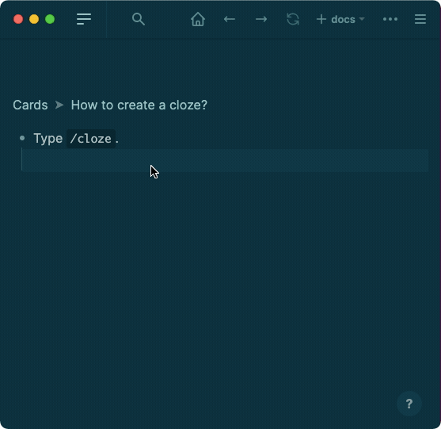

type:: [[Command]]
description:: Creates collapsible content that is not shown by default. Usually used with [[Flashcards]]

- ## Usage
	- Type `/cloze`.
		- {:height 538, :width 485}
- ## Functionality
	- For example, {{cloze something}}, you can click it to reveal its content. You can have multiple {{cloze clozes}} in a block too.