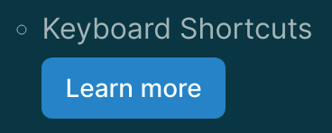

-
  > People come to Logseq from different operating systems, use different keyboard layouts and languages, and have different preferences. Customizable keyboard shortcuts is the only way to make everybody happy. - [[Cobblebot]] [discussion](https://discuss.logseq.com/t/customizable-keyboard-shortcuts/146)
- **How to setup custom keyboard shortcuts?**
  To add custom shortcuts, you can add/modify the `:shortcuts` section in [[config.edn]], for example, then restart Logseq.
  #+BEGIN_EXAMPLE
  :shortcuts {:ui/toggle-theme "mod+c mod+t"}
  #+END_EXAMPLE
- **Which shortcuts could be customized?**
  The default shortcuts are [here](https://github.com/logseq/logseq/blob/master/src/main/frontend/modules/shortcut/config.cljs)
  Click `Learn more` of the help page to see full list of shortcuts by categories.
  
- Syntax:
	- `+` means keys pressing simultaneously eg: `ctrl+shift+a`
	- ` ` empty space between keys means key chords
		- eg: `t t`
		- eg: `mod+c mod+t`
	- `mod` means
		- `ctrl` for Linux and Windows
		- `cmd` for Macos
	- you can define multiple bindings for one action
		- eg: `:editor/down ["ctrl+j" "down"]`
- Example of a vim-like shortcut setup:
	-
	  ``` clojure
	  :shortcuts
	   {:editor/new-block "enter"
	   :editor/new-line "shift+enter"
	   ;; remap insert-link to something else to avoid conflicts
	   :editor/insert-link "ctrl+shift+k"
	   :editor/up ["ctrl+k" "up"]
	   :editor/down ["ctrl+j" "down"]
	   :editor/left ["ctrl+h" "left"]
	   :editor/right ["ctrl+l" "right"]
	   :editor/open-edit ["i" "enter"]
	   :editor/backspace ["ctrl+d" "backspace"] 
	   :date-picker/complete ["enter"]
	   :date-picker/prev-day ["ctrl+h" "left"]
	   :date-picker/next-day ["ctrl+l" "right"]
	   :date-picker/prev-week ["ctrl+k" "up"]
	   :date-picker/next-week ["ctrl+j" "down"] 
	   :auto-complete/prev ["ctrl+k" "up"]
	   :auto-complete/next ["ctrl+j" "down"]
	   :auto-complete/complete ["ctrl+l" "enter"]}
	  ```