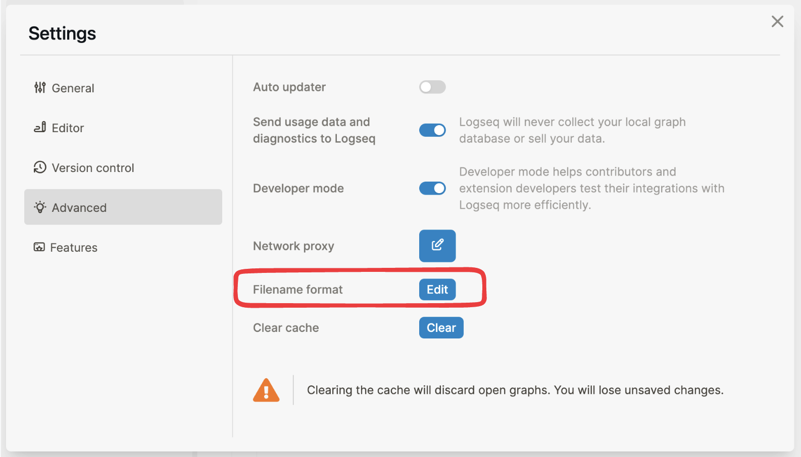
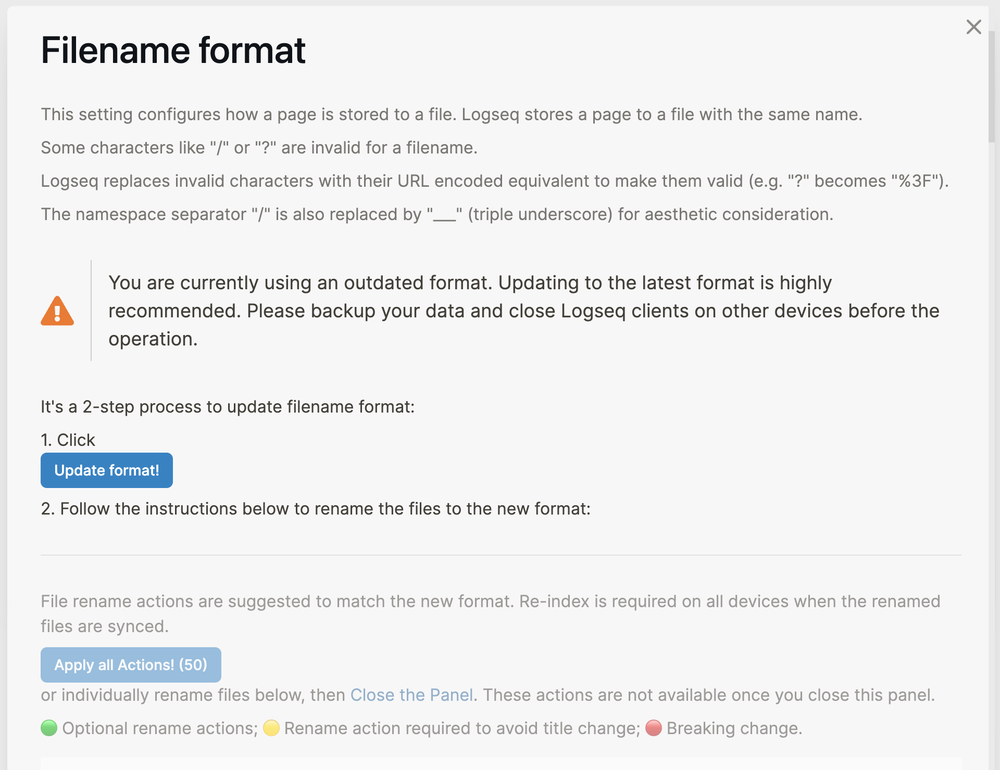

type:: [[Feature]]
platform:: [[Desktop]]
description:: Allow users to migrate the filenames to the latest format
initial-version:: 0.8.9

- ## Usage
  id:: 634fae2e-edab-42e0-8385-59df3fc3da0e
	- You may find the `Filename format` setting since Logseq `0.8.9`
		- 
	- This setting configures how a page is stored to a file
		- Only upgrade to the latest format is available, unless [[Developer mode]] is enabled (downgrade is not encouraged).
	- To change the config, click the `Edit` button and follow the instructions in the pop-up `Filename format` panel to convert your files.
		- #+BEGIN_WARNING
		  **Backup** all your notes somewhere else **first** before continue 
		  #+END_WARNING
		  #+BEGIN_IMPORTANT
		  There's a **point of no-return** by clicking the button `Update format`. Preview the required changes towards the existing filenames beforehand
		  #+END_IMPORTANT
		- 
		- Also refer: ((634fb104-f332-4743-904a-4827ee754bfc))
## Functionality
	- **What is a `Filename format`?**
		- In Logseq, every page is stored as an individual file on your computer, which use the page title as the name of the file.
		- However, while some special characters like `/` and `?` are common for page titles, they are invalid for filename on some operating systems. Hence, we need a way to encode these special characters into filenames and decode them back to page titles, what we call `filename format`.
		- The previous `filename format` Logseq used to treat page titles is `:legacy`. Since `0.8.9`, Logseq introduces `:triple-lowbar` as the new `filename format` with better readability, better compatibility and less ambiguity.
	- **FIlename format explain**
		- `:legacy`
		  id:: 634fb9a8-cab9-441e-b476-41fa828010ea
			- Use Percent-encoding for `/` and other invalid characters
			- For some earlier versions of Logseq, use `.` to encode `/` instead of Percent-encoding (`%2F`); use `_` to encode special characters
			- Decode `.` in file name as slash `/` in page title for backward compatibility
			- Add `title::` properties ([[custom page title]]) to pages with encoded characters to avoid ambiguity
		- `:triple-lowbar`
		  id:: 634fb9b1-7a77-4666-9235-bc5cf27c8fd4
			- Use triple underscore `___` for slash `/` in page title, for better readability
			- Use Percent-encoding for other invalid characters
			- No more `title::` property required (you can still use `title::` property [manually]([[custom page title]]))
	- **Where is the `Filename format` config stored?**
	  id:: 634fb3ee-cef0-4081-9085-c002d3be4e75
		- `Filename format` is a per-graph setting. It is stored in [[config.edn]], with key `:file/name-format`, for example:
			- ```clojure
			  :file/name-format :legacy
			  ```
			- #+BEGIN_WARNING
			  Changing the option from `config.edn` is not recommended. Should access the setting `Filename format` and follow the instructions 
			  #+END_WARNING
		- There are two available values, `:legacy` and `:triple-lowbar`
			- The default value for new graphs created since `0.8.9` is `:triple-lowbar`
			- If your `config.edn` has no such key provided (e.g., comes from an earlier version of Logseq), the default value will be `:legacy`
	- **How does the conversion work?**
	  id:: 634fb104-f332-4743-904a-4827ee754bfc
		- Basically it's to update the `filename format` of your graph from the [`:legacy` filename format](((634fb9a8-cab9-441e-b476-41fa828010ea))) to the beautiful new [`:triple-lowbar` filename format](((634fb9b1-7a77-4666-9235-bc5cf27c8fd4)))
		- #+BEGIN_WARNING
		  **Backup** all your notes somewhere else **first** before continue 
		  #+END_WARNING
		  #+BEGIN_IMPORTANT
		  There's a **point of no-return** by clicking the button `Update format`. Preview the required changes towards the existing filenames beforehand
		  #+END_IMPORTANT
		- By click-in the `Filename format` panel from settings, you may find the `Update format` button, and preview the required renaming actions on switching to the new format.
			- Once you click the button, the `Filename format` setting of the current graph would be updated. Logseq will treat the graph with the new `filename format` after you leave the panel. So this is a **point of no return**
			- Also refer ((634fb3ee-cef0-4081-9085-c002d3be4e75))
		- After you clicked the `Update format`, the previously previewed renaming actions will be available.
			- 
			- May rename all the listed file via button `Apply all Actions!`, or rename files individually via clicking the `Rename` buttons on the right hand side.
			- For the meaning of the 🟢 🟡 🔴 indicators of the listed files, please refer ((634fe449-cecc-4b82-9cb5-3bbb01fd7d98))
	- **Rename Indicators Explain**
	  id:: 634fe449-cecc-4b82-9cb5-3bbb01fd7d98
		- 🟢 means the renaming is **optional**
			- The page name **won't be changed** in the new format without operation, but rename the file to follow the new format is suggested.
			- Mostly happens when the page contains a `title::` property that created under the [`:legacy` filename format](((634fb9a8-cab9-441e-b476-41fa828010ea))), renaming will improve the readability of the filename
			- Pages with manually edited `title::` property ([[custom page title]]) **will not be listed**.
		- 🟡 means the renaming is **required**
		  id:: 634fd550-3ce9-4c5c-88e0-37d45007d6c8
			- The page name **will be changed** in the new format without operation, unless rename the file according to the new filename format.
			- Mostly happens when the filename contains characters like `/`, `?`, `!`, `_`, `.` under the [`:legacy` filename format](((634fb9a8-cab9-441e-b476-41fa828010ea))), and no `title::` property provided in the corresponding page
				- may caused by manual deletion, or the file is imported externally
		- 🔴 means breaking change happens without available renaming
			- This is an uncommon case for updating filename format (from `:legacy` to `:triple-lowbar`)
- ## FQA
	- **Is the filename conversion mandated?**
		- No. You can keep using the old `:legacy` format. But the new `:triple-lowbar` format provides you:
			- More readable filenames (especially, no more `%2F` in filename for namespace pages).
				- **Example**: For page `Logseq/Features`, the corresponding filename will be changed from `Logseq%2FFeatures.md` to `Logseq___Features.md`
			- No more [auto-generated](((634faa53-1294-4fc8-8343-e2edc39eb755))) `title::` property required
	- **Why some of the files are not listed in the `Filename format` panel**
		- Please confirm the current `Filename format` setting of your graph via ((634fb3ee-cef0-4081-9085-c002d3be4e75)).
		- If your current format is `:triple-lowbar`, mostly happens when you clicked `update format` then close the modal without renaming the files.
			- May recover the backup-ed graph and [redo the conversion](((634fb104-f332-4743-904a-4827ee754bfc)))
		- Otherwise, if your current format is `:legacy`, and some of the files with special characters are not listed, most likely they have [[custom page title]] setup which are not generated automatically under [`:legacy` filename format](((634fb9a8-cab9-441e-b476-41fa828010ea))).
	- **Why some of the listed renaming actions are not expected**
		- Very likely the listed pages belongs to [this case](((634fd550-3ce9-4c5c-88e0-37d45007d6c8))). The rename actions are inferred based on the `:legacy` filename format, which might come to unwanted result if no `title::` property provided.
		- May skip these actions when happens.