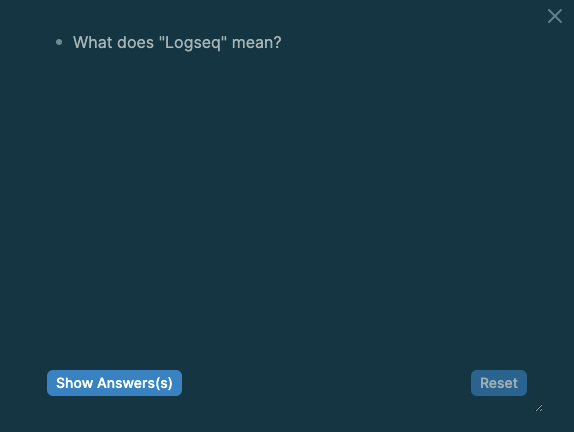
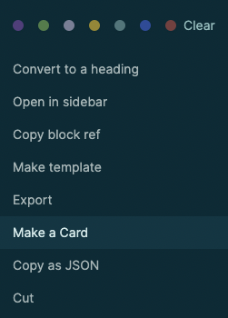

type:: [[Feature]]
platform:: [[All Platforms]]
tags:: #Academic

- ## What's a "card"?
  collapsed:: true
	- A card is intended to be used as an aid in memorization. In logseq, it's just a block with either `#card` or `[[card]]`. It can have some [[Clozes]] too.
		- For example, this block is a card:
			- What does "Logseq" mean? #card
			  card-last-interval:: 28.3
			  card-repeats:: 4
			  card-ease-factor:: 2.66
			  card-next-schedule:: 2021-11-08T17:59:40.382Z
			  card-last-reviewed:: 2021-10-11T10:59:40.382Z
			  card-last-score:: 5
				- You can read it as "Log sequence" or "Logical sequence" (thank you [[Ed]]).
			- If you right click the bullet and select "Preview Card", you'll see something like this:
				- 
## How to create a card?
collapsed:: true
	- There're two ways to create a card.
		- 1. You can add either `#card` or `[[card]]` to any block to make it a card.
		- 2. You can right click the bullet to "Make a card", which will add `#card` to the end of the current block.
			- 
## I've created several cards, how can I review all of my cards?
collapsed:: true
	- Click the "Flashcards" tab on the [[Left sidebar]].
## Can I review parts of my cards instead of all of them? For example, only those cards related to Logseq?
collapsed:: true
	- Yes, you can use `/cards` and [[Queries]].
	- `{{cards [[Logseq]]}}` will be displayed as:
	  
	  {{cards [[Logseq]]}}
	- You can also show all cards _except_ those tagged with a certain page. `{{cards (not [[Logseq]])}}` will be displayed as:
	  
	  {{cards (not [[Logseq]]) }}
## TIPs
collapsed:: true
	- Press `t c` (toggle cards) to review all of your cards
	- You can add your "cards" queries to the "Favorites" page in the right sidebar for quick access.
- [[Resources]]
	- [Augmenting Long-term Memory](http://augmentingcognition.com/ltm.html)
	- [SM5](https://www.supermemo.com/en/archives1990-2015/english/ol/sm5) by supermemo
- TODO Organize this page #docs
	- Maybe split out tutorial. Add Tienson's latest functionality
	- srs.edn