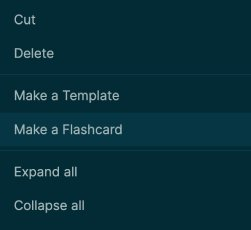

type:: [[Feature]]
platforms:: [[All Platforms]]
tags:: #Academic
description:: Cards are blocks that are intended to be used as an aid in memorization

- ## Usage
	- To create a card:
		- You can add either `#card` or `[[card]]` to any block to make it a card.
		  logseq.order-list-type:: number
		- You can right click the bullet to "Make a Flashcard", which will add `#card` to the end of the current block.
		  logseq.order-list-type:: number
			- 
	- To review all cards, click the "Flashcards" tab on the [[Left sidebar]] or press `t c` (toggle cards) to review all of your cards
	- To review some of your cards e.g. only those related to Logseq:
		- Use `/cards` and [[Queries]]. - `{{cards [[Logseq]]}}` will be displayed as:
		  
		  {{cards [[Logseq]]}}
		- You can also show all cards _except_ those tagged with a certain page. `{{cards (not [[Logseq]])}}` will be displayed as:
		  
		  {{cards (not [[Logseq]]) }}
		- You can add your cards queries to the "Contents" page in the right sidebar for quick access.
- ## Functionality
	- ### What's a "card"?
		- It's just a block with either `#card` or `[[card]]`. It can have some [[Clozes]] too.
			- For example, this block is a card:
				- What does "Logseq" mean? #card
				  card-last-interval:: 28.3
				  card-repeats:: 4
				  card-ease-factor:: 2.66
				  card-next-schedule:: 2021-11-08T17:59:40.382Z
				  card-last-reviewed:: 2021-10-11T10:59:40.382Z
				  card-last-score:: 5
					- You can read it as "Log sequence" or "Logical sequence" (thank you [[Ed]]).
				- If you right click the bullet and select "Preview Card", you'll see something like this:
					- 
		- To review a queryable set of cards, the `/cards` command is provided
		  collapsed:: true
			- type:: [[Command]]
			  name:: Cards
			  description:: A [[Query]] that returns cards that meet the query criteria
- ## Additional Links
	- [Augmenting Long-term Memory](http://augmentingcognition.com/ltm.html)
	- [SM5](https://www.supermemo.com/en/archives1990-2015/english/ol/sm5) by supermemo
- TODO Finish this page #docs
	- Add Tienson's latest functionality
	- srs.edn