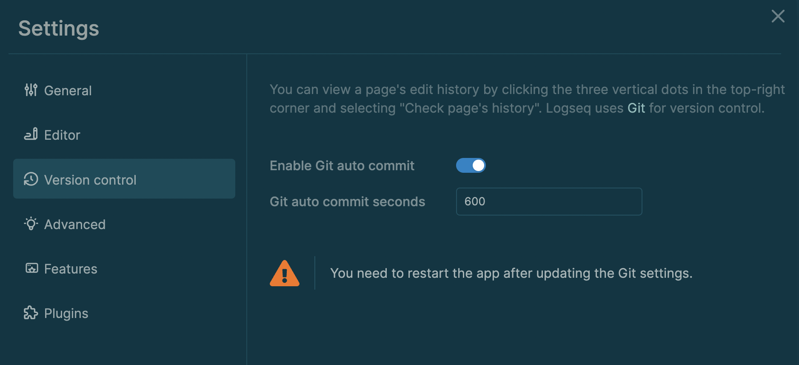

type:: [[Feature]]
platform:: [[Desktop]]
description:: Automatically save commit changes to a git repository.

- You can make Logseq save changes to a git repository at a specified interval.
	- 
	- When auto-commit is enabled, each graph's directory will be made into a git repository (if it's not already).
	- Logseq will commit changes at the specified interval of time.
		- Valid intervals are 1 - 600 seconds.