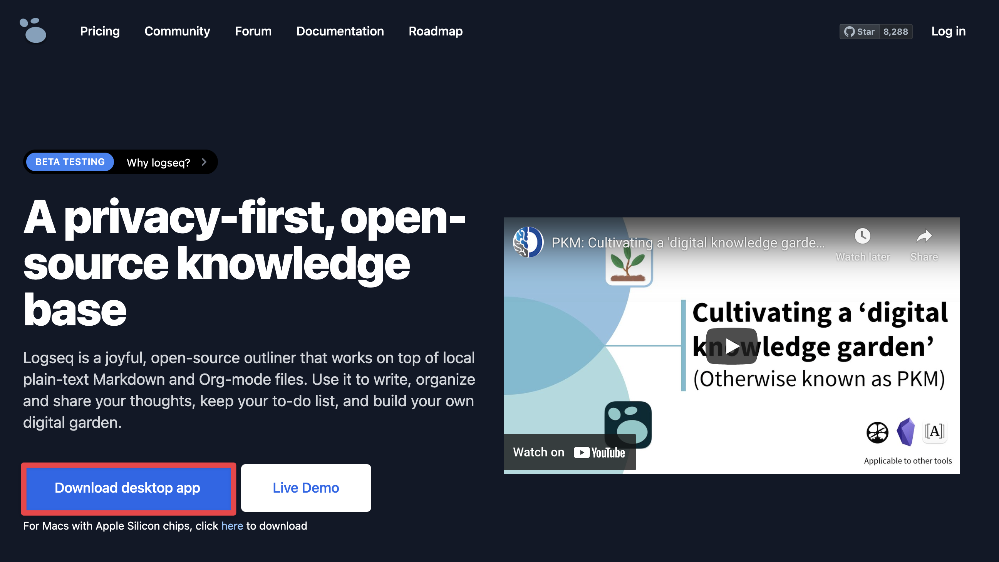
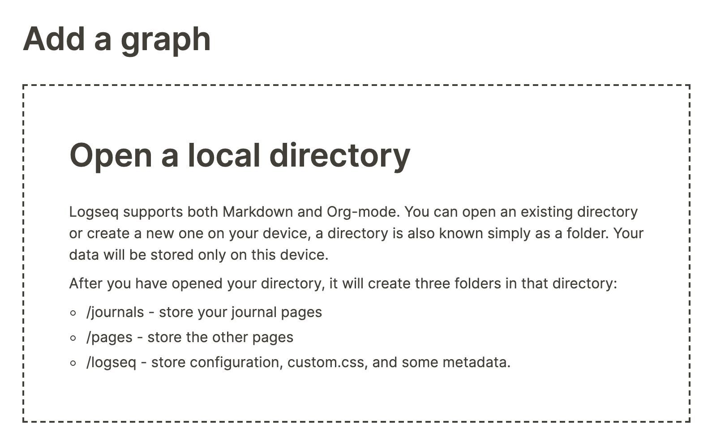

- Before we get started, it's first necessary you have the Logseq desktop app installed. While it's possible to use Logseq in a browser, we recommend the desktop app for a variety of reasons—speed being the main one. In the rest of this guide we'll assume you're using the app.
- To install the Logseq desktop app, head over to Logseq.com and click the blue button that says Download desktop app:
	- 
- The site will automatically determine what Operating System you're using and download the appropriate installation file.
- After you've downloaded the installation file, install it as you would do any other app. Once that's done, start Logseq.
- Opening Logseq for the first time, you'll see the following screen telling you to open a local directory:
	- 
- If you already have Markdown files you wish to use, look at the next section titled [[How to create a Logseq graph using existing Markdown files]].
- For now, let's assume you'll start a new graph. Select a folder where you wish to store everything you do in Logseq. Once done, Logseq will open a page with today's date; the Journals page. We'll get back to this special type of page later.
- Keep in mind that Logseq does not synchronize your data; it'll be only stored on your local machine. In case you want an extra safeguard for your data, you can create your graph in a folder that's synced via services like Dropbox or Google Drive. You can read more about this in the section [[How to sync your Logseq graph across devices]].
- Now you're ready for the fun part! If you've created a fresh graph, continue with the section [[Getting started with the Journals page]].