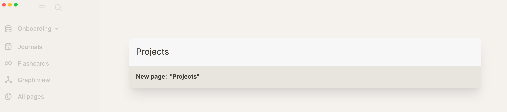

- As noted in the introduction, Logseq is a networked thinking tool. Because Logseq lacks a hierarchical structure like folders, you may find organizing your notes confusing at first. After all, how are you going to find back what you put into this app? That's where links enter.
- Links are entry points into your web of notes. What makes Logseq unique is that you can also point to individual paragraphs (blocks) instead of pages. In fact, pages are nothing more than a collection of blocks (paragraphs). Whereas most note-taking tools make linking to other notes a hassle, Logseq has a keyboard-first approach.
- Let's first look at how to create and link pages before diving into linking blocks in the next lesson.
- ## How to link to pages in Logseq
	- Creating links to pages is simple in Logseq; you just type them! No need to use your mouse, create a page, and then point to it. If you link to a page that doesn't exist yet, Logseq creates it for you.
	- There are two main ways to link to a page:
		- `[[Brackets]]`
			- Logseq uses wiki-style links, which means that you can type double opening brackets to create a link (`[[` — Logseq will autocomplete the closing brackets):
				- 
			- When a page doesn't exist yet, typing the link will create the page with that name. If the page already exists, you can select it from the dropdown menu that appears by typing the name.
		- `#Hashtags`
			- Another way to type links in Logseq is to use the hashtag symbol (`#`):
				- 
			- The difference between bracket links and hashtags is purely cosmetic as they function the same. However, many people use them in different situations; brackets are often used for inline links, whereas hashtags are often used for metadata.
			- Hashtags can only contain one word, otherwise you need to `#[[wrap them between brackets]]`.
	-
- ## How to create pages with the search bar (without linking)
	- For completeness, let's also have a look at how to create pages using the search bar, although we don't recommend it (see the next page on bidirectional linking for why).
	- To create a page using the search bar, start typing a page name in it (use the `Cmd-k` (macOS)/`Ctrl-k` (Windows) shortcut to focus the cursor on the search bar without using your mouse). Then, select the option that starts with `New Page:` to create the page and open it:
		- 
- These are the ways to create pages in Logseq. We recommend creating pages using links, as this will ensure an entry point to them. Nothing is worse than having no links in a networked note-taking tool, so default to linking pages.
	-