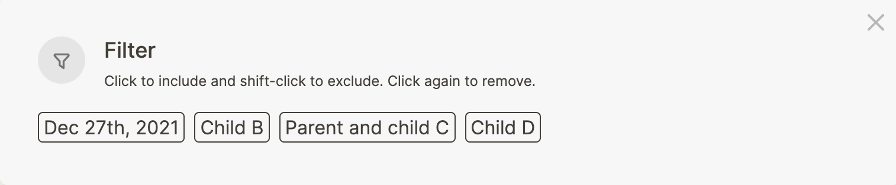

- In the previous lessons, we looked at why links and indentation matter to retrieve information. But as your Logseq graph grows, you might want to see less information so you're left with what's relevant. That's where filters come in.
- Logseq filters can be found next to linked references, recognizable by the funnel symbol. When you click the filter button, you see the following pop-up. The shown values are any links (using brackets or hashtags) that are are in the linked references:
	- 
- By clicking a filter value, you include it, meaning that only the block with the value you selected will _show_ on the page. When you `Shift-Click` a filter value, you _exclude_ it from the page, meaning that any block that contains that value is _hidden_.
- Logseq will remember what filters you've set; whenever you return to the page, the filter is still applied.
- You can recognize an active filter by it's color; when the filter is set to _include_ links it'll turn green:
	- 
- When a filter is set to _exclude_ links, it'll turn red:
	- 
- Filters are handy for easy access to specific values. But if you want to easily access frequently used pages from anywhere in your graph, it's best to add them to your favorites. In the next lesson we'll see how to add them to the left-hand sidebar.