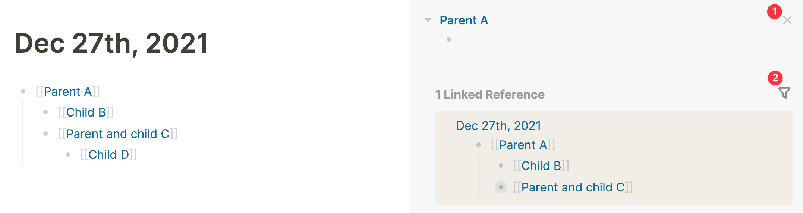
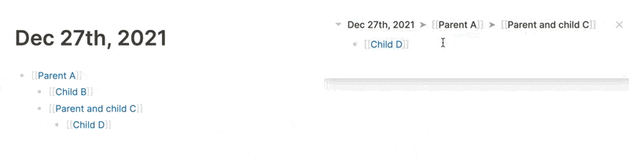

- By default, the sidebar on the right is hidden. With the keyboard shortcut `t r` you open it. But, you can't write in the sidebar nor drag blocks to it in this state, so what's the use?
- In the right-hand sidebar, you can open (branches of) blocks, pages, and references. Any internal link can be opened in the sidebar by holding the `Shift` key when clicking the link with your left mouse button (this also works to open a result from the search bar in the sidebar):
	- 
- Here, I `Shift-Click`'ed  on the **Parent A** link, opening it in the sidebar. In this case, the page is empty so we only see a bullet without text. However, from the sidebar we can start typing directly on the page or drag blocks onto it from the main window.
- Furthermore, we get the option to close the page in the sidebar (1) and to filter the linked references (2).
- To open a _block_ in the sidebar, `Shift-Click` on a bullet. You can easily add child blocks to the opened block by placing your cursor in it and hitting `Enter`:
	- 
- And those are the basics of Logseq's right-hand sidebar! Many use it to have several sources of information open at once or to drag blocks between pages and branches.