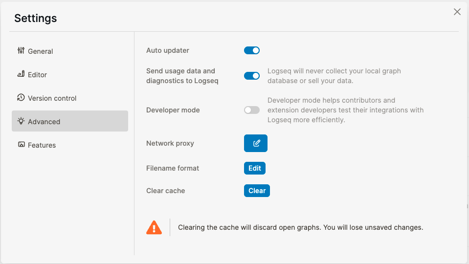
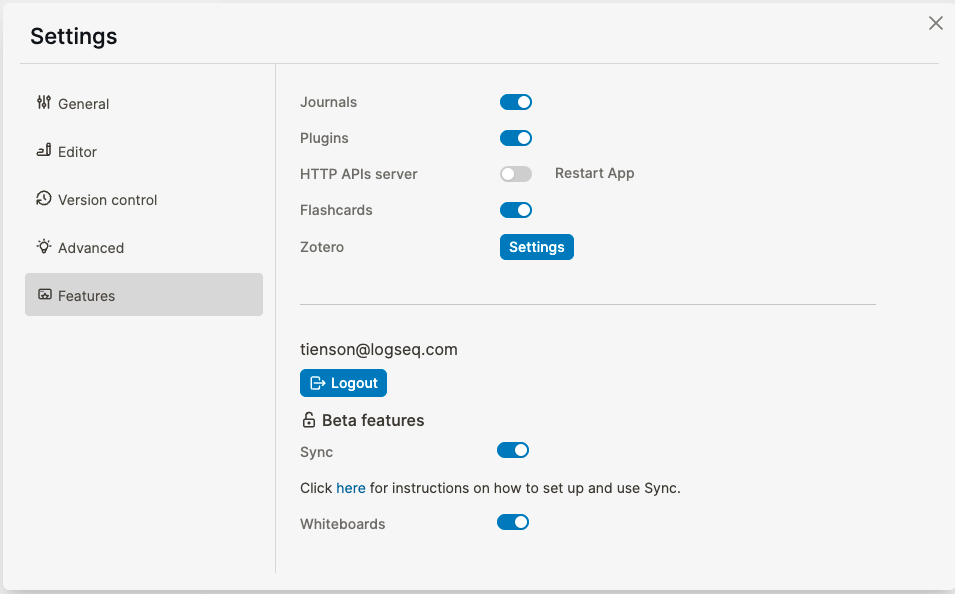
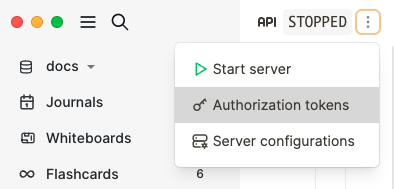
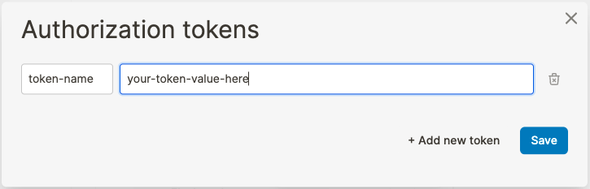

type:: [[Feature]]
platforms:: [[Desktop]]
description:: local HTTP server to access logseq's graph
initial-version:: 0.8.15
title:: Local Http server

## Background
	- Regardless of the appearance of Logseq, the essential part is always a graph database. Many users use Logseq as an all-in-one tool, but we know there are better and more efficient tools in some scenarios. Hence, as a first step, we developed the local HTTP server to support external access to the database through authorization.
## Usage
	- 1. Enable [[Developer mode]] in `Settings > Advanced > Developer mode`
		- 
	- 2. Enable HTTP APIs server in `Features > HTTP APIs server`
		- 
	- 3. Restart Logseq
	- 4. Add an authorization access your API. Only the `your-token-value-here` is used in an API request.
		- 
		- 
	- 5. Start the HTTP server
		- 
	- 6. Okay! Let's give it a try!
		- By default, api documentation is available at http://127.0.0.1:12315/.
		- Examples:
			- Insert a new block to the page `Test page` (you need to create the page in Logseq if it doesn't exist yet):
				- ```
				  curl -X POST http://127.0.0.1:12315/api \
				  -H "Authorization: Bearer {replace with your-token-value-here}" \
				  -H "Content-Type: application/json" \
				  -d '{"method": "logseq.Editor.insertBlock", "args": ["Test page", "This is a new block", {"isPageBlock": true}]}'
				  ```
				- Result:
				  
				  ``` shell
				  {"properties":{},"unordered":true,"tags":[],"pathRefs":[],"uuid":"63b004bf-e5c3-4816-a722-8fdff330f666","content":"This is a new block","journal?":false,"macros":[],"page":126,"format":"markdown","refs":[]}
				  ```
			- Query `TODO`s
				- ``` 
				  curl -X POST http://127.0.0.1:12315/api \
				  -H "Authorization: Bearer {replace with your-token-value-here}" \
				  -H "Content-Type: application/json" \
				  -d '{"method": "logseq.db.q", "args": ["(task TODO)"]}'
				  ```
				- Result:
				  
				  ```clojure
				  [{"parent":{"id":4096},"id":4101,"pathRefs":[{"id":4},{"id":487},{"id":665}],"uuid":"63afdd4f-a6eb-449c-9f47-85ef3fdf80e5","content":"TODO Fill out feature's functionality #docs","marker":"TODO","page":{"name":"knowledge graph","originalName":"Knowledge Graph","id":487},"left":{"id":4096},"format":"markdown","refs":[{"id":4},{"id":665}]},{"parent":{"id":3876},"id":4530,"pathRefs":[{"id":4},{"id":665},{"id":3876}],"uuid":"63afdd50-a458-42b1-87e5-fdc3a8391a02","content":"TODO More specific name for this feature #docs","marker":"TODO","page":{"name":"search","originalName":"Search","id":3876},"left":{"id":4520},"format":"markdown","refs":[{"id":4},{"id":665}]},{"parent":{"id":331},"id":3793,"pathRefs":[{"id":4},{"id":331},{"id":665}],"uuid":"63afdd4f-5b99-4143-80b7-c17f04d95d84","content":"TODO Go through this miscellaneous list of pages to create or revamp #docs","marker":"TODO","page":{"name":"features","originalName":"Features","id":331},"left":{"id":331},"format":"markdown","refs":[{"id":4},{"id":665}]}]
				  ```
	- That's it! 🎉
	  Hope you like it!
- ## Functionality
	- POST `/api` - `method` can be any of the ones listed in https://plugins-doc.logseq.com/. `args` is an array of arguments to pass to method.
	- Supports CORS for use from another web page or a browser extension.
## Additional Links
	- Logseq plugins API docs [https://plugins-doc.logseq.com](https://plugins-doc.logseq.com/)
	- Logseq [[Queries]] to check more query usage.