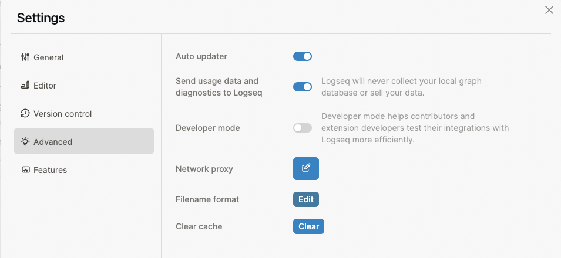

type:: [[Feature]]
platform:: [[All Platforms]] except [[Web]]
description:: Provides encrypted synchronization of graphs between devices.

- #+BEGIN_NOTE
  This feature is in BETA.
  #+END_NOTE
- ## Usage
	- See [this tutorial](https://blog.logseq.com/how-to-setup-and-use-logseq-sync/) for setting up and using sync.
	- **Do not** use this feature with any other third party sync service like iCloud, Syncthing, or Dropbox.
- ## Functionality
	- Syncing is a choice that is made per graph and thus allows for some graphs to be local only.
	- Each graph is encrypted with a password.
	- Sync automatically happens in the background. Click on the cloud icon and the `Sync now` button to force a sync.
- ## FAQ
	- **Question**: Can I use Sync with git?
		- This isn't recommend unless you are pretty familiar with git. If you have auto-commit enabled you are likely to run into issues. `logseq/graphs-txid.edn` should not be checked into git.
	- **Question:** Can I use Sync with other users?
		- This isn't supported yet.
	- **Question:** Are my notes encrypted?
		- Yes, your graph is end-to-end encrypted.
		- All the files, including the assets such as pictures, videos, and PDFs, are encrypted using the [age](https://age-encryption.org/) encryption.
	- **Question:** Are file names and paths encrypted?
		- Yes.
	- **Questions:** Some files couldn't be downloaded to my device, what should I do?
		- Firstly, make sure you're using the latest release.
		- Usually, it's because each operating system has its file and folder name limitations. You can check [[Logseq file and folder naming rules]] to get more details. We suggest you upgrade the filename format first, you can do it in `Settings` -> `Advanced` -> `Filename format` -> `Edit` and follow the instructions in the popup.
			- 
			-