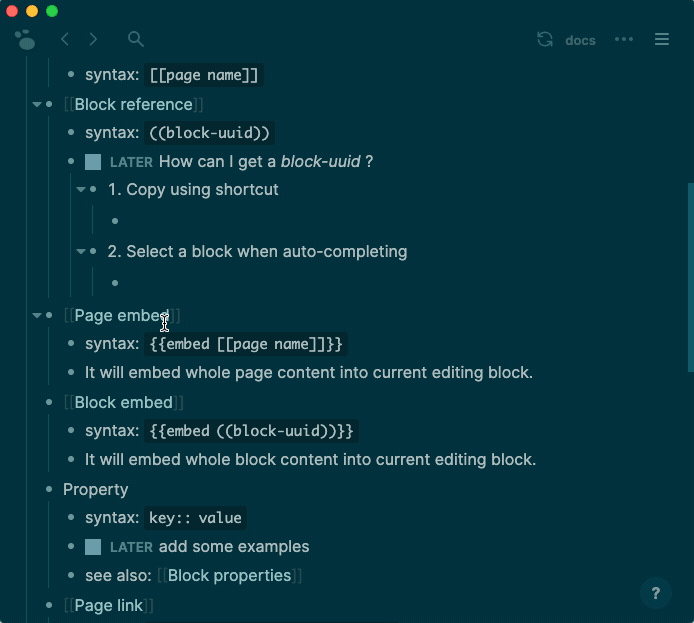
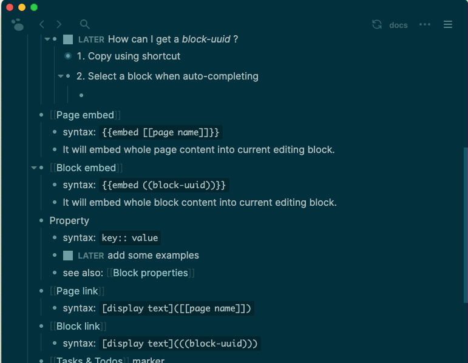

- Logseq support most [[Markdown]] syntaxes, and includes some extended syntaxes.
### **Standard** syntax
	- what's logseq? #card
	  card-last-interval:: 28.3
	  card-repeats:: 4
	  card-ease-factor:: 2.66
	  card-next-schedule:: 2021-11-08T19:18:29.363Z
	  card-last-reviewed:: 2021-10-11T12:18:29.363Z
	  card-last-score:: 5
		- knowledge base
	- `**Bold**`   -> **Bold**
	- `_Italics_ ` -> _Italics_
	- `~~Strikethrough~~` -> ~~Strikethrough~~
	- `^^Highlight^^` -> ^^Highlight^^
	-
	  [:div [:code  "`Code`"]  "-> " [:code "Code"]]
	- `[label](https://example.com)` -> [label](https://example.com)
	  id:: 60ab7486-8119-4c9a-888c-1e6213fd28e0
	- `` -> {:height 53, :width 42}
	  id:: 60aba887-96f4-461f-a9f0-d205d766d78b
	- and so on...
### **Extended** syntax
id:: 60a78b6b-a0ff-49fe-822f-87216fbf79ff
	- [[term/page link]]
	  id:: 60ab4582-5a6e-4f3a-84a2-71ae056455a0
		- syntax: `[[page name]]`
		  id:: 60a78b6b-688c-4ced-9104-60784597daf9
	- [[term/block link]]
	  id:: 60ab3eb7-c1e8-47ad-8a18-770896a10c5c
		- syntax: `((block-uuid))`
		- How can I get a _block-uuid_ ?
		  done:: 1621594005775
		  now:: 1621585437721
		  later:: 1621585438918
		  id:: 60a78b6b-b74f-4496-a7b7-dc0d454ca4f3
			- Copy a block-reference using shortcut
			  collapsed:: true
				- {:height 354, :width 437}
			- Select a block when auto-completing
			  collapsed:: true
				- {:height 352, :width 442}
	- [[term/embedded page]]
	  id:: 60ab3eb7-2fb1-4148-af2b-9ba2319ef5b6
		- syntax: `{{embed [[page name]]}}`
		- It will embed whole page content into current editing block.
		  id:: 60a78b6b-b43d-4328-a1dc-934f0d3dbff7
	- [[term/embedded block]]
	  id:: 60ab3eb7-5a6b-4e6a-90e0-80dd11e47c48
		- syntax: `{{embed ((block-uuid))}}`
		- It will embed whole block content into current editing block.
		  id:: 60a78b6b-70c6-4209-bb26-045395458a04
	- [[term/properties]]
		- syntax: `property:: value`
		  id:: 60ab6f5b-4bdc-4ef0-a0f8-6cad9dcad2b2
		- some examples
			- [[Templates]] related properties
			  id:: 60aca587-77bd-4d4e-afcd-c475b52cb754
				-
				  [:code "template:: template-name"]
				-
				  [:code "including-parent:: false"]
				- {{embed ((60a790f8-d187-499a-b2e2-73bf137356dd))}}
		- see also: [[Block properties]]
	- [[term/page link with label]]
		- syntax: `[display text]([[page name]])`
		  id:: 60ab6d72-e70c-4eb4-a60a-3802f12874c4
	- [[term/block link with label]]
		- syntax: `[display text](((block-uuid)))`
		  id:: 60ab6f5b-a01f-44eb-8d4a-fb8ca1893dcf
	- [[Tasks & Todos]] marker
		- syntax: `TODO` `DOING` `DONE` `LATER` `NOW`
		- These markers can be set with commands(`/TODO`) 
		  or shortcut(default `ctrl/cmd+enter`)
	- Priority
	  id:: 60ab4582-b191-496a-be39-0a865f9ecece
		- syntax: `[#A]` `[#B]` `[#C]`
		- Priorities can be set with commands(`/A`, `/B`, `/C`)
		  id:: 60ac5b08-d4bb-49de-b415-e63fcf29c59f
	- [[Hiccup]]
	  id:: 60ab5bc7-f196-4f87-91aa-164ac71184ed
		- Sometimes you want to express more complex text structure, you can embed Hiccup in blocks.
		- example
			- `[:p "Hello " [:em "World!"]]`
			  ->[:p "Hello " [:em "World!"]]
		- [Hiccup syntax here](https://github.com/weavejester/hiccup/wiki/Syntax)
	- inline latex
	  id:: 60ab5bc7-f08f-4e7d-a293-add673533700
		- `$$E = mc^2$$` -> $$E = mc^2$$