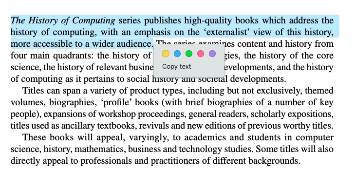
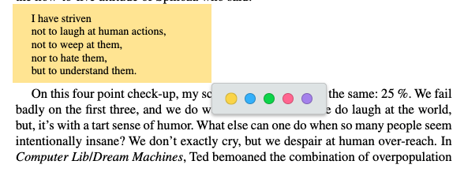
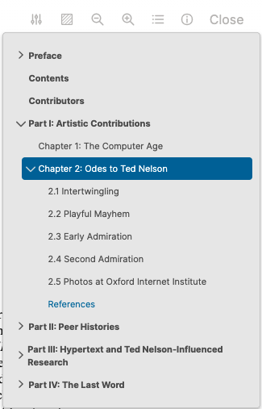

-
  #+BEGIN_NOTE
  This only works on the desktop app at the moment.
  #+END_NOTE
- **How to add a PDF file?**
	- There're two ways to add PDF files to your graph:
		-
		  1. Create a new block in any page, drag your PDF file to the new block.
		-
		  2. Type '/upload an asset' and choose your PDF file.
- **How to highlight text?**
	- Click to select some text and choose your favorite color.
		- 
	- Paste (`Cmd/Ctrl + v`) your highlighted reference to any block if you need.
- **How to highlight area?**
	- Press either `Cmd` or `Alt`, click to select an area and choose your favorite color.
		- 
	- Paste (`Cmd/Ctrl + v`) your highlighted reference to any block if you need.
- **Do you have a dark theme for the PDF viewer?**
	- Yes, there're **three** themes.
- **Do you support outline?**
	- Yes.
	  {:height 563, :width 325}