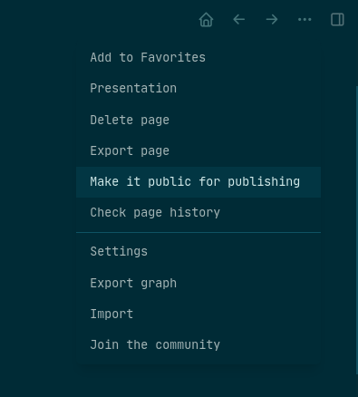
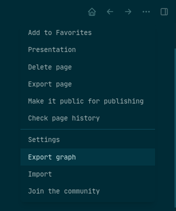

- To provide the best publishing experience, Logseq at this moment only supports publishing on the desktop app.
- How to publish?
	- 1. Click the page titles that you wish to publish, select "Make it public for publishing" in the right pop-up menu. You can also choose to make all the pages public by adding `:all-pages-public? true` to `logseq/config.edn`.
		- {:height 440, :width 396}
	-
	  2. Click the top-right three-dots and select `Export graph`. Then select a folder, and Logseq will export all the files needed for publishing there.
		- 
		-
	- 3. The exported assets basically make up a web application, when runs Logseq with your public pages, in read-only mode. After exporting, if you are on Linux-like environment, you can `cd` into the export folder and run `python -m SimpleHTTPServer`. Voilà, you can now visit the published graph at localhost:8000 in your browser.
	- 4. Of course publishing your beautiful graph on localhost only is not that fun. Since we have all the assets now, publish them on platforms like Github Pages and Vercel is straightforward. Below is a video tutorial on how to publish Logseq pages to Github Pages.
		- {{youtube https://www.youtube.com/watch?v=nf9MyWRratI}}
	- Here're some links might be useful:
		- 1. https://docs.github.com/en/github/working-with-github-pages/creating-a-github-pages-site
		- 2. https://vercel.com/docs