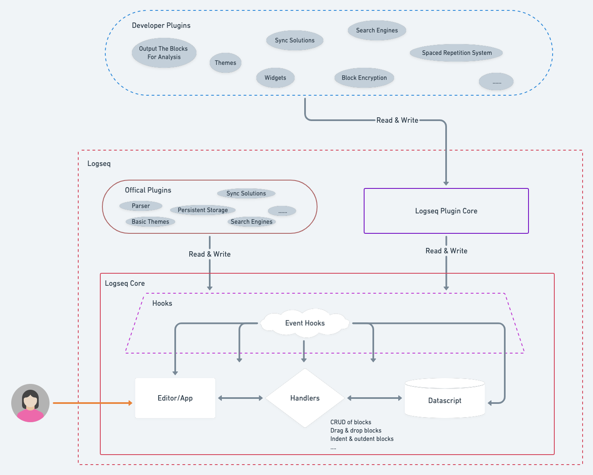

- We have been worked the refactoring of Logseq since about two months ago. Below I am going to talk bit about it.
- Why does Logseq need refactoring?
  
  Logseq was a side project for providing outliner features on org-mode and markdown files by @tiensonqin. Since it was released, many people like it a lot.  With the needs grew,  @Tiensonqin add many new features with happiness .  Compared to other outliner note-taking apps, Logseq has a lot of manipulation around files, characters, and bytes. It led to that codebase quickly grew into such situation -- many functions operate directly on raw string, as the design was easy to implement. With the increasing features, we encountered our problems.
  
  Most operations are around strings and their positions. When you create, update, delete a block, Logseq had to calculate the start-and-end positions, levels and updating the following blocks' positions and levels. In the beginning, we could make it correct by being careful. However, the software complexity grows incredibly fast. When we indent or outdent the blocks in batches,  drag a block tree, drop it into another position, or undo and redo the previous operations,  we still had to calculate the block's position and level, same as the children blocks' and the following blocks'. Even worse, we need to deal with Unicode characters, like CJK characters, which may occupy 3 or 4 bytes and hardly be calculated right at sometimes. Calculation based on raw strings was the main problem at that time.
  
  With the daily growth complexity, some other problems also need to solve, or these things will be another technical debt. A severe problem, I think, is that there are no apparent boundaries between modules, or say, the granularity of the modules is too coarse. It led that there was no mechanism to isolate errors when other modules failed. When a user filed a bug, it may lay in a wide range, which was very difficult to find out, and some minor bugs also might cause a dead error.
  
  The complexity and no boundaries pulled the developer's legs. To my surprise, I found that supporting Markdown & org-mode might already be our limit that Logseq can support. 
  
  Now it's time to do something to improve, which I think they are reducing complexity, distinguishing the module boundary clearly, and improving stability and scalability.
  
  Below is the architecture before refactoring.
  
  
- What have we done?
  
  Let me post a new architecture first.
  
  
    - Extract a Logseq Core
      
      Logseq team is going to keep a small team for a long time. It requires us to focus on a minimal scope to achieve out goals----high quality, stable and scalability, rather than implementing all the features. The small scope is what we call Logseq core. For the other features, we will utilize the plugin system to satisfy.
      
      The most critical component in Logseq Core is the outliner. Let's take some more time to talks about it.
        - Outliner
          
          If taking the previous design, we'll continuously have to deal with the headache strings and bytes and hardly optimize it. So, we need to seek another solution. We should move all the string and byte calculations out of the outliner logic in the first step. So we had moved the logic of serialization and deserialization of a block into plugins. Doing this brings another significant benefit: we can easily implement multiple persistent storages such as markdown files, org-mode files, AsciiDoc files, or SQLite, etc., by just writing different serialize & deserialize adaptors. The outliner module, which is the main component of Logseq Core, only receives and sends meaningful structured data that have been deserialized or will be serialized. Then, we need to decide how to organize the relationship between blocks. Assuming that we have some blocks:
          
           
          
          The relations in Logseq looks like a tree in the picture below (the picture below is from the Internet) :
          
           
          
          At the very beginning, I proposed a data structure to organize the block relations. After a long discussion (about costs & benefits & whether it fit us and ...), other workmates confirmed its feasibility. Then it became the most fundamental part of outliner operation in Logseq until now, and it's straightforward.
          
          Relations:
          
          |    Node id   | parent_id | left_id |...|
          | ----------- | ----------- | ----------- |-----------|
          | 1      | nil       | nil |...|
          | 2   | 1        | 1 |...|
          | 7   | 1 | 2 |...|
          
          Let's dive into the outliner operation. We briefly show how to make block CRUD here.
          
          * Create a new block
          
          We will create a block record when adding a block. We assume the block's ID is 13 and between 2 and 7.
          
          Logseq should set 13's parent_id as 1, and left_id as 2, then update 7's left_id to 13.
          
          * Update block's content
          
          We only need to update the block record—no need to update relations.
          
          * Delete a block
          
          Assuming we want to delete block 7, we need to delete the block record and update 8's left as 2.
          
          * Move a subtree
          
          Assuming we want to move subtree (3,4, 5) to a position where is between 2, 7. We only need to update 3's parent_id as 1, 3's left_id as 2, then update 7's left_id as 3.
          
          The other day, somebody told me that some of others use `children` and `order` (abbr: order-solution for convenience) rather than `parent_id` and `left_id`(abbr: left-solution for convenience) to process the relation of blocks, and I might think about it. (PS: Datascript can only save look-refs as `set` rather than `vector`.)
          
          I thought that left-solution is still simpler and more efficient in our case. When inserting a block in the middle of sibling nodes, order-solution needs to update the whole following siblings' order number; And when moving a subtree as a child to another parent, order-solution needs to update the following order numbers on both sides. If a block has a large number of children, the calculation will be very impressive.
        - Concepts
          
          Logseq has three main concepts, which are graph, page, and block. A page maps to a single file on the file system. After refactoring, page becomes one type of block. It brings some benefits.  It won't necessarily be related to a file or other thing inside storage. It becomes more abstract and general. It is just the root of a block tree. The whole graph is a big tree of blocks,  and the page is a normal node in it representing a specific collection of blocks. Moving a block or some blocks from a page into another page is a natural moving-subtree operation.
        - Hooks
          
          The outliner is very simple, so we should find a way to enhance the ability of Logseq to meet various demands. Hook is our final choice. Hooks can plug in the whole lifecycle of outliner operations. For example, we have provided a hook point for reading the block data when a new block inserts or block changes and a hook point to save block when it receives valid block data. These two hooks could provide the ability to connect arbitrary persistent storage,  which including but not limited to Markdown, Org-mode, SQLite, Elasticsearch, and so on.  Another example is, we have provided a hook that is invoked when the Logseq on load. The Logseq plugin authors can utilize the hook to design widgets, custom the themes, or whatever the user has been privileged. 
          
          The hook is a middle layer between outliner and plugins. There will be many hooks,  I hope they will make Logseq more powerful.
    - Build Logseq Plugin Core and Offical Plugins
      
      I think Offical Plugins and Developer Plugins almost have the same ability. Only under these two conditions, Logseq team might provide the plugin: 
      
       * The plugin might be related to user data security. 
       * The plugin could provide a more complete user experience out of the box. For example, we provide the Markdown, org-mode storage plugin.
      
      Logseq Plugin Core is an abstract layer for Developer Plugins. The related API details are also coming soon.
- Conclusion
  
  Logseq team is going to refocus on Logseq Core and nail the foundation. I hope we can build a reliable, flexible, and minimal core and bring us a new experience.  The outliner's implementation is side-effect-free and straightforward, and we'll add more tests to make it more robust; The plugin system will bring us more possibilities to meet our needs. We hope you like it.