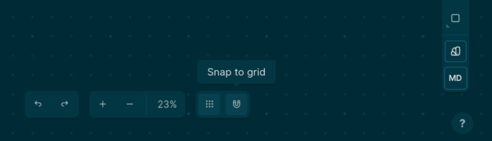

type:: [[Feature]]
description:: Snap shapes to canvas grid
platforms:: [[All Platforms]]
initial-version:: 0.9.10

# Usage
	- You can toggle grid snapping using the magnet button next to the grid toggle, at the bottom of the canvas
		- 
# Functionality
	- When turned on, creating/translating/scaling should follow the grid. [[Pencil]] and [[Highlight]] tools should not be affected by it. The snapping step is fixed to the default grid size, regardless of the camera zoom level. The grid adjusts when you zoom in and out, so snapping will not always be aligned with the visible grid.
# Background
	- This feature is helpful when we want to align [[Shapes]] without using guides or any other snapping utilities.