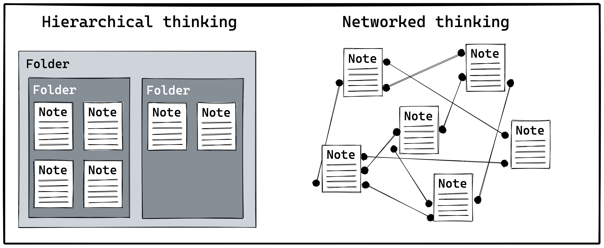

- ## Introduction
	- Logseq looks simple on the surface and is extremely powerful under the hood. Much like the famed Microsoft Excel, Logseq aims to be an environment for thinking. Excel's fuel are blocks of numbers, **Logseq's fuel are blocks of words**.
	- It takes time to master this tool, as Logseq doesn't impose a way of working. But once you figure out how to get your desired end results, **Logseq will help you become a much more effective thinker.**
	- To help you get started figuring out the workflows that work for you, we will take you through all of Logseq's core features. See them as tools in your toolbox; individually a tool will do little, but once you learn to use them in combination you can become an artist. **Aim to be a knowledge artist.**
	- Before we dive into the overview of Logseq's functionality, let's first dig a bit deeper into what makes Logseq special. As we said before; Logseq looks simple on the surface. But looks can be deceptive.
- ## What makes Logseq special?
	- **Logseq is an outliner.** Each bullet is a block, which you can best compare to a paragraph. Because Logseq is an outliner, every paragraph in Logseq is preceded by a bullet. Need more than a single paragraph? Create _branches_ by grouping related blocks.
	- **Logseq is a _networked_ outliner.** You can connect any block, from anywhere in your notes collection. Creating copies of blocks is as easy as dragging your mouse. Remix your ideas in new outlines in minutes. Everything in Logseq is about the block; throughout this guide we'll see the opportunities of this concept.
	- Logseq is different compared to traditional note-taking apps. Most notes tools try to emulate paper and folders, meaning that each note is located in precisely one folder. This makes remixing your notes difficult, and often leads to having several copies of slightly different notes. Logseq aims to solve this so you can focus on doing your best thinking.
	- In the coming lessons we’ll dive deep into what this freedom of information enables us to do. For now it’s enough to understand that **every bullet is a block** and that it can connect to any other block or collection of blocks (pages).
	- 
- ## Common use cases for Logseq
	- **Logseq does not impose a way of working.** Structure the tool in a way that matches _your_ way of thinking. By writing, grouping, and linking blocks, you create your own information structures. But if you just start out, you shouldn't worry too much about structure. **In Logseq, structure can _emerge_.**
	- Before you move your entire personal knowledge management system to Logseq, let's see what are some use cases to get started. We recommend you start small to see if you can shape Logseq to your way of thinking. As you become more proficient, you'll start to see the possibilities to use Logseq more.
	- Two common ways to get started with Logseq are note-taking and task management. With these core workflows and Logseq's features, you can support any other workflow for research, writing, or even running entire projects:
	- ### Note-taking
		- The absolute best way to get started with Logseq is by writing everything on the daily Journals page. Not only does this take away the decision on where to store a note, you can easily go back in time to revisit your notes.
		- Because it's so easy to link in Logseq using the `[[double brackets]]` or `#hashtag`, it doesn't matter where your notes are stored. You can easily link to anywhere in your notes collection, which is why proficient Logseq users write 99% of the time on their journals page. This is not the only way to use Logseq (remember: you can shape it any way you want), but it definitely is the best way when you just get started.
		- By using Logseq as a daily log, you quickly collect notes on a variety of topics. Most users start out by taking notes during meetings, to track tasks, or even manage entire projects. Logseq is also popular among researchers and writers. Synthesizing information is a joy as collecting and remixing blocks is easy.
	- ### Task management
		- As you write in Logseq, you might think of tasks you need to do later. While you may use a dedicated tasks tool, a common use case for Logseq is task management.
		- **Combining your notes and tasks is a breeze in Logseq.** Not only can you create tasks, you can also track how much time you spend on them, and even create automated workflows using priorities or other tags.
		- Are your tasks mixed with your notes? No problem! [[Queries]] are a powerful way to resurface tasks and other information. But even as a beginning Logseq user can you benefit from tasks as you write on your daily Journals. To send a task to your future self, simply add a date link to quickly offload things from your mind (hint: type `/date picker` and hit `Enter` to easily add a future date to a task).
		- Once tasks start to cluster around projects, Logseq also has you covered. With the block-based approach, creating pages for projects is as easy as stacking blocks. And when you learn to use Logseq's powerful queries, you can effortlessly create dynamic indexes or task dashboards.
	- After seeing how others leverage Logseq's feature, you've hopefully started thinking of some of your own use cases. We recommend you continue following the rest of this starter guide to learn the core 20% functionality that will provide you with 80% of your wanted returns.
	- If you get stuck at any moment or if you just want to connect with fellow Logseq enthusiasts, [**join the Logseq Discord server**](https://discord.gg/sVsJdzJghp). There you'll always find someone friendly who's willing to help you better understand a Logseq feature or workflow. We look forward to getting to know you!
	- For now, let's get started by creating a graph.
- ## Create a graph
	- In Logseq, a collection of notes is called a _graph_. That's our word for a collection of notes that are connected, i.e. there are links pointing between the notes.
	- As you progress through this starter guide, you'll see the power of the different ways of linking in Logseq. Through the links between your notes, you create a network. Not only does this network make finding notes easy, but the connections between different notes will provide a lot of value in themselves. More on that later.
	- For now, decide how you want to start using Logseq:
		- [>> Start by creating a new Logseq graph]([[How to create a new graph]])
		- [>> Start by creating a Logseq graph using existing Markdown files]([[How to create a Logseq graph using existing Markdown files]])