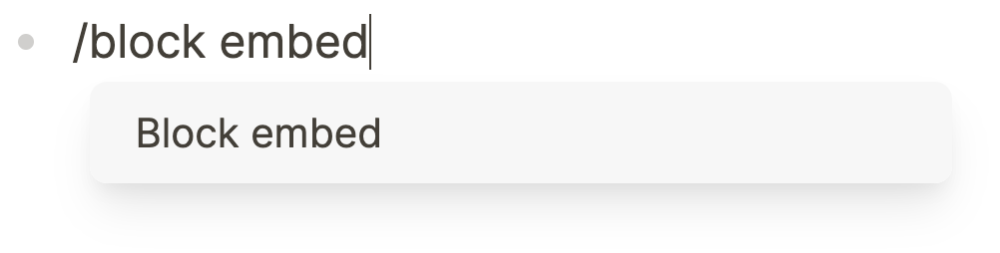
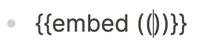
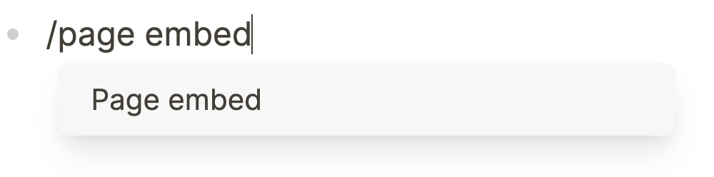
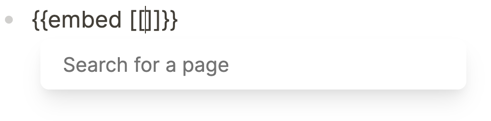
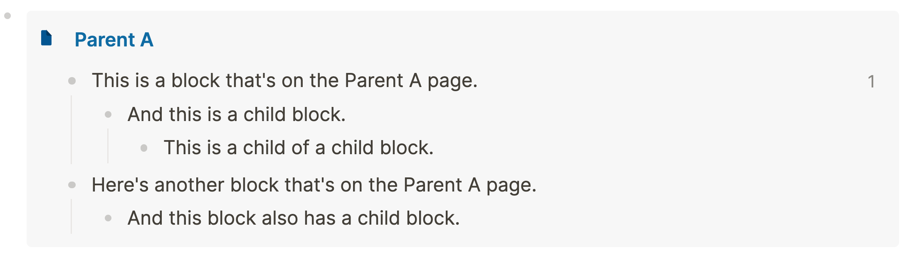

- In Logseq there are two ways to embed blocks:
	- 1. By embedding a block and its children
	  2. By embedding an entire page with all of its blocks
- ## Block embeds
	- The easiest way to embed a block is by calling the block embed shortcode using the trigger menu. Type `/block embed`, press the `Down` key, and hit `Enter` to select the option in the trigger menu:
		- 
	- Now, you get the following shortcode:
		- 
		- Between the `((double parentheses))`, you place the address of the block you'd like to embed. Alternatively, you can start typing words here to search for a block.
- ## Page embeds
	- Apart from (branches of) blocks, we can also embed entire pages. To do so, use the `/page embed` trigger to call the page embed shortcode:
		- 
	- Now, you get the following shortcode:
		- 
	- Inside the `[[double brackets]]`, type the name of the page you wish to embed. Click outside the block and the page's contents will show.
	- Not sure if you've embedded a block or a page? Page embeds always show the page name on top of the embed (in this example the page **Parent A**):
		- 