type:: [[Feature]]
description:: Put thoughts from your knowledge base as well as new ones next to each other on a spatial canvas together with shapes, drawings, website embeds and connectors. Built on a fork of [tldraw](https://github.com/tldraw/tldraw).
platform:: [[Desktop]]
alias:: Whiteboards

- #+BEGIN_NOTE
  This feature is currently in **beta** and only accessible for [Open Collective Sponsors](https://opencollective.com/logseq/contribute/sponsors-21163).
  #+END_NOTE
- # Usage
	- [[Whiteboards]] is a toggleable feature that can be activated in [[Settings]] under the `Features` tab.
	  collapsed:: true
		- 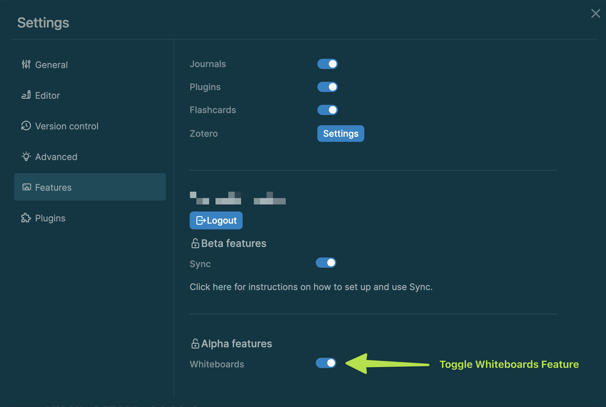
	- Once activated the [[Whiteboard]] feature can primarily be reached via the [[Left sidebar]] with a new menu item called `Whiteboards`.
	  collapsed:: true
		- 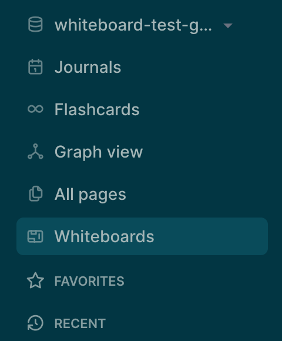{:height 402, :width 326}
	- New whiteboards can currently be created in 3 different ways:
	  collapsed:: true
		- [[Whiteboard/Dashboard]]
		  collapsed:: true
			- The tile in the top left of the dashboard grid always allows you to create a new whiteboard.
			  collapsed:: true
				- 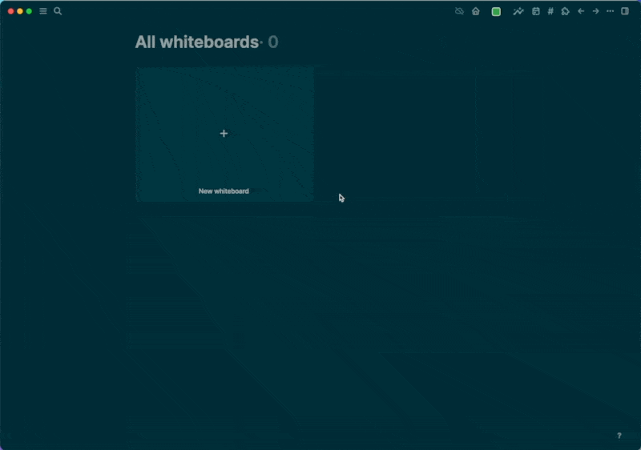
		- [[Create]] Button
		  collapsed:: true
			- After clicking the button labeled `Create` you can choose between creating `New page` or ==`New whiteboard`==. Choosing the latter will open a new whiteboard canvas. You can also create a new whiteboard with the keyboard shortcut `n w`.
			  collapsed:: true
				- 
				  id:: 6380a818-1a69-46f1-85f0-2b86fcba9b70
		- [[Search]]
		  collapsed:: true
			- After triggering the Search window with `Cmd + k`, you can start typing a whiteboard name. Next, select the second entry from the top starting with `New whiteboard: `. This creates a new whiteboard canvas with the typed input as the title.
			  collapsed:: true
				- 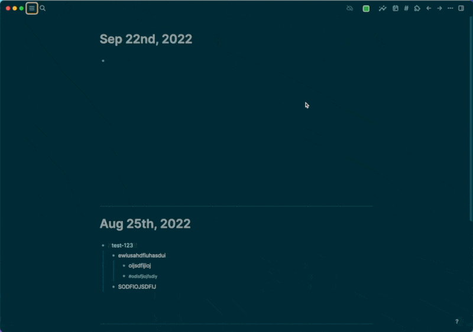
	- Once you've created a whiteboard, you get an empty canvas. These are some of the things you can do:
	  collapsed:: true
		- You can give your Whiteboard a [[Title]] by clicking in the input field in the top left corner.
		  collapsed:: true
			- 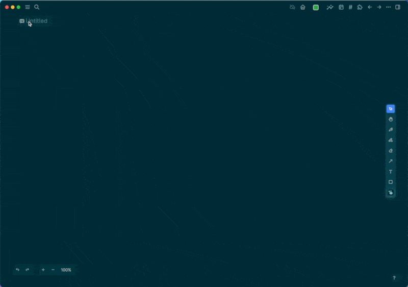
			  id:: 6380a818-a9dc-45ac-934b-fc3064509304
		- You can use the [[Toolbar]] to interact with the canvas and add elements like blocks, pages, and images to it. You can also directly draw on the canvas. These are the current toolbar options:
		  id:: 6380b0a1-0bce-4ecc-b373-fee87e6e9519
			- [[Toolbar/Select]]
			  collapsed:: true
				- Select elements on the canvas
					- 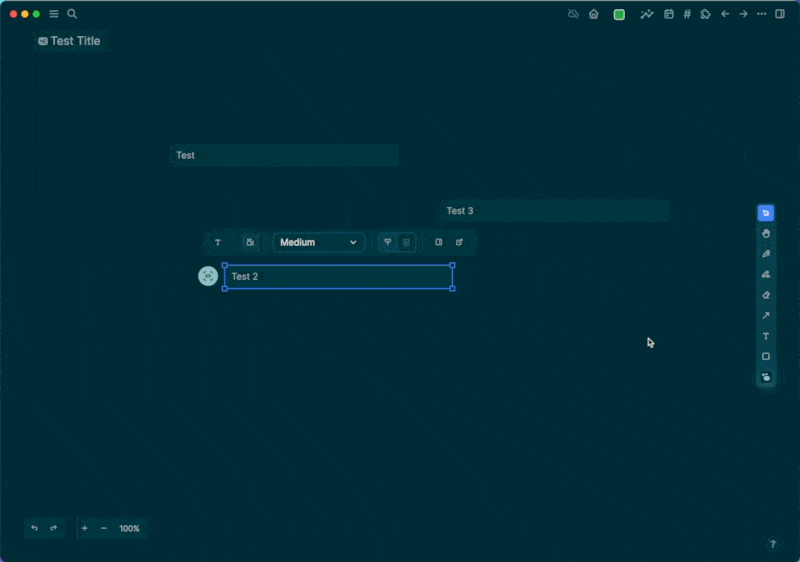
			- [[Toolbar/Move]]
			  collapsed:: true
				- Move around the canvas
				  collapsed:: true
					- 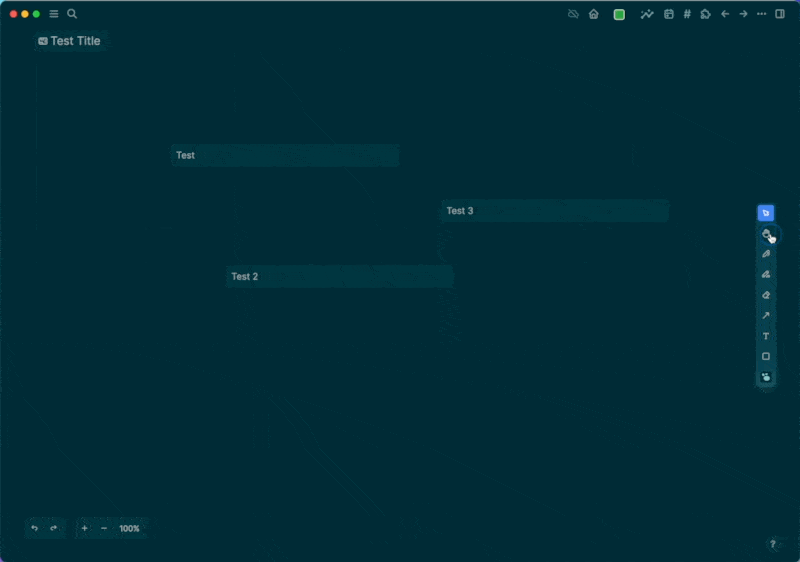
			- [[Toolbar/Draw]]
				- Freeform pencil drawings on the canvas
				  collapsed:: true
					- 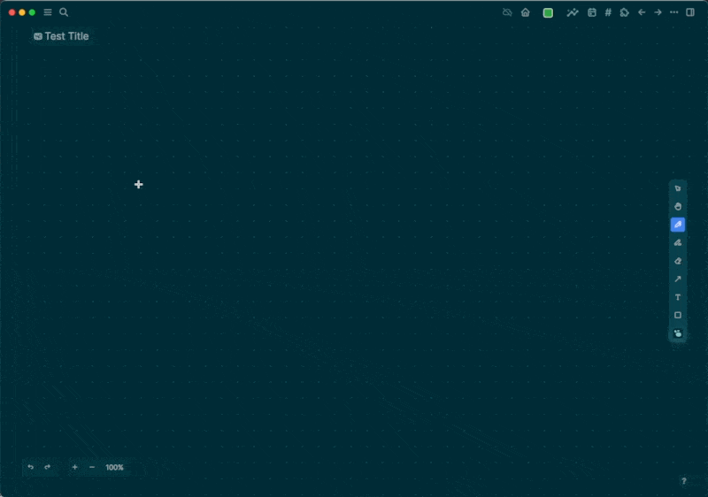
			- [[Toolbar/Highlight]]
			  collapsed:: true
				- Do freeform highlighting on the canvas
				  collapsed:: true
					- 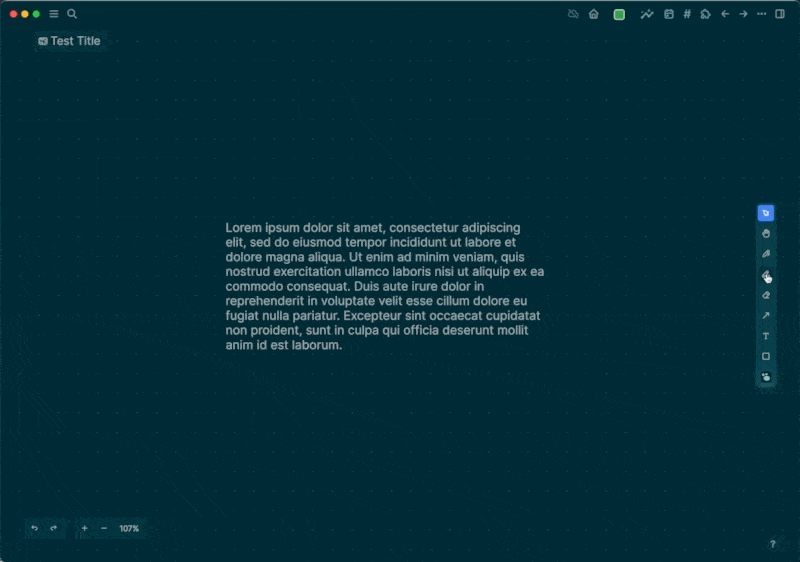
			- [[Toolbar/Eraser]]
			  collapsed:: true
				- Erase any element on the canvas
				  collapsed:: true
					- 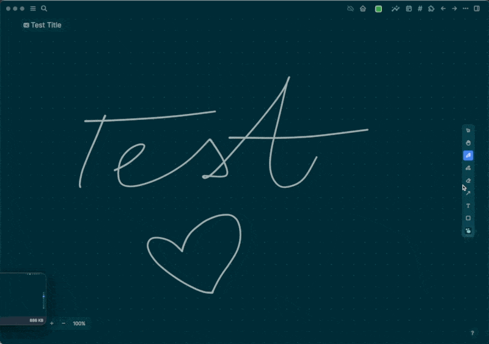
			- [[Toolbar/Connector]]
			  collapsed:: true
				- Connect any element on the canvas with a line. Add arrows to signal a direction. Add text on the connector. Can also be used to draw lines that are not connected to anything.
				  collapsed:: true
					- 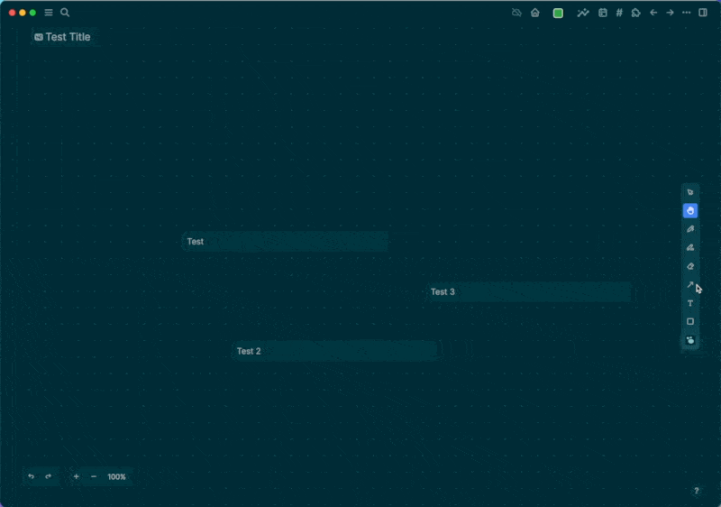
			- [[Toolbar/Text]]
			  collapsed:: true
				- 
			- [[Toolbar/Shapes]]
			  collapsed:: true
				- Create rectangle, circle and triangle shapes on the canvas
				  collapsed:: true
					- 
			- [[Toolbar/Logseq Portal]]
			  collapsed:: true
				- Find existing or create new blocks/pages and place on the canvas
					- Create a new Whiteboard block
					  collapsed:: true
						- 
					- Create a new page
					  collapsed:: true
						- 
					- Find an existing block
					  collapsed:: true
						- 
					- Find an existing page
					  collapsed:: true
						- 
- # Functionality
	- Logseq [[Whiteboards]] are local-first like the rest of the software.
	  collapsed:: true
		- When you create your first Whiteboard, a new folder titled `whiteboards` is added to your graph folder. All the whiteboards you create are saved in the `whiteboards` folder as `.edn` files. While there are other ways to [delete whiteboards]([[Whiteboard/Deletion]]), you can also directly delete them from your file system by removing the respective `.edn` files.
			- 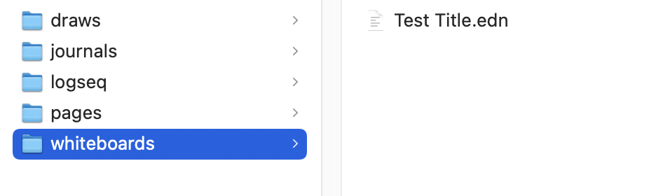
		- Whiteboards are a special type of page. You can find them in-app in the [Whiteboards dashboard]([[Whiteboard/Dashboard]]) and [[All pages]] overview.
	- Currently, there's limited support for [[Whiteboard embeds]]. We plan to expand this functionality in later versions of [[Whiteboards]].
	  collapsed:: true
		- When referencing a [[Whiteboard]] in the outliner by its [[Title]], you will see a Whiteboard icon show up at the front of the link. Hovering that link shows you an abstracted preview of the whiteboard.
			- 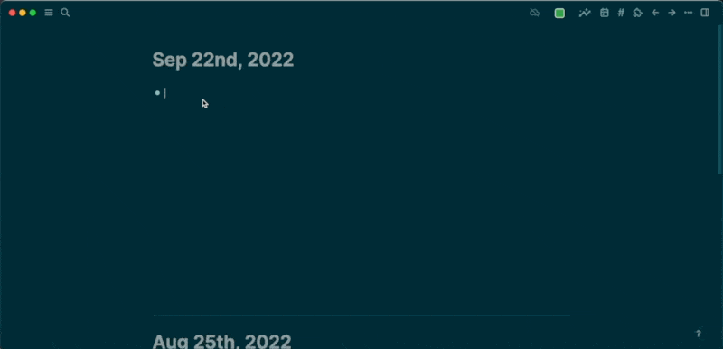
		- Once you do a [[Page embed]] of a [[Whiteboard]], you will see the abstracted preview of the whiteboard canvas directly in the block.
			- 
- # Background
	- What makes Logseq's [[Whiteboards]] unique is the combination of the Outliner with a spatial canvas. Thanks to [[Logseq Portals]], you will be able to visually group and link different blocks and pages from your knowledge base as well as external media types (YouTube, Images, Websites) and simple shapes. This allows visual thinkers to compose, remix, annotate and relate contents from their knowledge base as well as emerging thoughts in a new way.