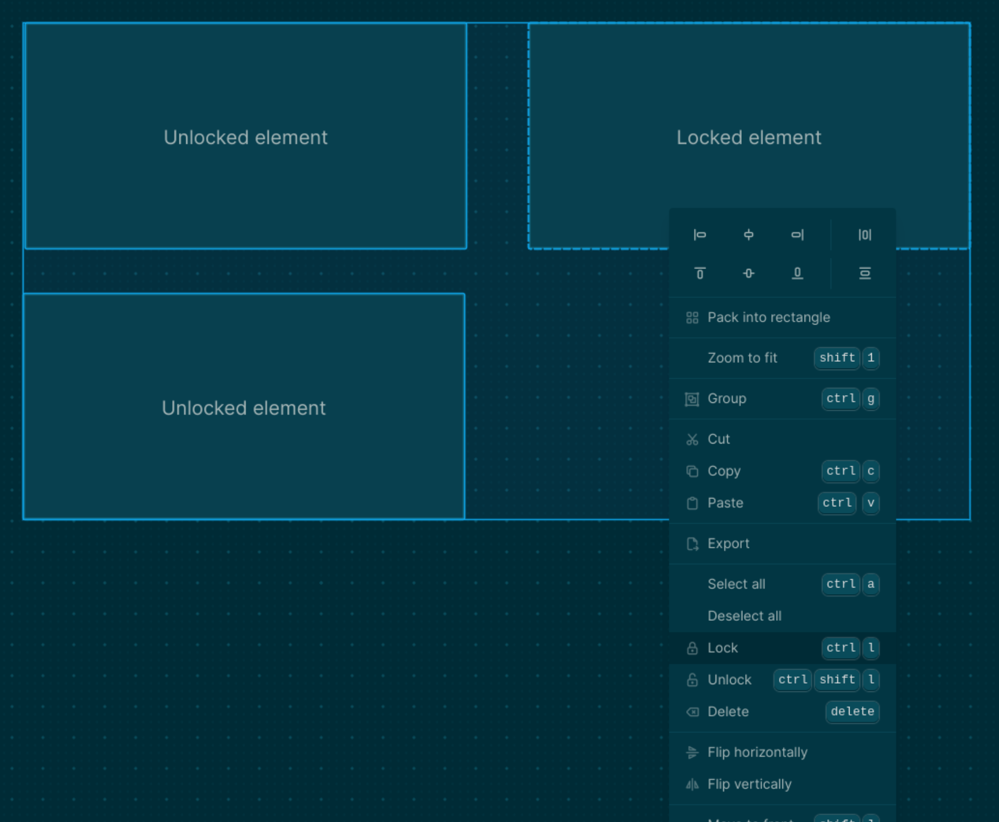

alias:: Element locking
type:: [[Feature]]
platforms:: [[All Platforms]] except [[Publish Web]]
description:: Allows locking whiteboard elements, rendering them unmodifiable
initial-version:: 0.9.4

# Usage
	- You can lock/unlock the selected elements using the [[Context Menu]] , or by pressing `mod+l` and `mod+shift+l` respectively.
	  
		-
# Functionality
	- Selected locked elements can be distinguished by the dashed bounds indicator. Deleting, editing and updating should be prevented. If both locked and unlocked elements are selected, editing actions will only be applied to the unlocked elements. Copying and cloning locked should be allowed. The pasted/cloned elements shouldn't be locked.
# Background
	- Locking can be used to create background elements that we usually don't want to update. It could also help us work on element heavy whiteboards.