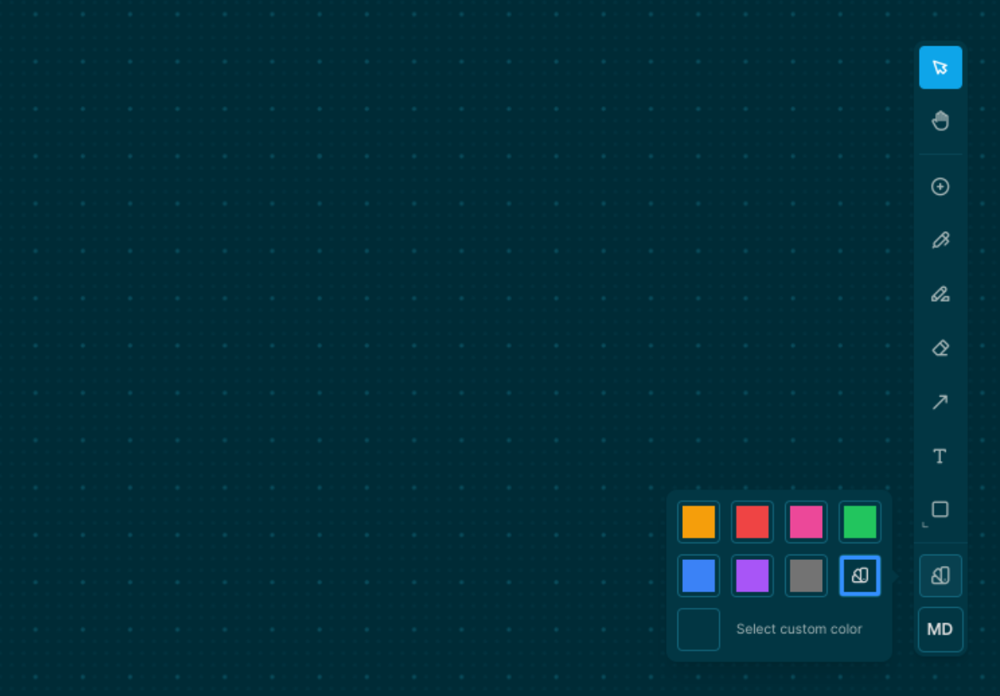

alias:: Global color swatch
type:: [[Tool]], [[Whiteboard/Object]]
platforms:: [[All Platforms]] except [[Publish Web]]
description:: Sets the global color
initial-version:: 0.8.12

# Usage
	- You can set the global color of whiteboards, by clicking on the color swatch of the [[Toolbar]]
		- 
			-
# Functionality
	- Changing the global color will affect the elements that are going to be created afterwards. It would also change the color of the currently selected elements.
	- Colors from our default color palette automatically adjust depending on the type of the shape and the theme mode, but you are also allowed to select a custom one.