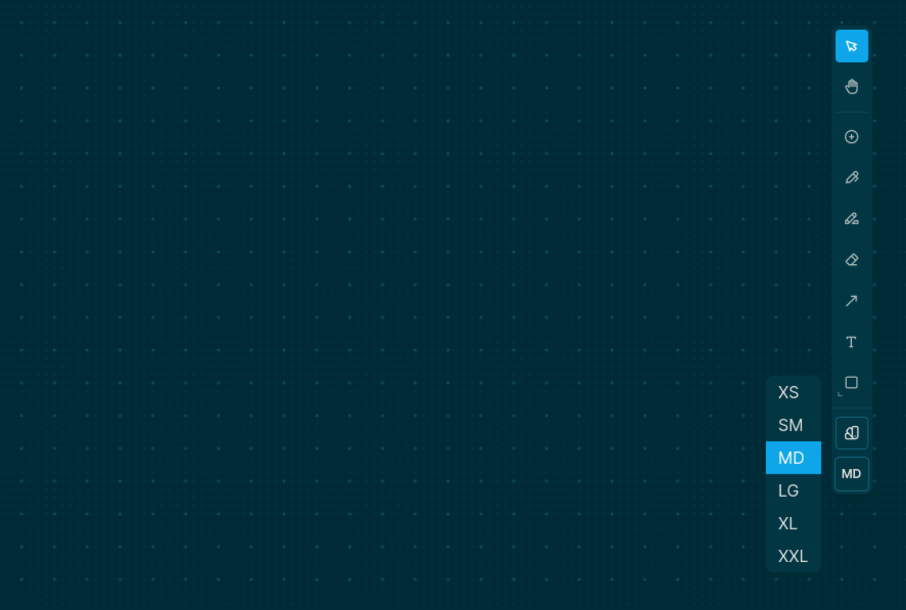

alias:: Global scale select
type:: [[Tool]], [[Whiteboard/Object]]
platforms:: [[All Platforms]] except [[Publish Web]]
description:: Sets the global scale level
initial-version:: 0.9.3

# Usage
	- You can set the global scale level of whiteboards, by clicking on the scale level tool of the [[Toolbar]]
		- 
# Functionality
	- Changing the global scale level will affect the scale of the elements that are going to be created afterwards. It would also change the scale level of the selected elements, if any.
# Background
	- Having a global scale level option helps us create consecutive elements with a specific scale. For example, it is extremely helpful when we want to use the [[Pencil]] tool to draw something with a non default stroke width.