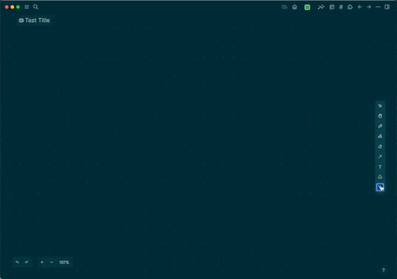
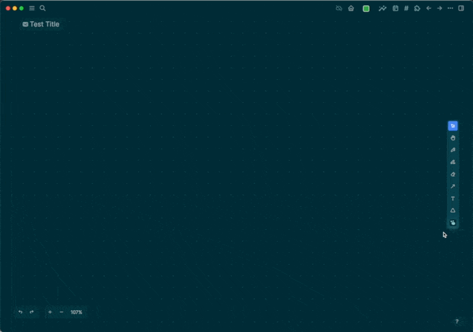
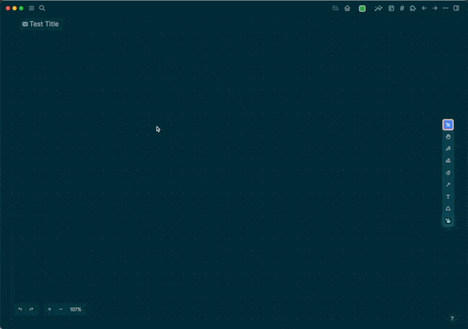
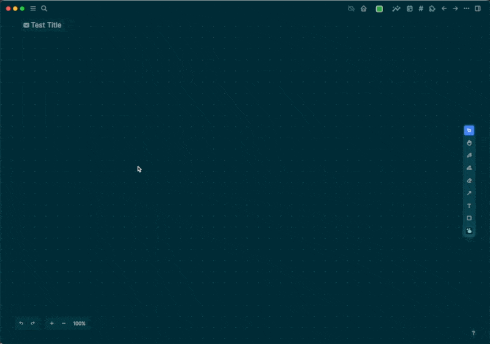

alias:: Portal, Logseq Portal, Logseq Portals
type:: [[Tool]]
description:: Find existing or create new blocks/pages and place on the canvas

- ## Create a new Whiteboard block
- 
- ## Create a new page
- 
- ## Find an existing block
- 
- ## Find an existing page
- 