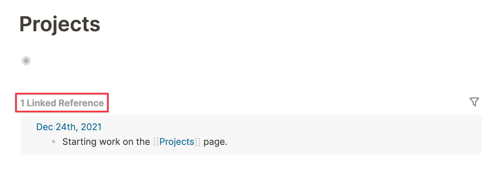
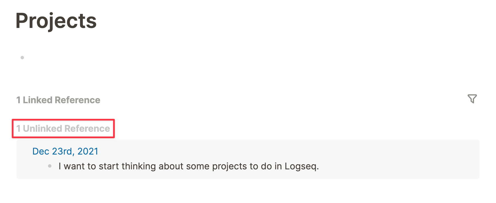

- If your database is made up of blocks—the atomic unit in Logseq—why would you bother linking to _pages_?
- As said, Logseq pages are nothing more than collection of blocks. In that sense, they're the perfect place to write (short) articles about topics for yourself. The cool thing about Logseq is that you can populate a page from anywhere, thanks to the powers of **bidirectional links**.
- Whenever you link to a page in Logseq, you actually create _two_ links; one that you write, and one that automatically appears in the **_Linked references_** section of the page you link to. Each page has this _Linked references_ section, showing all the blocks that point to that page:
	- 
- If you didn't link to a page but did use its name in the text, you can see all mentions in the **_Unlinked references_** section:
	- 
- It's not just linking to pages that creates bidirectional links; linking to an individual block will also create a link in two directions. We'll see later in this guide how links show when referencing (linking) blocks.