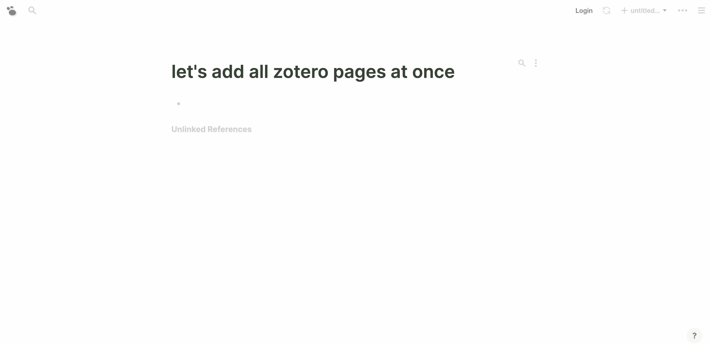

type:: [[Feature]]
description:: Built in integration that helps import your Zotero items as pages seamlessly. [Zotero](https://www.zotero.org/) is a free, easy-to-use tool to help you collect, organize, cite, and share research.
platforms:: [[All Platforms]] except [[Publish Web]]
tags:: #Academic

- ## Usage
	- You can either type `/Zotero` command, search individual zotero item (title, author, text, anything), select and add as a Logseq page.
	  id:: 6103e488-22d4-4751-b27a-69b278067c26
	  
		- type:: [[Command]]
		  name:: Zotero
		  description:: Imports a Zotero journal article
	- Or if you wish to import and create all pages at once, goto `Zotero settings`, and click `Add all` to import all Zotero items and add them as Logseq pages
	  collapsed:: true
	  
	- If you add same item twice, Logseq will append data to same page instead of overwrite existing meta data. If you know what you're doing, delete that page first and re-import.
- ## Functionality
	- Currently it only works for users who have enabled Zotero [Syncing](https://www.zotero.org/support/sync)
	- If you don't have Zotero Syncing enabled, you might want to checkout [this](https://github.com/sawhney17/logseq-citation-manager/) third-party plugin. Or [zotero-mdnotes](https://argentinaos.com/zotero-mdnotes/), a Zotero plugin to export item metadata and notes as markdown files.
	- Prerequisites:
	  collapsed:: true
		- Create a Zotero account and enable [Syncing](https://www.zotero.org/support/sync)
		- Create a new API key [here](https://www.zotero.org/settings/keys), also note down your userID from that same page
		  id:: 61024cd6-1951-47cc-8050-25f68960d729
		  At least `Allow library access` permission is required
		  If you want to include notes, make sure `Allow notes access` permission is selected
		- Optional:
		  If you've got [BETTER BIBTEX FOR ZOTERO](https://retorque.re/zotero-better-bibtex/installation) installed, Logseq will use citation key as your page name, otherwise, it'll just use default item title as your page name.
		  Make sure to check [here](https://alix-lahuec.gitbook.io/zotero-roam/getting-started/prereqs) and follow the setup checklist to enable autoPinDelay and pin your existing citekeys.
	- Basic settings:
	  collapsed:: true
		- Goto [[Settings]] , then click `Zotero settings`, fill in your API key and User ID mentioned in ((61024cd6-1951-47cc-8050-25f68960d729))
		  id:: 61024ec1-fd51-4b84-905e-8443a9204ae9
			- #+BEGIN_WARNING
			  User ID is different from your username, it's a number of digits
			  #+END_WARNING
		- The same for group usage, your just put your group id, api key and choose group.
	- Other Zotero settings:
	  collapsed:: true
		- Whether to include children items of attachment links and notes
		- You can customize your Zotero imported page's prefix, default is `@`, that is all Zotero pages added will begin with `@` for easy of searching. If you'd like some hierarchy, for example you can set it to a namespace prefix like `zotero/`
- [[Thanks]]
	- This feature took the idea and inspiration from the great [zotero-roam](https://alix-lahuec.gitbook.io/zotero-roam/) made by [[@Alix Lahuec ]]. Special thanks to [[@Alix Lahuec]] for providing all kinds of ideas and useful suggestions!
	-