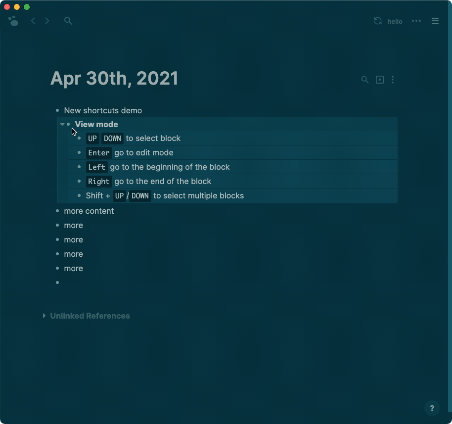

## [[Apr 30th, 2021]]
Canary Version 0.0.1
Desktop app download link:

Logseq Canary is for early adopters and developers to test new features and APIs without affecting the stable working environment. It will be installed as a separate app besides the stable one.

#+BEGIN_WARNING
To play it safe, we recommend using new content only with the canary app. If you want to try it with existing content, do remember to back up first in case of data loss or corruption.
#+END_WARNING
### This is the first canary release, introducing the big refactoring of Logseq. The rationale behind the refactoring is detailed here [[The Refactoring Of Logseq]]. Overall, it makes the code simpler and more robust, fixes some long-standing issues along the way and paves the way for upcoming features.
### [[Enhancement]]
#### A refactored core that is simpler and more robust.
#### A much better undo/redo experience.
#### Better keyboard navigation:
##### 
##### We've made most of above shortcuts customizable as well. If you don't like arrow keys, you can change it. Also for navigation keys in auto-completion, search, and more.

To add custom shortcuts, you can add/modify the `:shortcuts` section in config.edn like before, but now you can also add multiple bindings for one shortcut, for example here's my personal vim like bindings:
#+BEGIN_EXAMPLE
:shortcuts
 {:editor/new-block "enter"
   :editor/new-line "shift+enter"
   :editor/up ["ctrl+k" "up"]
   :editor/down ["ctrl+j" "down"]
   :editor/left ["ctrl+h" "left"]
   :editor/right ["ctrl+l" "right"]
   :editor/open-edit ["i" "enter"]
   :editor/delete ["ctrl+d" "backspace"]

   :date-picker/complete ["enter"]
   :date-picker/prev-day ["ctrl+h" "left"]
   :date-picker/next-day ["ctrl+l" "right"]
   :date-picker/prev-week ["ctrl+k" "up"]
   :date-picker/next-week ["ctrl+j" "down"]

   :auto-complete/prev ["ctrl+k" "up"]
   :auto-complete/next ["ctrl+j" "down"]
   :auto-complete/complete ["ctrl+l" "enter"]}
#+END_EXAMPLE

The full list of shortcut bindings for canary version is here:
https://github.com/logseq/logseq/blob/feat/outliner-core/src/main/frontend/modules/shortcut/binding.cljc
#### Markdown improvements:
##### The grammar of properties changes as below while staying the same in Org mode:
#+BEGIN_QUOTE
title
property-1:: value-1
property-2:: value-2
body
#+END_QUOTE
##### Support unordered list as headings
##### Support headings as top-level blocks, with convenient /h1 ~ /h6 commands
