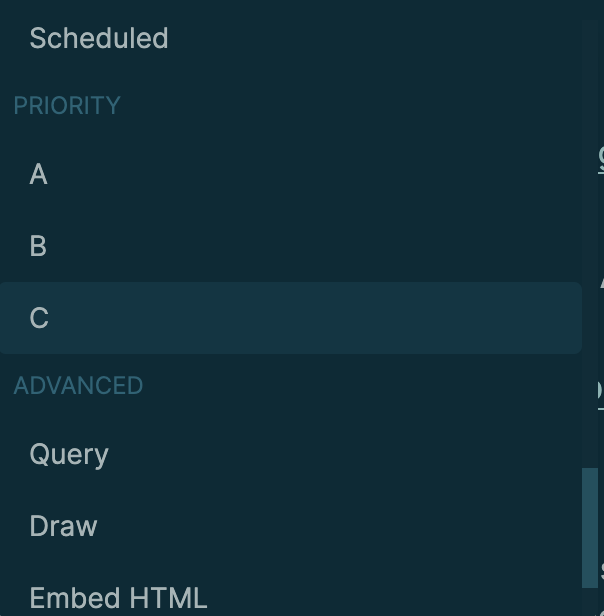
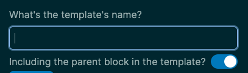
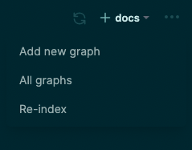
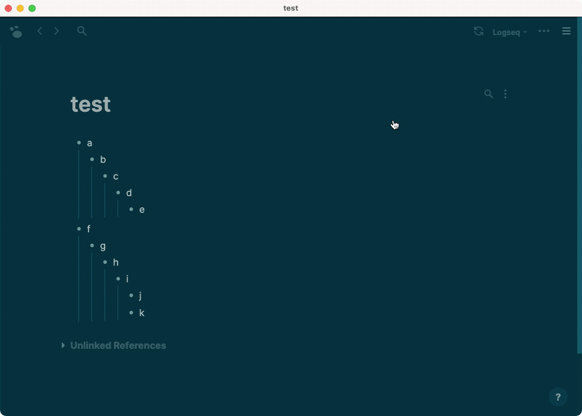

- [[Jun 29th, 2021]]
  id:: 60db3824-3728-458b-b7e1-ed359c275d96
  **Beta 0.2.2**
  Desktop app download link: https://github.com/logseq/logseq/releases/tag/0.2.2
	- [[Thanks]]
		- [[Devon Zuegel]]
			- Make block control available via CSS selectors so it can be customized
		- [[Sebastian Bensusan]]
			- Allow numbers to have commas in calc
	- [[Fixed Issues]]
		- Pages set to public not getting published
		- Dragging file may create dulplicated files in /assets
		- Image doesn't show
		- Error when editing config.edn
		- Should align with baseline for multi-line headings
		- Collapse take account of block body
		- Desktop App fails to render images that are on newline
		- Rename a Page without spaces to one with spaces impacts tags
- [[Jun 28th, 2021]] 
  **Beta 0.2.1**
  Desktop app download link: https://github.com/logseq/logseq/releases/tag/0.2.1
	- [[Thanks]]
		- [[Devon Zuegel]]
			- Added shortcut setting visual polishing and refactoring
			- Refactor setting page ui code and fix React warnings
		- [[bensu]]
			- Added fix for codemirror click editing issue
			- Enhanced parsing rule for calculator
	- [[Fixed Issues]]
		- Fix link syntax behavior
			- Markdown
				- `` will display pdf preview (desktop app) or image
				- `[label](url)` only display as clickable label
			- Org-mode
				- `[[url][label]]{:show true}`
					- pdf preview (desktop app)
					- image inline display
				- `[[url][label]]{:show false}` just display as clickable label
				- `[[url][label]]` keep same behaviors as before: inline images if its suffix included in `#{:gif :svg :jpeg :ico :png :jpg :bmp}`
		- Exported markdown with spaces and wrong format
		- Expand action does not delete collapsed property issue
	- [[Features]]
		- Namespace pages now display with hierarchy
		- New command `paste-text-in-one-block-at-point` (mod+shift+v) will paste multi paragraph text in clipboard as one block
		  
	- [[Enhancement]]
		- Display pdf by default
		- Make it easier to drag files to the editor
- [[Jun 23rd, 2021]] 
  id:: 60d3353a-8999-4186-adcc-1f99b0f71560
  **Beta 0.2.0**
  Desktop app download link: https://github.com/logseq/logseq/releases/tag/0.2.0
	- [[Thanks]]
		- [[andrevem]] added Spanish translation
		- [[Devon Zuegel]] added `/calculator` slash command
		- [[Peng Xiao]]
			- Preview block reference with its children
			- Show block breadcrumbs in preview
			- Output custom.css instead of append for publish
			- Do not pass theme to tippy
		- [[bensu]] don't show calc parse errors to the UI
		- [[Nikhil Warke]] fix non ml-doc file links in org syntax
		- [[Michael Schmidt-Korth]] Page rename: Use current title as default
	- [[Fixed Issues]]
		- Remove `collapsed:: false` property (this only works for new pages)
		- Newline after scheduled and deadlines
		- `:hidden` config doesn't work for both nfs and the desktop app
		- Second settings can't be opened
		- Entity not found err when import opml with non-existed block-ref-id
		- Broken slash command registry #plugin
		- Unlinked references search alias as well
		- Copy heading with children
		- Can't drag a block as the first child of a parent block
		- Exported md files includes block children from embed source block
		- ID-links follow the ID when clicked [[Org Mode]]
	- [[Features]]
		- Alt-dragging to create a block reference
	- [[Enhancement]]
		- Open the second level children by default for linked references
			- A new option `:ref/default-open-blocks-level` was added to `config.edn` #settings, the default value is `2`
			  #+BEGIN_EXAMPLE
			  The default level to be opened for the linked references.
			  For example, if we have some example blocks like this:
			  - a [[page]] (level 1)
			    - b        (level 2)
			       - c      (level 3)
			          - d    (level 4)
			  
			  With the default value of level 2, `b` will be collapsed.
			  If we set the level's value to 3, `b` will be opened and `c` will be collapsed.
			  #+END_EXAMPLE
		- Customize shortcuts UI support
		- `Ctrl+Shift+r` to replace a block reference at point with its text (editing mode)
- [[Jun 18th, 2021]]
  id:: 60cb89fb-1518-471d-8ec2-f41a634bea70
  **Beta 0.1.9**
  Desktop app download link: https://github.com/logseq/logseq/releases/tag/0.1.9
	- [[Plugins]]
		- [[Peng Xiao]] created a react template for Logseq plugins
		  https://github.com/pengx17/logseq-plugin-template-react
		- [[Charlie]] made a reddit hot news page! 🎉
		  collapsed:: true
			- Source code: https://github.com/logseq/logseq-plugin-samples/tree/master/logseq-reddit-hot-news
			- 
	- [[Thanks]]
		- [[Nikhil Warke]] added a shortcut to collapse/expand all the blocks `t o`
		- [[Devon Zuegel]] updated the modal so that click on backdrop closes the modal and bump up opacity on icons to increase contrast
		- [[Peng Xiao]] fixed the issue that page title when preview should use its original name
	- [[Fixed issues]]
		- Support nested headings for Markdown
		  collapsed:: true
			- #### Something like this
		- Select blocks sometimes doesn't work
		- Weird behavior when toggling edit mode for long text
		- Writing in new page in sidebar makes new line after each keypress
		- [display name]([[page name]]) is not counted as a page reference
		- Nested queries
	- [[Features]]
		- [[Roam Research]] JSON export
	- [[Enhancement]]
		- Lazy loading page/block previews, reduce CPU usage
		- Add a custom shortcut for escape editing
		- Grouped commands
		  collapsed:: true
			- {:height 305, :width 241}
- [[Jun 15th, 2021]] 
  id:: 60c8be46-6179-40c0-ad3a-74ecdeaa595e
  **Beta 0.1.8**
  Desktop app download link: https://github.com/logseq/logseq/releases/tag/0.1.8
	-
	  #+BEGIN_NOTE
	  The draft Plugins API is out! 🚀🚀  Any feedback or suggestions are appreciated! 
	  The documentation is at https://logseq.github.io/plugins/
	  We have some short tutorials too, check [[Plugins 101]].
	  #+END_NOTE
		- You can enable the `Developer mode` in the settings page, we only enable it for the desktop app for the time being, we'll add the support to the web app when it's more stable. The plugins are mostly for developers to test, we don't recommend it for daily usage.
	- [[Thanks]]
		- [[Calc]] mode by [[bensu]] 🎉🎉
		  #+BEGIN_EXAMPLE
		  ```calc
		  1 + 1
		  a = 1
		  b = 2
		  a * b + a
		  1.0e3 + 2
		  ```
		  #+END_EXAMPLE
			-
			  ```calc
			  1 + 1
			  a = 1
			  b = 2
			  a * b + a
			  1.0e3 + 2
			  ```
		- Scroll to follow the moving block by [[bensu]]
		- Several minor issues fixed by [[pengx17]]
	- [[Features]]
		- Import from [[OPML]]
	- [[Fixed Issues]]
		- Wrong order when copy/paste or create blocks from a template
		- Nothing found for entity id [:block/uuid nil]
		- Don't create a new file if there's only one block with empty
		- Can't parse and load some files
		- Quick input（）will clear the current block
- [[Jun 11th, 2021]]
  id:: 60c37f16-0fcb-4b0a-8874-c3c3f1a561ca
  **Beta 0.1.7**
  Desktop app download link: https://github.com/logseq/logseq/releases/tag/0.1.7
	- [[Thanks]]
		- [[pengx17]] for adding several plugins and many thoughtful discussions
		- [[tekacs]] for adding both editor/strike-through binding `ctrl/cmd + shift +s` and 
		  [toggle formatting of selected area instead of double-wrapping](https://github.com/logseq/logseq/pull/2166)
		- [[Cobblebot]] for the suggestion to have a central place for all the UI/UX suggestions.
			- https://discuss.logseq.com/c/ux-ui-suggestion/13
	- [[Fixed Issues]]
		- Cursor moving in the editor
		- Bring back template support without the parent block
			- 
		- Ctrl-z not working if all the blocks of a page were deleted
		- Code block editing
		- Repeated aliases in page's properties
		- Cursor blinks when editing in zoom mode
		- Import JSON from Roam uses `-` instead of `#`
		- Rename page doesn't work for markdown with front matter
		- Using a #tag in a line followed by a `[[page-link]]` causes line to be erased
		- Marker keywords in bullet content change on ctrl+enter
		- Display normal text size if a heading block has body content (not just a title)
	- [[Enhancement]]
		- Rename "Contents" to **Favorites**
			- You can specify the display name by changing `:name/favorites` in `config.edn`, for example:
			  `:name/favorites "My favorites"`
		- Better UX for the graph switcher
			- 
- [[Jun 8th, 2021]]
  id:: 60bf567e-1aaf-4500-92dd-19dfc5e8cff4
  **Beta 0.1.6**
  Desktop app download link: https://github.com/logseq/logseq/releases/tag/0.1.6
	- [[Fixed issues]]
		- App nonresponsive
		- Error when pressing `Ctrl+UP` or `Ctrl+DOWN`
		- CPU high usage when tooltips are enabled
		- Bump better-sqlite3 to fix glibc issue on Linux
- [[Jun 8th, 2021]]
  id:: 60be49ad-b87f-47cf-946b-5ddbc5a08ead
  **Beta 0.1.5**
  Desktop app download link: https://github.com/logseq/logseq/releases/tag/0.1.5
	- [[Fixed issues]]
		- Linked references don't work if the tag has emojis and other special characters
		- Page reference disappears when clicking outside the editor
		- Extra space and tab characters will be inserted into the file
		- Wrong indentation for paragraphs and lists (in the Markdown file)
		- Fix wrong Alias behaviour
			- An alias page reference will jump to the source page if the alias page is empty
		- Display all the aliases (if any) in the page's properties
		- Page filters doesn't work on block children
		- Can't remove local assets on the web app
		- Search bar can't be scrolled
		- Can't delete multiple blocks if the first one and the last one are not the same level
		- Add `level` back to the dom
	- [[Enhancement]]
		- Tooltips will be hidden quickly now
		- Page searching is more accurate
		- Search jumping to a block will be selected by default, so that you can quickly press `Enter` or Left/Right arrow to edit it.
	- [[Features]]
		- Now you can collapse/expand the whole page by pressing `Command+up` and `Command+down`
			- 
		- JSON and EDN export
		- Both block embeds and references are included when exporting OPML and Markdown
- [[Jun 3rd, 2021]]
  id:: 60b8f68d-1c28-45f8-ab8e-0976163c2116
  **Beta 0.1.4**
  Desktop app download link: https://github.com/logseq/logseq/releases/tag/0.1.4
	- [[Fixed Issues]]
		- Logseq freezes when hovering a page and clicking to edit it later
		- Block refs are difficult to click
		- Can't see the last matched result when searching (DOWN arrow)
		- Sometimes can't paste files into Logseq
		- Add block's page to `:block/path-refs`, `[[page]]` in the query will return all the blocks belong to this page and blocks that mentioned `[[page]]`
		- `:org-mode/insert-file-link? true` not working anymore
		- block-reference a block with heading:: true will display extra `-`
- [[Jun 2nd, 2021]] 
  id:: 60b770c6-1e15-4e2b-b6a4-a08de9cde5f8
  **Beta 0.1.3**
  Desktop app download link: https://github.com/logseq/logseq/releases/tag/0.1.3
	- {{embed ((60b3a414-1e93-46c3-96fc-54d3a0760f2c))}}
	- [[Thanks]] 🚀
		- [[bensu]] for a [[Calculator]] mode like numi or soulver (there'll be another PR!)
		  https://discuss.logseq.com/t/calculator-mode-like-numi-or-soulver/1059
		- [[devon]] for adding `resolve-input` for more Datalog queries
		  https://github.com/logseq/logseq/pull/2061
	- [[Fixed Issues]]
		- Linked references could be lost when files have been updated on the disk
			- By another editor or Logseq in another device
		- Can't copy and paste multiple blocks into the first empty block
		- Can't jump to pages on mobile
		- Keep CodeMirror mode as null when language not set
	- [[Features]]
		- Export either the graph or a page as OPML 🎉
- [[May 30th, 2021]] 
  id:: 60b3a579-56db-41ed-8940-70c8b54f8e34
  **Beta 0.1.2**
  Desktop app download link: https://github.com/logseq/logseq/releases/tag/0.1.2
	- {{embed ((60b3a414-1e93-46c3-96fc-54d3a0760f2c)) }}
	- [[Thanks]]
		- [[Matt Furden]] for wonderful bug reporting
	- [[Fixed Issues]]
		- All the existing Markdown converter issues
		- Most issues related to copy && paste
		- Sometimes the cursor will jump to the end when editing the first block
		- Weird characters on code blocks
- [[May 29th, 2021]] 
  **Beta 0.1.1**
  Desktop app download link: https://github.com/logseq/logseq/releases/tag/0.1.1
  Logseq.com is updated too. 
  #+BEGIN_NOTE
  We are launching on Product Hunt next Wednesday, Jun 2. 🚀  If you want to show your support, come stop by, and give us some feedback, we'll be hanging out on Product Hunt all day!
  #+END_NOTE
	- **How to migrate to the new Markdown syntax?**
	  id:: 60b3a414-1e93-46c3-96fc-54d3a0760f2c
		- <div style="position: relative; padding-bottom: 53.59375000000001%; height: 0;"><iframe src="https://www.loom.com/embed/19df38ad08e04bc4978d38d4a3e251b7" frameborder="0" webkitallowfullscreen mozallowfullscreen allowfullscreen style="position: absolute; top: 0; left: 0; width: 100%; height: 100%;"></iframe></div>
		  [:hr]
	- [[Thanks]]
		- [[Matt Furden]] for _Stop scrollbar from causing content shift_
		- [[Hindol Adhya]] for _Scroll to previously saved scroll position_
	- [[Fixed Issues]]
		- Converter choke on filters
		- Convertor doesn't recognize `background_color` and `custom_id`
		- `property` query doesn't work
		- Page alias parsing issue
		- Nested pages references
		- Heading rendering in the right sidebar
		- Code block editing
		- Don't export file paths when publishing
	- [[Enhancement]]
		- Forbid nested page/block preview
		- Better code block style in the dark mode
		- Override block if it's empty when pasting blocks
	- [[Features]]
		- {{embed [[setting/theme modes]] }}
- [[May 25th, 2021]]
  id:: 60abefe4-cc08-440d-a2c3-8632aae6ff34
  **Beta 0.1.0** 🥳🥳🥳
  Desktop app download link: https://github.com/logseq/logseq/releases/tag/0.1.0
	- [[Thanks]]
		- [[Cobblebot]] for [[Glossary]]
		- [[Dario]] for another amazing video [[Cultivating a 'digital knowledge garden']]
		  collapsed:: true
		  {{youtube https://www.youtube.com/watch?v=SUOdfa3MucE}}
		- [[Nami]] for building [logseq-bonofix-theme](https://github.com/Sansui233/logseq-bonofix-theme)
	- [[Fixed Issues]]
		- Drag files to logseq can be stuck
		- Block marker/priority is not displayed in references
		- Sometimes backspace removes two chars instead of one
		- Content can be lost when auto-complete page references
		- Copy doesn't include collapsed children
		- Page alias with spaces
		- Adding a "#tag" at the front of a block clear the whole block
		- Preserve spaces in the block's content
		- Can't insert a template in the first block
		- Page blank after clearing cache
		- Convert - to * for repeated task states (for markdown)
	- [[Enhancement]]
		- Switch default indentation to tab for markdown users
		- Unlinked references are much faster now
		- Separate page properties from block properties
	- [[Features]]
		- [[Page and block preview]]
			-
			  1. You can edit the blocks directly in the preview tooltip.
			-
			  2. You can disable/enable it on the settings page, it's called `Enable tooltip`
			-
			  3. 
- [[May 19th, 2021]]
  **Canary 0.0.4**
  Desktop app download link: https://github.com/logseq/logseq/releases/tag/0.0.4
  #+BEGIN_NOTE
  This will be our last Canary release, the next one will be back to the Logseq app, and we'll start our beta journey. We believe there's no data corruptions anymore, also undo is very stable now. Enjoy it!
  #+END_NOTE
	- [[Thanks]]
	  collapsed:: true
		- [[ChrisLasar]] for this wonderful user-driven documentation creation for Logseq
		  https://chrislasar.github.io/logseq-doc/
		- [[pengx17]] for the first community plugin - a datascript playground!
		  https://github.com/pengx17/logseq-query-playfround
		- [[lezuber]] for this tool to downloads all images to the local /assets folder.
		- [[Dario]] for this beautiful video series [[How to get started in Logseq]]
		  {{youtube https://www.youtube.com/watch?v=qtN7qqdeTwU&ab_channel=OneStutteringMind}}
	- [[Fixed Issues]]
		- Creating and editing blocks in linked references and unlinked references
		- Copy && paste text can split into multiple block
		- Slow editing when there're many files
		- And tons of bugs
	- [[Enhancement]]
		- **Add our old direct outdenting back and make it default**
			- There's an option "Enable logical outdenting" on the settings page [[setting/enable logical outdenting]]
			- Related thread: https://discuss.logseq.com/t/whats-your-preferred-outdent-behavior-the-direct-one-or-the-logical-one/978
		- Add a "Clear cache" button in the settings page
			- It'll clear both search cache and logseq's database's cache
		- Search in page should be much faster now
		- **Opt-out Sentry.io tracking**
		  You can disable it on the settings page too
- [[Apr 19th, 2021]]
  id:: 605deea9-da6c-41c7-8d0f-1a1084d870ab
  **Version 0.0.20**
  Desktop app download link: https://github.com/logseq/logseq/releases/tag/0.0.20
	- [[Thanks]]
		- [[Testimonials]]
			- ((607d1394-3b32-4613-9acf-9bade8ad7817))
		- [[Fixed Issues]]
			- Don't show assets and block ids in graph view
			- Switching graphs makes the journal page queries disappear
			- Can't exit when there's no graph
			- Block ref should be able to wrap
			- Scroll in the right sidebar doesn't affect the main view
		- [[Enhancement]]
			- A toggle icon for the right sidebar is always on the top right
				- The shortcut is `t r`, notice it only works in non-editing mode
			- Both the main view and the right sidebar have scrollbars now
			- Contents/Recent/Page graph/Help are always on the top of the right sidebar
- [[Apr 12th, 2021]]
  **Version 0.0.19**
  Desktop app download link: https://github.com/logseq/logseq/releases/tag/0.0.19
	- [[Thanks]]
		- [[Testimonials]]
			- {{embed ((607454a1-a6a5-4356-af6d-ae5ed0a2051a))}}
			- {{embed ((607454a1-043d-4beb-b86e-c513a68ad47e)) }}
	- [[Fixed Issues]]
		- Can't drag && drop
		- Can't set repeater for schedule && deadlines
		- Nested page in page properties
	- [[Enhancement]]
		- Search in current page
			- [[Shortucts]] `Ctrl+Shift+u` or `Cmd+Shift+u` (on Mac)
		- Click `More` to get more search results
		- Add custom date format to the settings page
- [[Apr 10th, 2021]]
  **Version 0.0.18**
  Desktop app download link: https://github.com/logseq/logseq/releases/tag/0.0.18
	- [[Thanks]]
		- [[pengx17]] for fixing an issue when clicking bullets in embedded block/page
		- [[karlicoss]] for adding check for Docker image consistency
		- [[haydenull]] for adding sass/scss/less modes to codemirror and highlight active line
	- [[Fixed Issues]]
		- Can't select blocks in edit mode
		- Can't toggle from NOW to LATER
		- Add icon for linux appimage
		- Re-enable full-text query on the desktop app
	- [[Enhancement]]
		- Full-text search is using SQLite now, which is both fast and more accurate, tested with 10k markdown files
		- Add block breadcrumb to search result
		- `Enter` will jump and highlight the matched block when searching
- [[Apr 1st, 2021]]
  **Version 0.0.17**
  Desktop app download link: https://github.com/logseq/logseq/releases/tag/0.0.17
	- [[Thanks]]
		- [[pengx17]] for support previewing videos and fixing image resize style issue
	- [[Fixed Issues]]
		- PDF embed doesn't work if the page name has blanks
		- Rename page name in raw file view
		- Display page's original name in linked references
		- Blank page for page graph
		- Disable multiple instances at the moment
			- The reason is that in the current system, logseq cached all the graphs locally in IndexedDB, which is impossible to be shared between multiple instances. We also need to handle other situations if we plan to enable multiple instances.
		- When selecting some text, the shortcuts for bold, italics and highlight should jump to a correct position
		- Multiple parser issues
	- [[Features]]
		- Add an option `:scheduled/future-days` for the `Scheduled and Deadline` section, the default value is `0`, which means it only display tasks for `Today`.
			- For example, if you'd like to see all the scheduled tasks && deadlines in 7 days, add `:scheduled/future-days 7` to the file `config.edn`
- [[Mar 31st, 2021]]
  **Version 0.0.16**
  Desktop app download link: https://github.com/logseq/logseq/releases/tag/0.0.16
	- [[Fixed Issues]]
		- Stuck loading on the desktop app
		- Re-index should be faster
		- File corrupts when editing code blocks
		- `/Deadline` sometimes create `/Scheduled`
		- Parsing error for page ref followed by a link
		- Blank page for bad macros
		- Can't change the case of a page name
		- Org mode doesn't support image's file path in link
		- Add to pages for TAGS and other properties inside block properties
	- [[Features]]
		- Initial **PDF** embed on desktop app
			-
			  <div style="position: relative; padding-bottom: 56.25%; height: 0;"><iframe src="https://www.loom.com/embed/b550c995cc8b44828d13e6a159461bd4" frameborder="0" webkitallowfullscreen mozallowfullscreen allowfullscreen style="position: absolute; top: 0; left: 0; width: 100%; height: 100%;"></iframe></div>
			  [:hr]
	- [[Enhancement]]
		- You don't have to go to edit mode first to select words 😂
		- The page graph will auto-refresh when redirecting to a new page
			-
			  <div style="position: relative; padding-bottom: 56.25%; height: 0;"><iframe src="https://www.loom.com/embed/f9309fec81ff473a87ec7648a2698f96" frameborder="0" webkitallowfullscreen mozallowfullscreen allowfullscreen style="position: absolute; top: 0; left: 0; width: 100%; height: 100%;"></iframe></div>
			  [:hr]
		- Rendering is much faster thanks to the hints by [[martinklepsch]]
		- Scheduled && deadline includes tasks in the next 7 days too, we'll make the number configurable soon
		- Auto update on Mac
- [[Mar 28th, 2021]]
  **Version 0.0.15**
  Desktop app download link: https://github.com/logseq/logseq/releases/tag/0.0.15
	- [[Fixed Issues]]
		- Some queries not working anymore
		- Reload stuck on the desktop app
		- `#[[some tag]]` has no references
- [[Mar 27th, 2021]]
  **Version 0.0.14**
  Desktop app download link: https://github.com/logseq/logseq/releases/tag/0.0.14
	- [[Thanks]]
		- [ahonn](https://github.com/ahonn) for adding remember electron windows state enhancement
		- [martinklepsch](https://github.com/martinklepsch) for both react profiling and adding clj-kondo support
		- [pengx17](https://github.com/pengx17) for providing feedback and suggestion on journals loading page
	- [[Features]]
		- [[Export]] graph as markdown files
			- Go to “Export” -> click “Export as Markdown”
			- Add config option ‘:export/heading-to-list?’ to toggle exported-heading to bullet list or not
		- Support [[Export]] single page to markdown
		  [](https://user-images.githubusercontent.com/5608710/112099687-ec656280-8bde-11eb-8d69-fe99dedb68a1.gif)
		- New [[Commands]] `/Underline` to support markdown underline
		- [[Block Alias]] support with markdown
		  Syntax: `[alias](((block-id)))`
		- Supports render inline html
	- [[Fixed Issues]]
		- Add custom css when publishing
		- Graph doesn't show on the full page
		- Incorrect journal shortcut in help page
		- Copy paste buffer stay intact after deleting blocks
		- Don't show brackets for tags
		- Roam macro import
		- Remove picture-in-picture from youtube iframe for security reason
		- Many parser issues fixed by [[Zhiyuan]]
	- [[Enhancement]]
		- Better and smooth loading for journals page
		- [[Desktop app]] remembers last window setting when reopened
- [[Mar 17th, 2021]]
  **Version 0.0.13**
  Desktop app download link: https://github.com/logseq/logseq/releases/tag/0.0.13
	- [[Thanks]]
		- [[pengx17]] for adding js/ts/tsx modes to codemirror support
		- [Deta](https://twitter.com/detahq) for becoming the first company sponsor
	- [[Features]]
		- Much better publishing experience!
		  <div style="position: relative; padding-bottom: 56.25%; height: 0;"><iframe src="https://www.loom.com/embed/39a34471c10f498bb5c37e898661b2d9" frameborder="0" webkitallowfullscreen mozallowfullscreen allowfullscreen style="position: absolute; top: 0; left: 0; width: 100%; height: 100%;"></iframe></div>
		  [:hr]
			- The desktop app can export all the public notes and logseq's Javascript and CSS files to a specified directory, then you can deploy it to GitHub pages, Vercel or your hosting service!
			  
			  Read more at [[Publishing (Desktop App Only)]]
		- Initial support for [[namespace pages]], namespace can be used to avoid name conflicts, also, it can be used for building hierarchical relationships later.
		  [[book/how to take dummy notes]] will create the parent page `book`.
			- Discussion thread at https://discuss.logseq.com/t/auto-create-pages-and-assign-page-tags-when-using-namespaces/573
		- [[Export]] graph as an [EDN](https://github.com/edn-format/edn) file, it's mostly for developers who'd like to analysis their graphs using other tools.
		  Logseq uses [Datascript](https://github.com/tonsky/datascript) , which is a database provides datalog queries.
			- Go to "All graphs" -> click "Export as EDN"
	- [[Fixed Issues]] #highlights
		- Search fails for long text
		- Org mode `TITLE` directive after properties
		- graph-view width now limited by the main container width
	- [[Enhancement]]
		- Don't create a journal file until input
		- Redirect to all pages when no default page in publishing mode
		- Display original title when renaming a page
- [[Mar 11th, 2021]]
  **Version 0.0.12**
  Desktop app download link: https://github.com/logseq/logseq/releases/tag/0.0.12
	- [[Thanks]]
		- [[Collin Lefeber]] for adding `/Embed Vimeo video` command
		- [[akhater]] for adding `<Pinned` command
			-
			  #+BEGIN_PINNED
			  a pinned example
			  #+END_PINNED
		- [[karlicoss]] for fixing the clojure version in Docker container
	- [[Features]]
		- Enable simple query in [[Advanced Queries]]
			- For example:
			  #+BEGIN_EXAMPLE
			  {:title "All todos"
			   :query (todo todo later done)}
			  #+END_EXAMPLE
			  
			  #+BEGIN_QUERY
			  {:title "All todos"
			   :query (and (todo todo later done doing now))}
			  #+END_QUERY
		- Much better [[Excalidraw]] integration, type `/draw` to start,
		  the excalidraw file will be stored in your local file system too.
			- **Gif**
			  id:: 60acbe13-f12d-451a-9793-56201f858074
			  <div style="position: relative; padding-bottom: 56.25%; height: 0; "><iframe src="https://www.loom.com/embed/cdc10a6d54644d7c9bb88cdcb3a0168b" frameborder="0" webkitallowfullscreen mozallowfullscreen allowfullscreen style="position: absolute; top: 0; left: 0; width: 100%; height: 100%;"></iframe></div>
		- Desktop app add AppImage format for linux
	- [[Fixed issues]]
		- Linux env titlebar not showing
		- Encryption not works on desktop
		- Desktop app can't quit
	- [[Enhancement]]
		- The block search results should be more precise
		- Undo will open another page in the right sidebar if it's not the same with the current page.
- [[Mar 8th, 2021]]
  **Version 0.0.11**
	- [[Thanks]]
		- [[Sam]] for adding filters
		- [[Piotr]] released the wonderful [clean theme](https://github.com/PiotrSss/logseq-clean-themes)
			- https://cdn.discordapp.com/attachments/756886540038438992/815659579655585802/wanderer.png
			- https://cdn.discordapp.com/attachments/756886540038438992/815659573683683388/night_in_nature.png
		- [[cannibalox]] released a priority matrix
		  https://discuss.logseq.com/t/css-template-eisenhower-matrix/526
			- https://discuss.logseq.com/uploads/default/original/1X/b7b600c4c91c6108e9900f093dc69c7e91b4038e.gif
		- [[Westofer]] made an archlinux aur package [logseq-desktop-bin](https://aur.archlinux.org/packages/logseq-desktop-bin/)
		- [[Bryan Jenks]] made a #gruvbox #theme
			- https://user-images.githubusercontent.com/479169/110302289-0b3af500-8034-11eb-8232-93c3c459f715.jpeg
	- [[Features]]
		- Linked references [[Filters]] by [[Sam]] 🥳
		  https://github.com/samfundev
			- https://user-images.githubusercontent.com/6759716/98471636-c2754b80-21bb-11eb-856c-425af4f97ce0.gif
	- [[Fixed issues]] #highlights
		- Both schedule and deadlines including today's blocks
		- Can't click and jump to the embed block
		- Allow `.` in tag names
		- Don't remember preferred workflows
		- Can't open local files on Mac && Windows
		- Display block's content if it doesn't have a title, e.g. code block, image, etc.
		- Tags autocomplete doesn't work in raw file mode (you can type `s` to switch between the outliner mode and raw file mode)
		- Many parser, UI and query issues
	- [[Performance]] improvements
		- It doesn't feel laggy anymore when working with 10k notes
		- Logseq can parse [10000 markdown files](https://github.com/Zettelkasten-Method/10000-markdown-files) in 3 minutes on Mac M1 chip
	- [[Enhancement]]
		- Press `t s` to toggle settings
		- Display search button by default
		- Better search results
		- UI improvements
- [[Feb 26th, 2021]]
  **Version 0.0.10**
	- [[Features]]
		- [[Encryption]] support contributed by [[kanru]] 🔒 #experiment
		  Both git repos and local directories support encryption!
		  You need to enable the encryption feature on the settings page, and then re-index your graph to make it works.
		- Resizable right sidebar!
		- [[Queries]] support the [[Dynamic Variables]] too
		  For example:
		  {{query (and (page <% today %>) (todo now))}}
		  {{query (and (between <% 7 days ago %> <% today %>) (todo now done))}}
		- [[Templates]] support multiple blocks in the same level
	- [[Fixed issues]] #highlights
		- Don't overwrite the file on disk when it's newer than the file cache in logseq
		- Can't [[Search]] block body
		- Can't delete files on desktop
		- Change title in the page property doesn't delete the old file
		- Page graph doesn't work for block page
		- Custom date configuration not working
	- [[Enhancement]]
		- `Ctrl+Shift+z` or `Command+Shift+z` on Mac to redo
		- `t c` to toggle Contents in the right sidebar
		- Lots of UI and performance improvements
	- [[Thanks]]
		- [[Kanru]] for encryption support
		- [[Piotr]] released [logseq-tools](https://piotrsss.github.io/logseq-tools/public/#/mini-calendar)
		- [[Lupin]] supports encryption too
		- [[Santi Younger]] add a [Cobra](https://discuss.logseq.com/t/cobra-theme-black-and-yellow-awesome-dark-mode/440/10) theme #theme
		- [[Handuo]] add a [Forest night theme](https://discuss.logseq.com/t/forest-night-theme-for-dark-mode/447) #theme
- [[Feb 20th, 2021]]
  **Version 0.0.9**
	- [[Features]]
		- Add the ability to delete your account on the settings page
		- [[Custom keyboard shortcuts]] support
		- [[Templates]] support [[Dynamic Variables]] now
		  {{embed ((60311eda-b6f7-4779-8187-8830545b3a64)) }}
		- **Smarter** [[queries]]
		  Previously, `(and [[Project 1]] (todo now))` will only query those blocks that have both the `Project 1` reference and a `NOW` marker. Now it works as long as if the block parents have the `Project 1` reference and the block has a `NOW` marker.
		  #+BEGIN_NOTE
		  Make sure to unlink your graph first and import your data to make it works!
		  #+END_NOTE
			- For example:
			  {{query (and [[Project 1]] (todo now))}}
			- [[Project 1]]
				- NOW Do something
				  now:: 1613831559033
		- Add `data-refs-self` for css mods
	- [[Fixed issues]]
		- Duplicated blocks when editing
		- Don't append image width/height metadata when not dragging
		- Images from github repos can't be displayed
		- `Tab` to collapse not working
		- Can't `Enter` to create a block after undo
		- Use `Command` instead of `Alt` on Mac
	- [[Enhancement]]
		- Up/Down to navigate to the first/last block
		- The parser is much faster now
	- [[Thanks]]
		- [Trigger columns/kanban view with tags](https://discuss.logseq.com/t/css-trigger-columns-kanban-view-with-tags/390) (by [[cannibalox]] )
		- [[Piotr]] built a calendar in the "Contents" page!
		  https://dynalist.io/d/ao7N0QbfJfDiZ_dNRnW4PI9_
		- [[Lupin]] can generate the calendars (by [[akhater]])
		- Fix missing update properties when the marker changes (by [[rainmote]])
- [[Feb 14th, 2021]]
  **Version 0.0.8**
	- [[Thanks]]
		- [[Lupin]] support both Images and [[Time Spaced  Repetition]] (by [[akhater]])
		  https://github.com/akhater/Lupin
		- Fix of bug "TODO mobile bar shortcut only works when called in the beginning of the line" (#1283) (by [[akhater]])
		- Continue improvements on encryption (by [[kanru]])
		- Using Logseq with Todoist and Google Calendar (by [[WilliamDurin]])
		  https://github.com/WilliamDurin/todoist2logseq
		  https://github.com/WilliamDurin/gcal2logseq
	- [[Fixed issues]]
		- Fix block references count not working
		- Fix block references auto-complete not working
		- Fix wrong prompts when the file is only edited by logseq
		- Allow ~-~ inside file name
		- Fix relative asset path
		- Fix fuzzy search causing freezes/lag
		- Display the main menu dots on mobile
		- Importing roam's code blocks
		- Don't jump to new journal when in editing mode
		- And other fixes
	- [[Enhancement]]
		- Better Undo && Redo
		- Faster full-text search
		- Add built-in pages such as TODO keywords and priorities
- [[Feb 5th, 2021]]
  **Version 0.0.7**
  [[Desktop app]] download link:
  https://github.com/logseq/logseq/releases/tag/0.0.7
	- [[Features]]
		- 1. Auto-update support for desktop app #experiment
		- 2. Add both `data-refs` and `data-href` attributes to [make css more power](https://discuss.logseq.com/t/propositions-to-empower-css-mods/289/1)
	- [[Thanks]]
		- German translation by [[rcvd]]
		- A forked cljs-time by [[rainmote]]
		- Add TODO and "/" shortcuts to mobile bar, by [[akhater]]
		- [Create Build LogSeq Desktop for windows on Ubuntu](https://github.com/logseq/logseq/blob/master/docs/Build%20LogSeq%20Desktop%20for%20windows%20on%20Ubuntu.md), by [[akhater]] #doc
		- [CSS mod colorful indentation lines](https://discuss.logseq.com/t/css-mod-colorful-indentation-lines/229), by [[cannibalox]] #css
		- [CSS mod custom columns/cards view (kanban)](https://discuss.logseq.com/t/css-mod-custom-columns-cards-view-kanban/228), by [[cannibalox]] #css
		- [Glossary - draft work in progress](https://discuss.logseq.com/t/glossary-draft-work-in-progress/196), by [[Cobblebot]] #doc
		- Awesome video by [[Santi Younger]] [[Videos]]
		  {{youtube https://www.youtube.com/watch?v=jovMt17_Vd4&ab_channel=SantiYounger}}
	- [[Fixed Issues]]
	  Some highlights:
		- Relative file path issue, local images should be displayed well on GitHub now
		- Don't display properties in the block breadcrumbs
		- Head's background color is not rendered
		- `/draw` not working well with GitHub repos
	- [[Enhancement]]
		- Display a loading button when importing files from the disk
		- Display a warning box if there're multiple files with the same `title` attribute
		- UI improvements
- [[Feb 2nd, 2021]]
  **Version 0.0.6**
  [[Desktop app]] download link:
  https://github.com/logseq/logseq/releases/tag/0.0.6
	- [[Fixed Issues]]
		- Fix assets can't be opened if there're non-ascii chars
		- Add slide support to desktop app
		- Fix footnotes not working
		  For example:
		  Here's a simple footnote,[^1] and here's a longer one.[^bignote]
		  
		  [^1]: This is the first footnote.
		  
		  [^bignote]: Here's one with multiple paragraphs and code.
		- Fix both preferred workflow and preferred format settings not working
		- Fix `/` commands list is empty
		- Add windows menubar
- [[Jan 31st, 2021]]
  **Version 0.0.5.3**
  [[Desktop app]] download link: https://github.com/logseq/logseq/releases/tag/0.0.5.3
	- [[Fixed issues]]
		- Fix daily journals can't be created automatically
		- Fix Inline tags can't be clickable
		- Fix recent pages can't be open in the main view
		- Fix block references not updated when the source text changed
		- Fix can't found code-editor.js on desktop by [[rainmote]]
- [[Jan 29th, 2021]]
  **Version 0.0.5.2**
	- [[Desktop app]] 🥳🥳🥳
	  Some highlights:
		- 1. Logseq will load new files automatically, no need to reload yourself anymore
		- 2. There's no need to always asking for the directory write permission every time when you open the app
		- 3. Drag && drop any files (in editing mode), you can click the link to open the file with the system default app
- [[Jan 12th, 2021]]
  **Version 0.0.5.1**
	- [[Features]]
		- 1. **Local images support!**
		  `Notice:` it only supports local file storage.
		  You can copy and paste any pictures to a page, those pictures will be stored in the folder `assets/`.
			- We'll support more kinds of files soon, e.g. pdf, epub, mp3, etc.
		- 2. Added `page` query.
		  For example: (page "Page Alias"):
		  {{query (page "Page Alias")}}
		- [main.js](/assets/pages_changelog_1611805815460_0.js)
		-
	- [[Enhancement]]
		- 1. **Much stable Undo && Redo**
		  `Notice`: It could be slow with page that has many blocks.
		  There's a bug with block timestamps enabled, so we disabled it temporally.
		- 2. `Ctrl+s` to save and push to GitHub
		- 3. Add `git-auto-push` to settings page, you can disable the auto push and type `Ctrl+s` to push yourself :)
		- 4. Add page title when searching blocks
		- 5. Add an option to disable the journals and set a default home page
	- [[Fixed Issues]]
		- 1. Remove duplicate blocks in references
		- 2. Properties not working well when enter at the start
		- 3. Can't enter to create a new block at the end of code
		- 4. Fixed `Scheduled` not working sometime
		- 5. Unique constraint issue when loading files
		- 6. Fix `all-page-tags` query
		- 7. Page refs in properties should be counted too
		- 8. Codemirror not working well with block timestamps
		- 9. Do not push local repo when switching repos
		- 10. Many other bugs on GitHub.
	- [[Thanks]]
		- 1. [kanru](https://github.com/logseq/logseq/pull/1073) is adding encryption support for GitHub Repos.
		- 2. [karlicoss](https://github.com/logseq/logseq/pull/1076) add filetags support for org mode and fixed some issues.
		- 3. [kailes](https://github.com/logseq/logseq/pull/1074) found and fixed a tricky issue when upgrading to latest shadow-cljs.