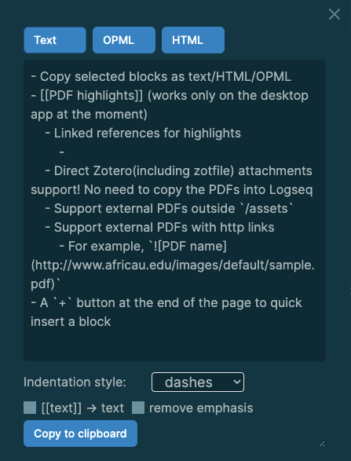
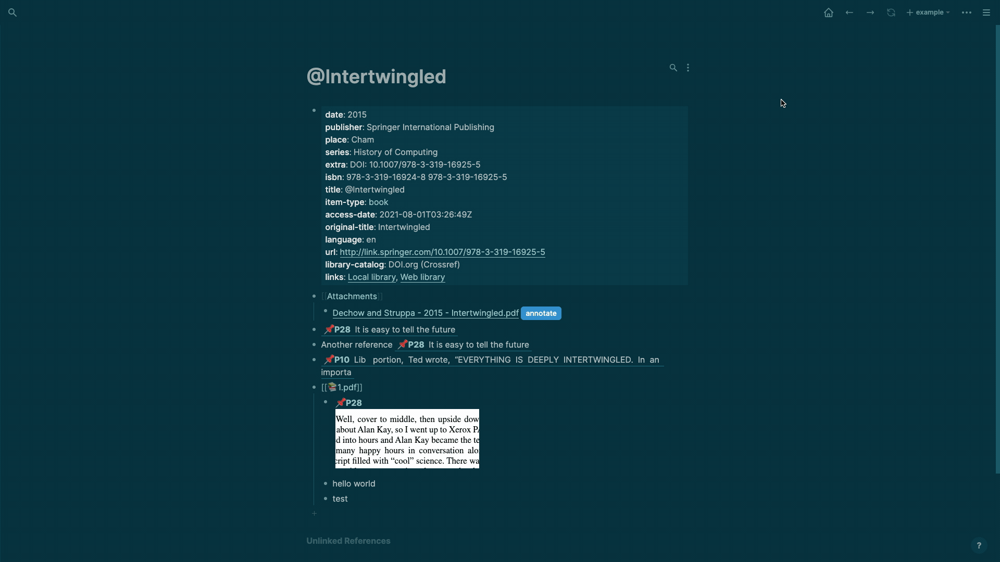
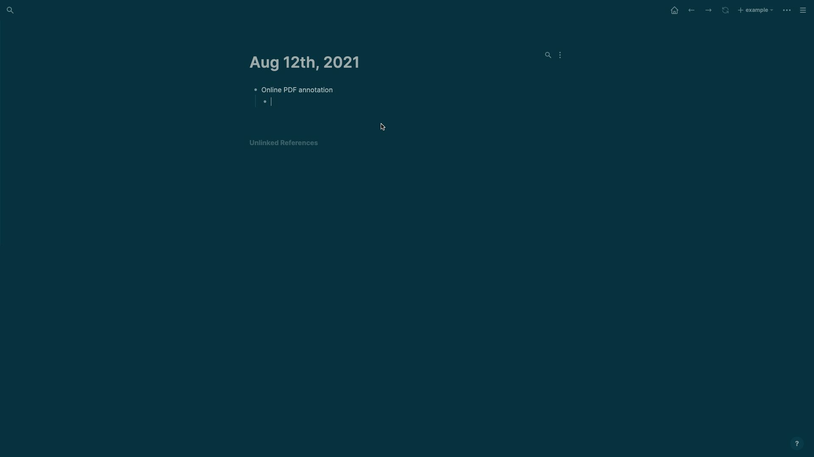
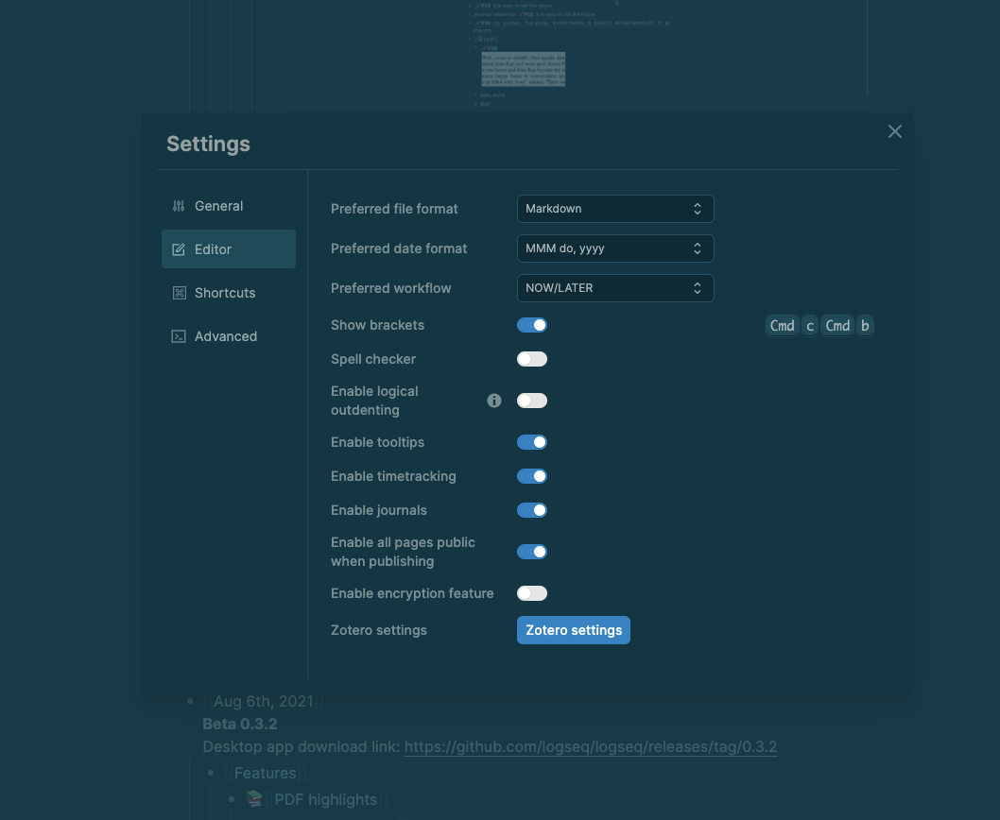
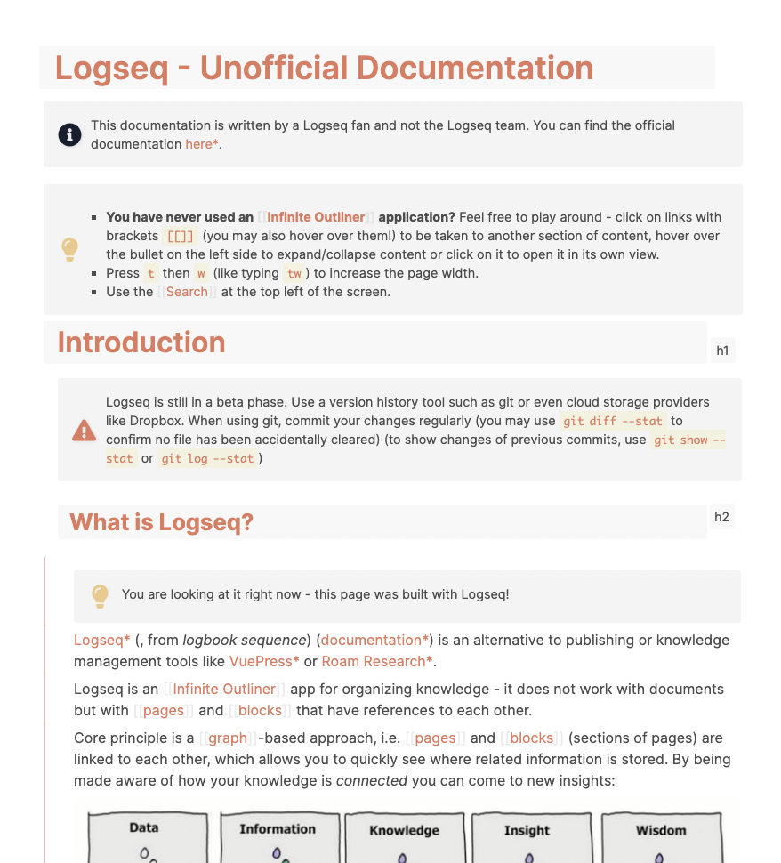
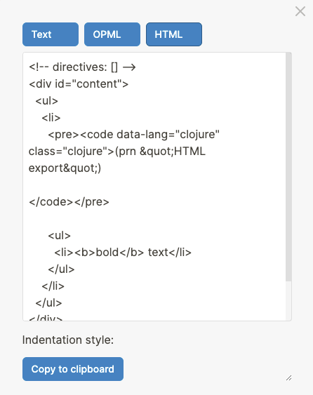
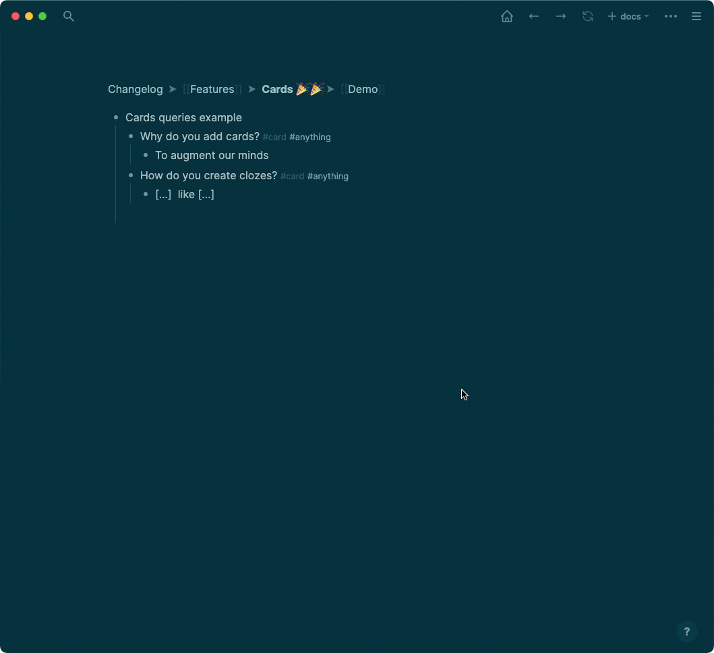
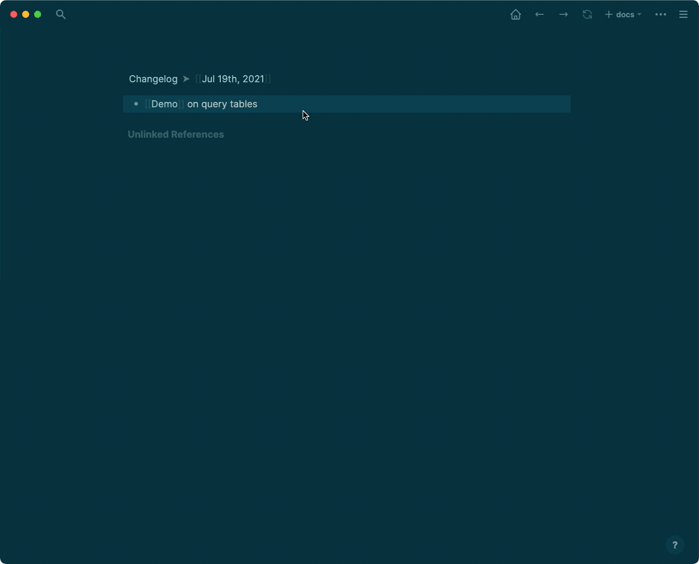
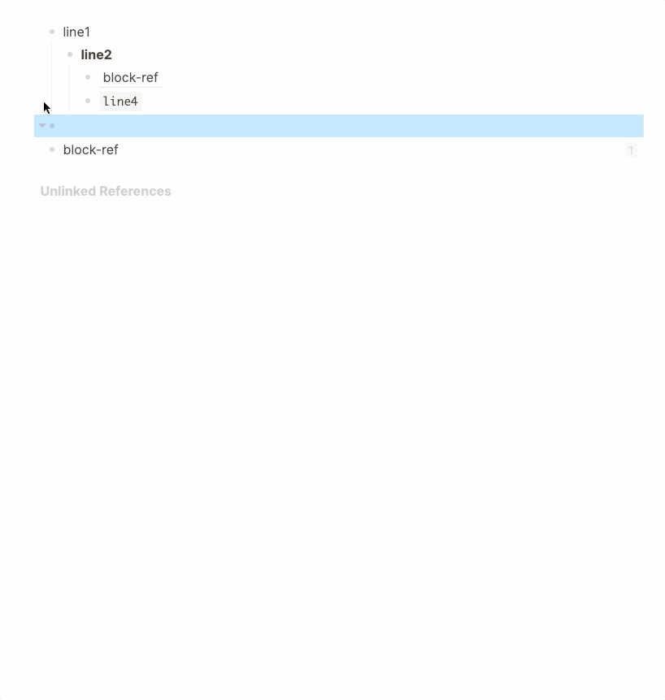
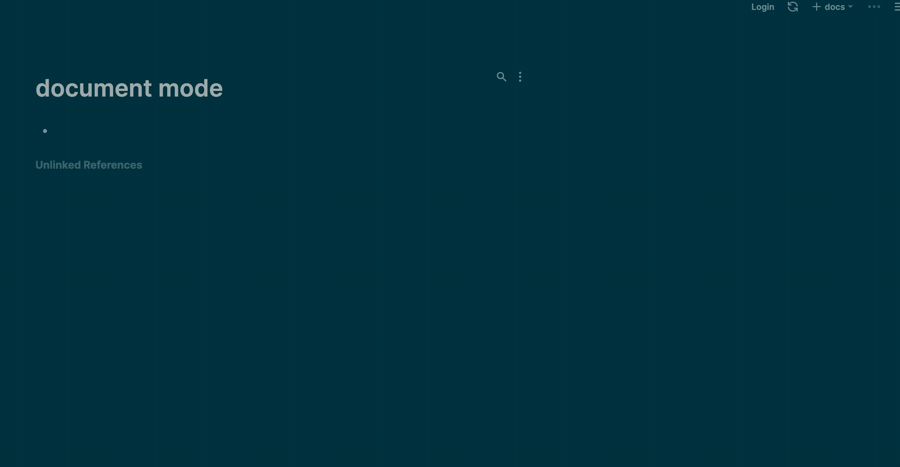

- [[Aug 19th, 2021]]
  id:: 611e698b-c30b-4b51-be56-703524d963a6
  **Beta 0.3.4**
  Desktop app download link: https://github.com/logseq/logseq/releases/tag/0.3.4
	- [[Thanks]]
		- [[Peng Xiao]]
			- Several UI issues
			- Make new block button more easily clickable
		- [[Michael Schmidt-Korth]]
			- Improve UI and make button & toggle interactivity on hover
			- UI fix for setting windows
		- [[Tiago Devezas]]
			- Add Portuguese translation
	- [[Fixed Issues]]
		- Export textarea background for dark theme
		- Zotero export format issues
		- Several pdf UX issues
		- Disabling journals in setting not working
		- Fail to load when refreshing with invalid block refs
		- Block id loss for references by file altering
		- Markdown links without extension does not work
	- [[Enhancement]]
		- Parsing speed up by leveraging web workers. Adding or reindexing large graph is now much faster!
		- Ability to edit SRS cards during the review
		- Add disable spellcheck option setting for desktop app.
		- Make local pdf asset file as relative path in pdf hls annotation file
		- Add [[Zotero]] `Linked Attachment Base Directory` setting for users with Zotfile workflow and using relative attachment links
		- Improved `open` button to open [[Zotero]] attachment file using relative link instead of absolute link. This needs user to setup `Zotero data directory` for imported attachment or `Linked Attachment Base Directory` for linked attachment and re-import the [[Zotero]] item.
	- [[Features]]
		- Support markdown url link format `[Link caption](<url>)`. Note in this format, url can contain white spaces without the need of encoding
		- [[Zotero]] setting profile support. In a multi-device or multi-user scenario, user can add different [[Zotero]] setting profile for each without overriding existing [[Zotero]] settings.
- [[Aug 11th, 2021]]
  id:: 5473b972-e358-46eb-ae13-fa2ae1dd41bb
  **Beta 0.3.3**
  Desktop app download link: https://github.com/logseq/logseq/releases/tag/0.3.3
	- [[Thanks]]
		- [[ingepettersen]]
			- Add Norwegian (bokmål) translation
		- [[Michael Schmidt-Korth]]
			- CSS-changeable max-width in wide mode
		- [[Peng Xiao]]
			- Fixed several UI issues
	- [[Fixed issues]]
		- Serious bug in naming the journal md files
		- Page auto-complete search can clear the editing block
		- Inconsistent timestamps on pages
		- Failed to drag or paste images
		- Page blank with invalid block ids
		- PDF links can't be opened
		- Can't jump to highlights when enlarging the pdf viewer
		- `<Center` command
		  collapsed:: true
			-
			  #+BEGIN_CENTER
			  Center text
			  #+END_CENTER
		- Widen mode width is too large
		- Blank white screen after updating to 0.3.2
		- Resize image
		- Simple queries not working in config.edn
		- Rename page case only
	- [[Enhancement]]
		- Copy selected blocks as text/HTML/OPML
			- 
		- Add spellcheck toggle in Settings/editor
		- [[PDF highlights]] (works only on the desktop app at the moment)
			- Linked references for highlights
				- 
			- Direct Zotero(including zotfile) attachments support! No need to copy the PDFs into Logseq
				- 
			- Support external PDFs outside `/assets`
			- Support external PDFs with http links
				- For example, ``
				- 
		- A `+` button at the end of the page to quick insert a block
		- Settings options are separated into groups
			- 
- [[Aug 6th, 2021]]
  id:: f3b8092e-ab5c-42c9-883c-81ae055b051d
  **Beta 0.3.2**
  Desktop app download link: https://github.com/logseq/logseq/releases/tag/0.3.2
	- [[Features]]
		- 📚 [[PDF highlights]]
			- Brought to you by [[Charlie]]!
			- Demo GIF
				- 
			- {{embed [[PDF highlights]] }}
	- [[Thanks]]
		- [gombiuda](https://github.com/gombiuda)
			- Hide specific block properties [[Configuration]]
				- **How to use it?**
					- Add something like `:block-hidden-properties #{:created-at :updated-at}` to your config.edn.
		- [[Peng Xiao]]
			- Hide the bullet when the block content is hr (default mode)
	- [[Fixed issues]]
		- Templates nesting not working
		- Date format crashes when reindex
		- Markdown produced even when set to org-mode
		- Don't treat hex colors as pages
		- Alias parsing
		- Markdown image link
		- Daily Notes Loading & Scrolling Issue with New Blank Daily Note
		- block ref style issue
	- [[Enhancement]]
		- [[Zotero]]
			- Add always use citekey as page title option
			- Allow extra tags for imported pages
- [[Aug 3rd, 2021]]
  id:: 5522d7d5-2c1a-4d97-9c0d-5d4a74d29bd4
  **Beta 0.3.1**
  Desktop app download link: https://github.com/logseq/logseq/releases/tag/0.3.1
	- The existing backend code is open sourced on GitHub, it's mostly for people who'd like to host the GitHub integration themselves.
	  collapsed:: true
	  https://github.com/logseq/deprecated-github-backend
		- Notice that we have no plan to open source the future backend for both data safety and business considerations.
	- [[Configuration]]
		- `default-templates` support named template for new journal pages
			- For example, you can create a template named `my-template`, and change the `default-template` part in`config.edn` to:
			  collapsed:: true
			  `:default-templates {:journals "my-template"}`
			- [[Breaking Changes]]
				-
				  #+BEGIN_WARNING
				  The jounnals `default-templates` only supports the template name now. 
				  #+END_WARNING
		- `:ui/show-empty-bullets?`
		  collapsed:: true
			- If you want to show the empty bullets in the default mode (instead of document mode), add this to `config.edn`:
			  `:ui/show-empty-bullets? true`
	- [[Thanks]]
		- [[Michael Schmidt-Korth]]
			- Incredible unofficial Logseq documentation https://mschmidtkorth.github.io/logseq-msk-docs/
			  collapsed:: true
				- 
	- [[Fixed issues]]
		- Block gets removed on new line when preview (only for the new generated journal page)
		- Page blank when clicking page name in the query result
		- Add page title property when renaming a page that include Windows reserved chars
		- [[Zotero]]
			- Remove key from page title
			- PDF attachment link not working
		- [[Query/table]]
			- Click shouldn't open the page in the right sidebar (shift need to be pressed too)
		- [[Parser]]
			- Some files might have wrong indentation at the beginning
		- [[Publishing]]
			- Static export fails silently if asset is missing
	- [[Enhancement]]
		- Performance should be much better when editing long pages
		- Jump to alias's source page when searching
		- [[Zotero]]
			- Separate abstract note into another block
- [[Jul 30th, 2021]]
  id:: f65e2408-643d-43af-9320-57f1076847d5
  **Beta 0.3.0**
  Desktop app download link: https://github.com/logseq/logseq/releases/tag/0.3.0
	- [[Features]]
		- [[Zotero]] integration! 🎉 🎉 #Academic
			- By [[Weihua]] and [[Junyu]]
			- {{embed ((6103e488-22d4-4751-b27a-69b278067c26))}}
		- Support `==` for highlight in Markdown
	- [[Thanks]]
		- [[Peng Xiao]]
			- `/Embed Twitter` support!
				- E.g. `{{tweet https://twitter.com/logseq/status/1420968129987969026}} ` will displayed as:
					- {{tweet https://twitter.com/logseq/status/1420968129987969026}}
		- [[Julio Navarro]]
			- fix: after renaming a page, going back should not goto the original page
	- [[Fixed issues]]
		- Broken block references after refreshing
		- Page references not working as linked ref in page's properties
		- Backspace will remove the whole block when block timestamps was enabled
		- Can't load files named with `x.y.z.md` as namespace pages
			- This bug can result in page corruption! You're encouraged to upgrade to the latest release or use any releases before `0.2.8`
		- Some javascript files can't be loaded for subpath publishing
		- Block reference count doesn't work properly when zoom-in
		- Can't copy && paste multiple blocks
		- URL in page metadata should not be treated as page reference
		- Alias can't be redirected after deleting the page
		- Images support `webp` format
		- Right Click 'Make a Card' on Windows App does not work
		- Home page blank with some custom date formats
		- Block references no longer show the references element
		- Redirect to the new page when page property title changed
	- [[Enhancement]]
		- Group blocks query result by same path
		- [[Query/table]] persists sort options (sort-by, desc/asc)
		- "Copy as" support both `remove [[]]` and `remove emphasis`
		- Don't parse quoted string as page references for properties
		- Property value wrapped by `""` will not be treated as page references
		- Add a `:breadcrumb-show?` option for custom queries to hide breadcrumbs. #option
			- The value should be `false`
	- [[Deprecated]]
		- Block timestamps was deleted to avoid countless rare cases
- [[Jul 26th, 2021]]
  id:: 4d0c3c40-a21d-41f2-8c89-091aec2a416a
  **Beta 0.2.10**
  Desktop app download link: https://github.com/logseq/logseq/releases/tag/0.2.10
	- [[Features]]
		- Block level html export
			- You can right click the left bullet, click `Export` and select `HTML`
				- {:height 522, :width 401}
	- [[Thanks]]
		- [[Sebastian Bensusan]]
			- fix(calc): don't show errors for empty lines
		- [[ruffnex]]
			- add mhchem plugin #latex
	- [[Fixed issues]]
		- App crashing when auto-complete some page references
		- Display an error when the file or graph directory was deleted
		- `.recycle` pages should be ignored
		- Copy && paste not working well on Windows
		- Org-mode id links
	- [[Enhancement]]
		- Long pages should be loading faster
		- Query results support both nested children and breadcrumbs
		- File watcher is more efficient, it also reduces CPU usage
		- Both `^^` and `__` can be autopaired when there's selected text
		- Jump to the end of `[[page reference]]` if chose to not show double brackets
- [[Jul 23rd, 2021]]
  id:: 48e76d46-3419-455c-84a0-349b80e369b8
  **Beta 0.2.8**
  Desktop app download link: https://github.com/logseq/logseq/releases/tag/0.2.8
	- [[Fixed issues]]
		- Query table properties are not displayed
		- Can't edit code block
		- App frozen when export a block to either Markdown or OPML
		- Wrong blocks order in presentation mode
		- App crashes for some pages due to wrong parsing
	- [[Enhancement]]
		- Don't hide both the first and the last empty bullets
- [[Jul 22nd, 2021]]
  id:: 2397b650-2828-48f9-b51e-320565c847fb
  **Beta 0.2.7**
  Desktop app download link: https://github.com/logseq/logseq/releases/tag/0.2.7
	- [[Features]]
		- **Cards**  🎉 🎉  #Academic
			- By [[Zhiyuan]]
			- [[Demo]]
				- 
				- You can use `/cards` to create specific collections instead of all of the cards
					- 
			- {{embed [[Cards]]}}
	- [[Thanks]]
		- [[Peng Xiao]]
			- Fix cursor state sometimes not cleared correctly
		- [[Michael Schmidt-Korth]]
			- Add additional date formats (Europe/India)
	- [[Fixed issues]]
		- Org mode title not parsed if file-level property block exist in file
		- Deleted page shall not show up in search
		- Query: sum supports float string
		- Click outside doesn't clear selections
		- Can't select Up using shortcut
	- [[Enhancement]]
		- Hide bullets when the block is empty (non-editing mode)
		- Copy includes block references and embeds
- [[Jul 19th, 2021]]
  id:: 60f57103-7fe8-4b83-b497-f3576672d30b
  **Beta 0.2.6**
  Desktop app download link: https://github.com/logseq/logseq/releases/tag/0.2.6
	- [[Demo]] on query tables
	  #+BEGIN_TIP
	  You can press `t w` to adjust the width so that it's easy to see the Gif as below.
	  #+END_TIP
		- 
	- [[Thanks]]
		- [[Sebastian Bensusan]]
			- [[Calculator]] supports negative numbers 🪄
	- [[Fixed issues]]
		- Can't drag the desktop app when scrolling down a bit
		- Can't go back to global search after searching in a specific page
		- Catch error when rendering image with wrong metadata
		- Don't show properties in block references
		- Don't show built-in properties in search results
		- Autocomplete shortcut config
		- Block timestamps in the code block
	- [[Features]]
		- [[Query/table/function]]
			- How to create a function below the query table? #card
			  card-last-interval:: 4
			  card-repeats:: 1
			  card-ease-factor:: 2.6
			  card-next-schedule:: 2021-07-26T14:25:55.552Z
			  card-last-reviewed:: 2021-07-22T14:25:55.553Z
			  card-last-score:: 5
				- Firstly, you have a query like this:
				  query-table:: true
				  query-properties:: [:block :author :publication-date :price :qty :updated-at]
				  {{query (property type book)}}
				  Then, you can create functions (by trigger `/function`) as this query block's children.
				  
				  For example:
					- How many books? `{{function (sum :qty)}}`
						- Answer: {{function (sum :qty)}}
					- What's the average price? `{{function (average :price)}}`
						- Answer: {{function (average :price)}}
					- How much does it cost to buy all of them? `{{function (sum (map (fn [x] (* (:price x) (:qty x))) result))}}`
						- Answer: {{function (sum (map (fn [x] (* (:price x) (:qty x))) result))}}
			- What features does it support?
				-
				  #+BEGIN_NOTE
				  The property to be used in the function must be a keyword, a keyword has a `:` at the beginning.
				  For example, `:price` is a keyword while `price` is not.
				  #+END_NOTE
				- Aggregations including sum/average/min/max/total
					- `{{function (sum :property)}}`
					- `{{function (average :property)}}`
					- `{{function (min :property)}}`
					- `{{function (max :property)}}`
					- `{{function (total :property)}}`
				- [[Clojure]] function!
				  The function takes the query result and bind it to the symbol `result` for usage.
					- `{{function (sum (map (fn [x] (* (:price x) (:qty x))) result))}}`
	- [[Enhancement]]
		- [[Queries/table]]
			- Click to open a block in the right sidebar
			- Human-readable block timestamps
			- Add sorts by any property
			- Add custom properties support
- [[Jul 14th, 2021]]
  **Beta 0.2.5**
  Desktop app download link: https://github.com/logseq/logseq/releases/tag/0.2.5
	- [[Thanks]]
		- [[Devon Zuegel]]
			- WYSIWYG headers + CSS cleanup
		- [[Peng Xiao]]
			- Clear data-active-keystroke when blur
		- [[Michael Schmidt-Korth]]
			- Updates to keyboard shortcut wording
	- [[Fixed issues]]
		- Pages or even the whole graph can be deleted when re-index
			- Introduced by the release `0.2.4` which was deleted to avoid more data loss
		- Block reference gets lost on alt-dragged blocks after re-index
		- Bring block timestamps back, you can enable it in the settings page
			- It'll add both `created-at` and `updated-at` properties.
		- Preserve the block properties order
		- Publishing supports subpath now
		- Previous page are not removed in the graph view
		- Can't delete selected blocks when zoom in
		- Don't show the collapse arrow when there's no block title or children blocks
		- Fix light theme colors
		- Hide :collapsed property when editing
		- Org mode image rendering
	- [[Features]]
		- Finally, we can render queries as tables! 🎉 [[Queries/table]]
			- {{query (property type book)}}
			  query-table:: true
			- {{query (page-property tags)}}
	- [[Enhancement]]
		- [[Publishing]]
			- Disable edit-mode
			- Remove access to settings on the exported site
			- Do not export pages with "public:: false" option when all pages are set public from the config
			- You can set all pages as public in the settings page
		- [[All pages]] support sorted by page's name, links, created at and updated at
			- 
- [[Jul 9th, 2021]]
  **Beta 0.2.3**
  Desktop app download link: https://github.com/logseq/logseq/releases/tag/0.2.3
	- [[Thanks]]
		- [[Peng Xiao]]
			- Various UI improvements & refactoring
			- Improve cursor style with block reference
			- New page preview for page autocomplete
			  collapsed:: true
			  
			- `shift+enter` to open autocomplete item in sidebar
			- Fix sidebar not able to resize and draggle issue
			- Fix custom css not work when switching graphs
		- [[Michael Schmidt-Korth]]
			- Fix privacy term links not working for electron
		- [[bensu]]
			- Enhance scrolling into moving blocks behavior
	- [[Fixed Issues]]
		- Fix open file externally with relative paths
	- [[Features]]
		- Graph display is completely revamped
			- Webgl rendering thousands of nodes instantly for large repo
			- Better nodes filtering and searching
			- Various UX improvements
			- demo
			  collapsed:: true
			  
		- New block level export (export to plain text or opml)
		  collapsed:: true
		  
	- [[Enhancement]]
		- Enhanced document mode experience (`t d` to toggle, use `shift+enter` to create new block inside document mode)
		  collapsed:: true
		  
		- New frameless design and UI polish for mac desktop app on Mac
		- Enhance Mldoc ast types for link reference
		- Bundle assets for desktop app to eliminate outbound network requests
		- Add global shortcuts for moving backward`ctrl/cmd [` and forward`ctrl/cmd ]`
		  id:: 60e80f8d-f130-4925-ad22-474977a1f56d