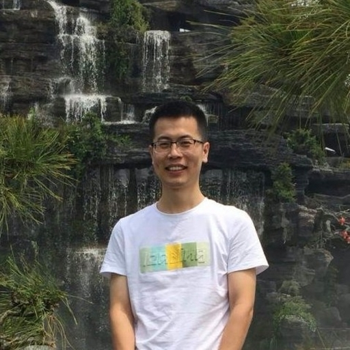

- **Hello, everyone!**
- **A little about the team**
	- **Michael** 
	  {:height 560, :width 960}
	- **Charlie**  
	- **Zhiyuan**
	  
	- **Weihua**
	  
	- **Junyu** 
	  {:height 379, :width 279}
	- I'm Tienson from Hangzhou, thanks to my wife we have a beautiful daughter.
		- {:height 557, :width 518}
- **What's logseq?**
	- At present, it's a note-taking app
		- It's also a community for knowledge sharing and collaboration, yes, our discord group and forum!
	- In the future, we hope Logseq can be more helpful for everyone around the world.
- **Why the name?**
  later:: 1616236181947
  I know `log` is for daily notes, what `seq` means?
	- It's a sequence of our notes, ideas and thoughts. To me it's all the things I want to remember in my life.
- **Why building logseq?**
	- I started a side project called `putchar.org` back in 2018, which is Medium for programmers, a place to publish and discuss tech articles.
		- Unfortunately, it's deprecated after more than 1 year working on it because for me It's hard to build a community and I have some contracts at that time so that I can't focus on it.
		- But I still want to make it better for general knowledge publishing and collaboration.
		- Also, many code, especially the parser for logseq are from some of my previous side projects, so failures are not that bad :)
	- I was using both Org-mode and TiddlyWiki for my notes, I want to read my notes and capture some links on mobile, also, I want a better outliner UI on web  compared to text editors like Emacs and Vim.
	- So, when my last contract ended at the end of 2020, I knew it's the time to build something! 😎
- **What's the difference between logseq and other tools?**
  id:: 61110543-a71f-458d-b42e-b78a4d22f0c0
	- **The user is the king of the data. ** [[local-first]]
	  Simply put, I don't trust putting my notes and my life on any cloud services without End-to-End encryption support.
	- **Logseq doesn't lock the data.**
		- Even though logseq is an outliner tool, it works directly with plain-text like Markdown and Org mode. We believe in plain-text for data longevity, we believe in standard syntaxes and open protocols for better collaboration with the existing ecosystem.
		- Shameless plug, logseq might be the **_first_** app that have two-way sync between plain-text and outliner, yay!
	- **Everyone can build their own workflows**
	  Slip box? GTD? Hierarchical tags? With [[Queries]], [[Advanced Queries]] and coming [[Plugins]], nothing is impossible!
	- **Open Source**
	  As developers, we believe the ultimate fun is to fork the code and do nasty tweaks!
	- **Being different instead of a clone**
		- Bring org mode's task management and many other features to Markdown
		- The first(might be) note-taking app with Git sync on Web (Thanks to [[Isomorphic-git]])
		- The first(might be) note-taking app can work with your local files on Web
		- ` /Page Embed`
		- `/Draw` integration with [[Excalidraw]]
		- `Now Later workflow`
		- Custom queries on journals page
		- Publishing the whole web app to your own website
- **The future**
	- More stable and more performant
	- Better undo/redo #undotree
	- End-to-End encryption storage
	- Mobile apps
	- Real-time collaboration
	- Exploring more ways to help for thoughts
	- Who knows?
- **Thank you everyone for your time, have a great weekend!** 🙏