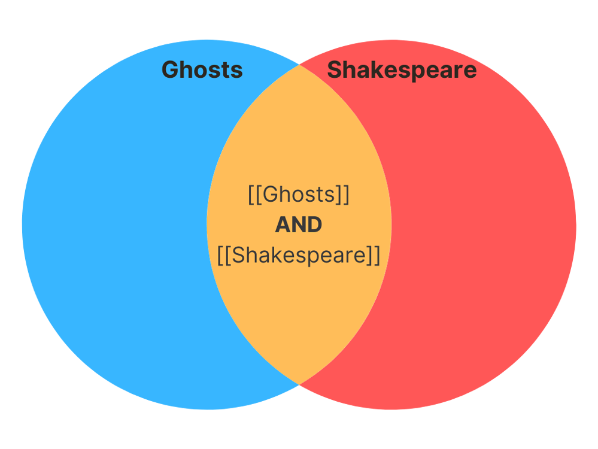
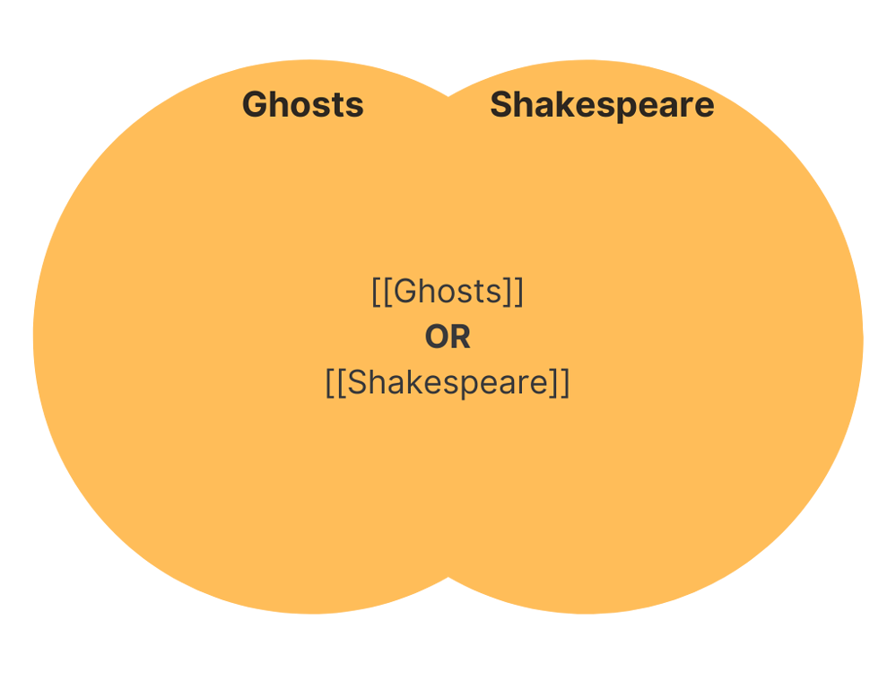
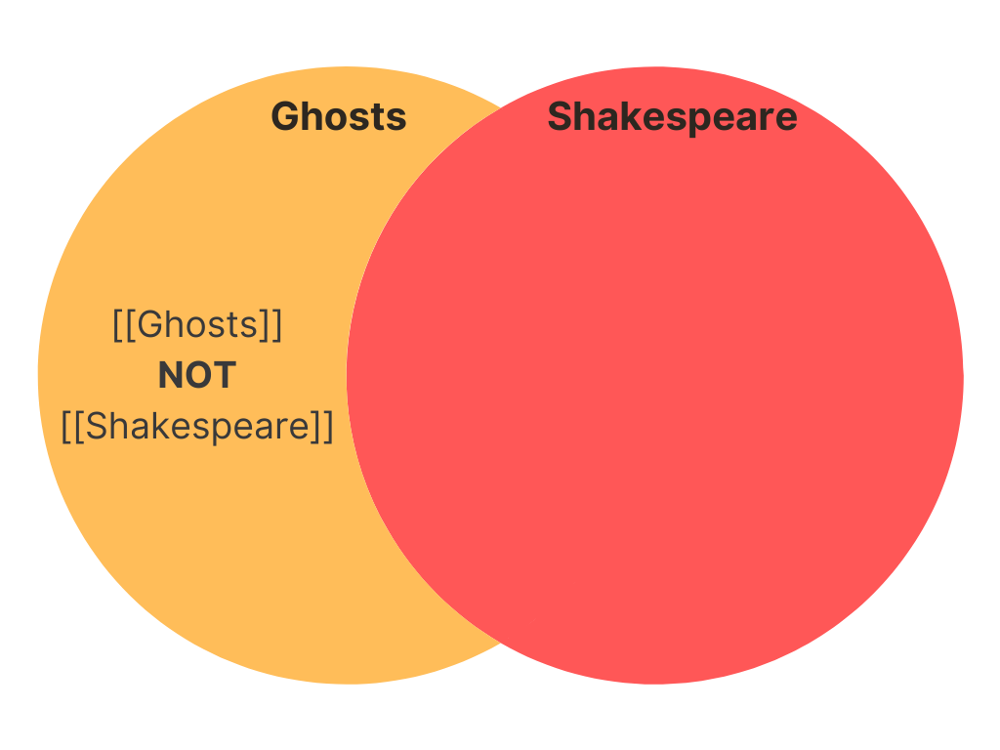

title:: Queries

- ## What are "Queries"?
  updated-at:: 1609247076654
  created-at:: 1609230242742
	- A query is just another way of saying “*request for information*.” Probably the most common type of query is the search terms you type into search engines like Google and DuckDuckGo.
	  updated-at:: 1609231528688
	  created-at:: 1609230243642
	- Did you know that with search engines, you can search very precisely using keywords and filters? Likewise, it's possible to precisely search your graph (your collection of notes).
	- As an example, a beginner search engine user may write a Google query like this:
	  `highlights or notes from How to Take Smart Notes`
	  
	  An experienced Google user would likely write something like this:
	  `highlights OR notes "How to Take Smart Notes"`
	  
	  Similarly, we can use keywords and filters in Logseq to request information from a graph. The way to write this request may be different in Logseq, but the question is exactly the same as the examples above:
	  ```
	  {{query (and [[How to Take Smart Notes]] (or [[highlights]] [[notes]])) }}
	  ```
	- This page aims to provide a complete introduction to queries. But before you can properly understand how to search a graph using queries, you first need to understand the basic structure of your notes. For a better understanding of Logseq's outline structure, read the pages on [linking]([[Why linking matters]]) and [indentation]([[What is indentation and why does it matter?]]) first.
- ## Introduction to Boolean logic
	- To talk with a database like Logseq, you mostly need to understand how it thinks. In other words: you need to understand the basic logic that Logseq uses to search through your notes.
	- The type of logic that Logseq follows is called [Boolean logic](https://en.wikipedia.org/wiki/Boolean_algebra). While you may have never heard of this term, you most likely have applied it before.
	- Have you ever filtered results on an e-commerce website? For example, to only show results within a specific price range or with a minimum rating? Then you’ve used Boolean logic before.
	- In the world of Boolean logic, things are very black and white. Something is either **true**, or it’s **false**; those are the only answers you can get from a Boolean question. For now, remember that Logseq queries only show results that return **true** as an answer.
- ## The three basic Boolean operators
	- There are three basic Boolean operators: AND, OR, and NOT. But despite them being basic, their logic can be somewhat counter-intuitive.
	- Let’s walk through each step-by-step. To make things less abstract, we'll assume you’re a fan of Shakespeare and have lots of notes about his plays (who hasn’t!?). As Shakespeare was kinda obsessed with ghosts (they appear in five of his plays), we’ll use this theme throughout.
	- ### AND
		- You might think, *“Oh hey, AND. That sounds like it increases my results when searching!”* But AND actually *decreases* our search/query results. Let us explain.
		- Imagine you’re searching through your collection of notes. You want to see everything you have about ‘ghosts’, so you search the keyword  `[[Ghosts]]`  (remember we use  `[[links]]`  as search terms in queries).
		- Let’s say you get 100 results from that. That’s a lot! You realize you actually only wanted to see results about ghosts in *Shakespeare* plays. You want to decrease your results, so you search for  `[[Ghosts]] AND [[Shakespeare]]` . Now you only get 20 results.
		- AND means that all the results in our example must contain **both** the keywords  `[[Ghosts]]`  and  `[[Shakespeare]]` . If we have a Venn diagram of items that contain *Ghosts* in one circle and items that contain *Shakespeare* in the other, our search for  `[[ghosts]] AND [[Shakespeare]]`  would give us results that are where those two circles overlap (the orange part in the middle).
		- {:height 200, :width 400}
	- ### OR
		- OR *increases* the number of search results.
		- In a Venn diagram, OR brings us the entirety of both circles and where they overlap. This OR is not exclusionary, meaning results can contain both or either.
		- You’ll get the 100 results from just searching *Ghosts* (including the overlaps with *Shakespeare*), plus any results about *Shakespeare* and not *Ghosts*. In our AND search, you wouldn’t have been able to see results about Romeo and Juliet, for example.
		- {:height 200, :width 400}
	- ### NOT
		- Let’s reason about how NOT functions, step-by-step:
			- If our original search for *Ghosts* was 100 results;
			- and if our search for  `[[Ghosts]] AND [[Shakespeare]]`  was only 20 notes;
			- then, the number of notes about *Ghosts* but not about *Shakespeare* is 80.
		- In a Venn diagram, this query would be only the part of the Ghost circle that didn’t overlap with the Shakespeare circle (the orange part on the left).
		- {:height 200, :width 400}
- ## How to write queries
  updated-at:: 1609251558592
  id:: 5feb30e3-fedc-4c2a-aa03-b44020c21c68
  created-at:: 1609231967174
	- There're two kinds of queries:
	  updated-at:: 1609244684831
	  created-at:: 1609237373442
	  1. Simple queries by using `{{query }}`, the format is something like this:
	   #+BEGIN_EXAMPLE
	   {{query Something you're looking for}}
	   #+END_EXAMPLE
	   You can type `/query` to create a simple query.
	  2. [[Advanced Queries]]
	- *On this page we focus on simple queries (using the `{{query }} syntax`).*
- ## Query Operators
  These three operators can be applied around any query filters.
	- **and**
	  created_at:: 1609237410438
	  updated-at:: 1609242191381
	  Examples:
	  #+BEGIN_EXAMPLE
	  (and [[page 1]] [[page 2]])
	  #+END_EXAMPLE
	  
	  #+BEGIN_EXAMPLE
	  (and (task now later done) [[page]])
	  #+END_EXAMPLE
	- **or**
	  created_at:: 1609237412110
	  updated-at:: 1609242378334
	  Examples:
	  #+BEGIN_EXAMPLE
	  (or [[page 1]] [[page 2]])
	  #+END_EXAMPLE
	- **not**
	  created_at:: 1609237413167
	  updated-at:: 1609243244686
	  Examples:
	  #+BEGIN_EXAMPLE
	  (not [[page 1]] [[page 2]])
	  #+END_EXAMPLE
- ## Query filters
  updated-at:: 1609237391135
  id:: 62967225-37d9-46b7-859f-92e0311ab4be
  created-at:: 1609237391135
  Most filters apply to blocks. Some filters only apply to pages.
   The following page-only filters cannot be mixed with block filters: `page`,  `page-property`, `page-tags` and `all-page-tags`.
	- **between**
	  updated-at:: 1609243879053
	  created-at:: 1609237415572
	  The format `(between start end)` will only support blocks on the journal pages.
	  
	  There're several built-in symbols:
	   1. `today|yesterday|tomorrow|now`
	   2. `+|-` number `y|m|w|d|h|min`
	  
	  Examples:
	  #+BEGIN_EXAMPLE
	  (between -7d +7d)
	  (between -2w today)
	  
	  #+END_EXAMPLE
	- **Page**
	  Examples: [[questions]]
	  {{query (page "term/alias")}}
	- **property** [[Block properties]]
	  created_at:: 1609237428110
	  updated-at:: 1609247365218
	  Examples:
	  {{query (property type book)}}
	- **Full-text query**
	  #+BEGIN_NOTE
	  It's only enabled on the desktop app at the moment.
	  #+END_NOTE
	  Examples:
	  #+BEGIN_QUERY
	  {:title "Query: \"alias\""
	  :query "alias"
	  :collapsed? true}
	  #+END_QUERY
	- **task** (used to be `todo`)
	  created_at:: 1609237429937
	  updated-at:: 1609242962513
	  Examples:
	  #+BEGIN_EXAMPLE
	  (task now)
	  (task now later)
	  #+END_EXAMPLE
	- **priority**
	  created_at:: 1609237434982
	  updated-at:: 1609242958502
	  Examples:
	  #+BEGIN_EXAMPLE
	  (priority a)
	  (priority a b c)
	  #+END_EXAMPLE
	- **page-property**
	  created_at:: 1609237443550
	  updated-at:: 1609243687213
	  Example:
	  {{query (page-property related "Block embed")}}
	- **page-tags**
	  created_at:: 1609237445606
	  updated-at:: 1609243746666
	  Example:
	  {{query (page-tags embed)}}
	- **all-page-tags**
	  created_at:: 1609237447926
	  updated-at:: 1609243762970
	  Example:
	  {{query (all-page-tags)}}
	- **sort-by**
	  updated-at:: 1609243222016
	  created-at:: 1609237456009
	  Format: `(sort-by property-name order)` or `(sort-by property-name)`
	  `key`: Can be any user property as well as built-in properties `created-at`  and `updated-at`
	  `order`: `desc` or `asc`, omit means `desc`.
	  #+BEGIN_EXAMPLE
	  (and (task now later) (sort-by created-at desc))
	  #+END_EXAMPLE
- **More query examples**
  created-at:: 1609232210837
  updated-at:: 1609243310412
	- 1. Find the blocks containing page "tag1"
	  created-at:: 1609232870139
	  updated-at:: 1609233755992
	  #+BEGIN_EXAMPLE
	  {{query [[tag1]]}}
	  #+END_EXAMPLE
	  {{query [[tag1]]}}
	- 2. Find the blocks containing both `tag1` and `tag2`
	  created-at:: 1609233702047
	  updated-at:: 1609233790865
	  #+BEGIN_EXAMPLE
	  {{query (and [[tag1]] [[tag2]])}}
	  #+END_EXAMPLE
	  {{query (and [[tag1]] [[tag2]])}}
	- 3. Find the blocks containing either `tag1` or `tag2`
	  created-at:: 1609233864422
	  updated-at:: 1609233864422
	  #+BEGIN_EXAMPLE
	  {{query (or [[tag1]] [[tag2]])}}
	  #+END_EXAMPLE
	  {{query (or [[tag1]] [[tag2]])}}
	- 4. Find the blocks containing `tag2` but not `tag1`
	  created-at:: 1609234732407
	  updated-at:: 1609236840152
	  {{query (and [[tag2]] (not [[tag1]]))}}
	- 5. Find journal blocks created between [[Dec 5th, 2020]] to [[Dec 7th, 2020]]
	  created-at:: 1609242222695
	  updated-at:: 1609242323029
	  {{query (between [[Dec 5th, 2020]] [[Dec 7th, 2020]] )}}
	- 6. Find all the blocks created today (you need to enable [[block timestamps]] before using this query)
	  created-at:: 1609235122723
	  updated-at:: 1609249085047
	  #+BEGIN_EXAMPLE
	  {{query (between created-at today tomorrow)}}
	  #+END_EXAMPLE