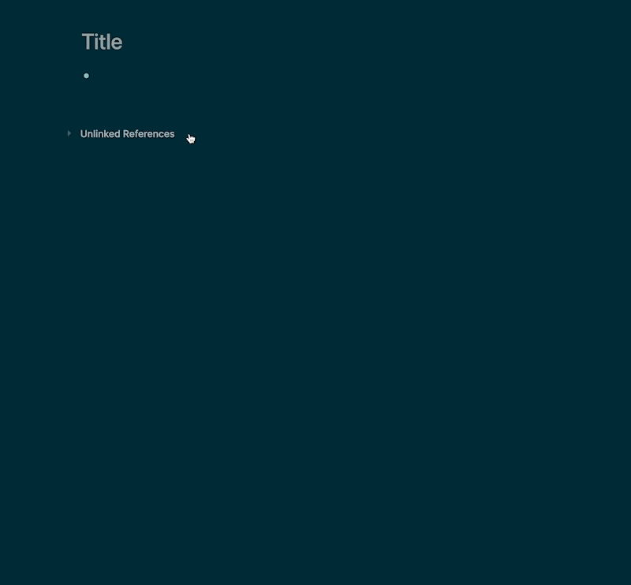

title:: term/page title
alias:: Title

- Both [[Page]] and [[Whiteboards]] can have a [[Title]].
	- You can create a [[Page]] or [[Whiteboard]] with a certain [[Title]] through the [[Search]] modal:
	  collapsed:: true
		- ((6380a818-1a69-46f1-85f0-2b86fcba9b70))
	- You can edit the [[Title]] by clicking on it.
	  collapsed:: true
		- For [[Pages]]:
			- 
		- For [[Whiteboards]]
			- ((6380a818-a9dc-45ac-934b-fc3064509304))
- With the title they can easily be found in [[Search]], via `cmd+k` or when looking for a link title after typing `[[]]`.
	- The title will also be the name of their corresponding file saved on your computer, either with a `.md` or `.edn` ending.